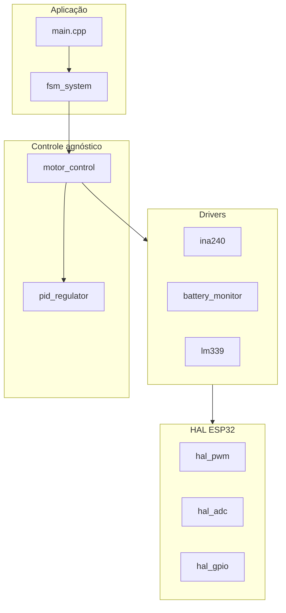

# Documentação de Programação — Firmware ESC BLDC (ESP32)

> **Documento vivo:** complemente e revise este arquivo **sempre** que criar, alterar ou revisar código em `Firmware/`.  
> Especificação de arquitetura (visão de produto): [`../Docs/especificacao_esc.md`](../Docs/especificacao_esc.md).

---

## Índice

1. [Política de manutenção](#1-política-de-manutenção)
2. [Visão geral do firmware](#2-visão-geral-do-firmware)
3. [Ambiente de build](#3-ambiente-de-build)
4. [Estrutura de diretórios](#4-estrutura-de-diretórios)
5. [Estado atual vs. planejado](#5-estado-atual-vs-planejado)
6. [Arquitetura em camadas](#6-arquitetura-em-camadas)
7. [Máquina de estados (planejada)](#7-máquina-de-estados-planejada)
8. [Mapa de hardware (`board_config.h`)](#8-mapa-de-hardware-board_configh)
9. [Módulo `lib/control/pid_regulator` (documentação de código)](#9-módulo-libcontrolpid_regulator-documentação-de-código)
10. [Histórico de revisões](#10-histórico-de-revisões)

---

## 1. Política de manutenção

| Regra | Descrição |
|-------|-----------|
| **Quando atualizar** | Ao adicionar, remover ou modificar arquivos em `src/`, `include/`, `lib/` ou `platformio.ini`. |
| **O que registrar** | Data, autor, arquivos afetados, resumo da mudança e impacto em API/comportamento. |
| **Onde registrar** | Seção [10. Histórico de revisões](#10-histórico-de-revisões) + seção do módulo correspondente. |
| **Divergência da spec** | Se o código diferir de `Docs/especificacao_esc.md`, explicar **por quê** (ex.: pinos inválidos no ESP32-WROOM-32). |
| **Padrão de escrita** | Preferir explicação em prosa + tabelas + passo a passo; não apenas listas de arquivos. |

---

## 2. Visão geral do firmware

Este firmware controla um **ESC trifásico** para motor **BLDC**. A ideia central da arquitetura é **separar responsabilidades**:

- **Aplicação** (`src/`): quando ligar o motor, em que estado está, regras de segurança.
- **Controle** (`lib/control/`): matemática de malha fechada (PI), sem saber qual pino é PWM.
- **Drivers** (`lib/drivers/`): conversão de sinais físicos (INA240, divisor de tensão, LM339) para grandezas de engenharia (A, V).
- **HAL** (`lib/hal/`): acesso direto ao silício (MCPWM, ADC, GPIO/EXTI).

Assim, você pode testar o PI no PC ou na bancada sem reescrever código quando mudar um pino ou sensor.

| Item | Valor atual / alvo |
|------|-------------------|
| MCU | ESP32 (`esp32doit-devkit-v1`) |
| Framework hoje | **Arduino** (via PlatformIO) |
| Framework alvo (spec) | ESP-IDF + FreeRTOS |
| PWM de comutação | 20 kHz, dead-time 500 ns (planejado, MCPWM) |
| Teto de duty | 95 % (recarga bootstrap IR2110) |
| Debug | GPIO 12–15 reservados para **JTAG** (ICE) |

---

## 3. Ambiente de build

Configuração em `platformio.ini`:

| Parâmetro | Valor | Significado |
|-----------|--------|-------------|
| `platform` | `espressif32` | Toolchain e SDK do ESP32 |
| `board` | `esp32doit-devkit-v1` | Placa de desenvolvimento de referência |
| `framework` | `arduino` | API Arduino (`setup`/`loop`) |
| `monitor_speed` | `115200` | Baud rate do monitor serial |

**Compilar:** `pio run` ou `platformio run`.

**Bibliotecas em `lib/`:** o PlatformIO compila automaticamente cada pasta como biblioteca estática e linka no firmware. Para usar o controlador PI em outro arquivo:

```c
#include "pid_regulator.h"
```

Não é necessário editar `platformio.ini` só por causa de `lib/control/`.

---

## 4. Estrutura de diretórios

```text
Firmware/
├── DOCUMENTACAO_PROGRAMACAO.md   ← este arquivo (documentação viva)
├── platformio.ini
├── include/                      ← cabeçalhos globais (ex.: board_config.h — pendente)
├── src/
│   └── main.cpp                  ← ponto de entrada atual (Arduino)
├── lib/
│   ├── control/
│   │   ├── pid_regulator.h       ← interface pública do PI
│   │   └── pid_regulator.c       ← implementação
│   ├── hal/                      ← (planejado) MCPWM, ADC, GPIO
│   └── drivers/                  ← (planejado) INA240, VBAT, LM339
└── test/                         ← testes (futuro)
```

---

## 5. Estado atual vs. planejado

| Componente | Status | O que faz / fará |
|------------|--------|------------------|
| `src/main.cpp` | **Provisório** | Apenas scan WiFi; **não** controla motor ainda |
| `lib/control/pid_regulator` | **Implementado** | Malha PI com anti-windup; pronto para integração |
| `include/board_config.h` | **Pendente** | Mapa de pinos e limites (usar proposta da seção 8) |
| `fsm_system` | **Pendente** | Máquina de estados INIT / IDLE / RUNNING / FAULT |
| `motor_control` | **Pendente** | Liga telemetria → PI → duty das 3 fases |
| `lib/hal/*` | **Pendente** | PWM, ADC bruto (mV), EXTI |
| `lib/drivers/*` | **Pendente** | Corrente (INA240), tensão barramento, trip LM339 |

**Resumo:** o núcleo matemático do PI já existe; ainda falta conectar sensores, PWM, FSM e `main` real do ESC.

---

## 6. Arquitetura em camadas



**Regra de ouro:** `pid_regulator` recebe apenas números (`float`): referência, medição, saída. Não inclui `board_config.h`, não acessa GPIO, não conhece MCPWM.

---

## 7. Máquina de estados (planejada)

O ESC não deve “ligar o motor” direto no `setup()`. A operação seguirá uma **FSM** (`fsm_system`), ainda não implementada:

| Estado | Nome | O que acontece |
|--------|------|----------------|
| `ESC_STATE_INIT` | Inicialização | Calibra ADC; mede offset do INA240 (~1,65 V); configura PWM e interrupção de falha |
| `ESC_STATE_IDLE` | Espera | Aguarda *arming* (comando de aceleração nulo estável); PWM em 0 %; telemetria pode rodar |
| `ESC_STATE_RUNNING` | Ativo | Motor comutando; `pi_compute()` atualiza o comando (ex.: duty %) em loop periódico |
| `ESC_STATE_FAULT` | Falha | Trip de sobrecorrente (LM339); PWM desarmado; só sai com reset controlado |

```c
typedef enum {
    ESC_STATE_INIT = 0,
    ESC_STATE_IDLE,
    ESC_STATE_RUNNING,
    ESC_STATE_FAULT
} esc_state_t;
```

**Transição típica segura:** `INIT` → `IDLE` → (arming OK) → `RUNNING`. Qualquer trip hardware → `FAULT`.

---

## 8. Mapa de hardware (`board_config.h`)

### 8.1 Por que revisar a especificação original?

O arquivo `Docs/especificacao_esc.md` descreve a intenção do projeto, mas o mapa de pinos original tem **erros para o ESP32-WROOM-32**:

| Pino na spec | Problema técnico |
|--------------|------------------|
| GPIO 9, 10, 11 | Ligados à **flash SPI interna** do módulo — não usar em aplicação |
| GPIO 14 em `PIN_PWM_AL` | É **TMS do JTAG**; a spec dizia preservar JTAG, mas usava esse pino |
| GPIO 19, 20 como ADC | GPIO **20 não existe**; GPIO 19 não é entrada ADC padrão no ESP32 clássico |
| GPIO 24 em `PIN_OC_TRIP` | GPIO **24 não existe** no ESP32 clássico |

### 8.2 Proposta revisada (a criar em `include/board_config.h`)

```c
#ifndef BOARD_CONFIG_H
#define BOARD_CONFIG_H

// JTAG reservado: GPIO12, 13, 14, 15
// Flash reservado: GPIO6, 7, 8, 9, 10, 11

#define PIN_PWM_AH    25
#define PIN_PWM_AL    26
#define PIN_PWM_BH    27
#define PIN_PWM_BL    18
#define PIN_PWM_CH    19
#define PIN_PWM_CL    21

#define PIN_ADC_IA    32   // ADC1_CH4
#define PIN_ADC_IB    33   // ADC1_CH5
#define PIN_ADC_IC    34   // ADC1_CH6 (input-only)
#define PIN_ADC_VBAT  35   // ADC1_CH7 (input-only)

#define PIN_OC_TRIP   4    // LM339, ativo baixo + pull-up

#define MAX_DUTY_CYCLE_PERCENT 95.0f
#define PWM_FREQUENCY_HZ       20000
#define DEAD_TIME_NS           500

#define CONTROL_LOOP_HZ        10000.0f
#define CONTROL_DT_S           (1.0f / CONTROL_LOOP_HZ)

#endif
```

### 8.3 Finalidade de cada grupo de pinos

#### PWM — GPIO 25, 26, 27, 18, 19, 21

Geram os **6 sinais de gate** da ponte trifásica:

| Sinal | Pino | Função |
|-------|------|--------|
| AH | 25 | High-side, fase A |
| AL | 26 | Low-side, fase A |
| BH | 27 | High-side, fase B |
| BL | 18 | Low-side, fase B |
| CH | 19 | High-side, fase C |
| CL | 21 | Low-side, fase C |

Serão gerados pelo **MCPWM** do ESP32, com **dead-time** de 500 ns no hardware para evitar *shoot-through* (curto entre high e low da mesma perna).

#### ADC — GPIO 32, 33, 34, 35

Leitura analógica de **correntes de fase** e **tensão do barramento DC**:

| Pino | Sinal | Canal | Observação |
|------|-------|-------|------------|
| 32 | Corrente fase A | ADC1_CH4 | Entrada/saída geral |
| 33 | Corrente fase B | ADC1_CH5 | Entrada/saída geral |
| 34 | Corrente fase C | ADC1_CH6 | **Somente entrada** (ideal para sensor) |
| 35 | Tensão VBAT | ADC1_CH7 | **Somente entrada** |

Usar **ADC1** evita conflitos comuns do ADC2 quando o Wi-Fi está ativo.

#### Segurança — GPIO 4 (`PIN_OC_TRIP`)

Entrada digital do comparador **LM339** (sobrecorrente). Configuração esperada:

- Sinal **ativo em nível baixo** (open-collector + pull-up).
- Interrupção externa (EXTI) para desarme rápido.
- **Recomendação:** acoplar também ao **fault do MCPWM** para desligamento imediato por hardware, não só por software.

#### Reservados — não usar

| GPIO | Motivo |
|------|--------|
| 12, 13, 14, 15 | **JTAG** — depuração ICE (`MTDI`, `MTCK`, `MTMS`, `MTDO`) |
| 6, 7, 8, 9, 10, 11 | **Flash SPI** interna do módulo |

---

## 9. Módulo `lib/control/pid_regulator` (documentação de código)

Biblioteca de controle **Proporcional-Integral (PI)** para o ESC. É **agnóstica de hardware**: não sabe se a saída é duty cycle, corrente ou velocidade — apenas processa referência, medição e limites configurados.

**Localização:**

```text
lib/control/
├── pid_regulator.h   ← tipos e protótipo público
└── pid_regulator.c   ← implementação
```

---

### 9.1 Arquivo `pid_regulator.h` — interface pública

#### Proteção contra inclusão dupla

```1:2:lib/control/pid_regulator.h
#ifndef PID_REGULATOR_H
#define PID_REGULATOR_H
```

Se outro arquivo incluir `pid_regulator.h` duas vezes, o pré-processador ignora a segunda inclusão. Evita erro de “redefinição de tipo”.

#### Compatibilidade C e C++

```4:6:lib/control/pid_regulator.h
#ifdef __cplusplus
extern "C" {
#endif
```

O projeto usa `main.cpp` (C++). Sem `extern "C"`, o linker do C++ aplicaria *name mangling* e não encontraria `pi_compute`. Com esse bloco, o símbolo exportado segue a convenção C.

#### Estrutura `pi_controller_t` — cada campo explicado

```8:17:lib/control/pid_regulator.h
typedef struct {
    float kp;
    float ki;
    float dt;             // [s]
    float integral_term;  // integrator state
    float out_max;        // output saturation max
    float out_min;        // output saturation min
    float integ_max;      // anti-windup clamp max
    float integ_min;      // anti-windup clamp min
} pi_controller_t;
```

| Campo | Papel no controle | Como usar na prática |
|-------|-------------------|----------------------|
| `kp` | Ganho **proporcional**. Multiplica o erro atual. | Valores maiores → resposta mais rápida, mas mais oscilação/ruído. |
| `ki` | Ganho **integral**. Define quanto o acumulador corrige erro persistente. | Valores maiores → elimina erro em regime, mas pode causar overshoot se alto demais. |
| `dt` | Período de amostragem em **segundos**. | Deve ser **igual** ao intervalo real entre chamadas de `pi_compute()`. Ex.: 10 kHz → `dt = 0.0001f`. |
| `integral_term` | **Estado** do integrador. Persiste entre chamadas. | Não zerar a cada ciclo. Zerar só em reset seguro (ex.: ao armar motor). |
| `out_max`, `out_min` | Limites da **saída final** do controlador. | No ESC: tipicamente `0` e `95` (% duty), alinhado a `MAX_DUTY_CYCLE_PERCENT`. |
| `integ_max`, `integ_min` | Limites do integrador (**anti-windup**). | Impedem que `integral_term` cresça sem limite quando a saída já está saturada. |

> **Nota:** a especificação em `Docs/especificacao_esc.md` lista apenas `kp`, `ki`, `integral_term`, `out_max` e `out_min`. A implementação atual **adiciona** `dt`, `integ_max` e `integ_min` porque controle discreto e anti-windup exigem esses parâmetros explicitamente.

**Não há `kd`:** este módulo é **PI**, não PID. Não há termo derivativo.

#### Função pública `pi_compute`

```19:19:lib/control/pid_regulator.h
float pi_compute(pi_controller_t *pi, float setpoint, float measurement);
```

| Entrada | Significado |
|---------|-------------|
| `pi` | Ponteiro para a instância do controlador (ganhos, limites e estado do integrador). |
| `setpoint` | Valor desejado (ex.: RPM alvo, corrente alvo). |
| `measurement` | Valor medido pelos sensores/drivers (telemetria). |

| Saída | Significado |
|-------|-------------|
| Retorno `float` | Comando de controle já limitado em `[out_min, out_max]`. |
| Se `pi == NULL` | Retorna `0.0f` (comando neutro / seguro). |

---

### 9.2 Arquivo `pid_regulator.c` — implementação

#### Função auxiliar `clampf`

```5:14:lib/control/pid_regulator.c
static inline float clampf(float x, float min_v, float max_v)
{
    if (x > max_v) {
        return max_v;
    }
    if (x < min_v) {
        return min_v;
    }
    return x;
}
```

| Aspecto | Explicação |
|---------|------------|
| `static` | Função visível **somente** neste `.c`; não polui o namespace global. |
| `inline` | Sugere ao compilador embutir o código, evitando custo de chamada em loop rápido. |
| Comportamento | Garante `min_v ≤ resultado ≤ max_v`. |

Usada em **dois momentos**: limitar o integrador (anti-windup) e limitar a saída final.

---

### 9.3 `pi_compute()` — passo a passo (linha a linha)

Código completo da função:

```16:38:lib/control/pid_regulator.c
float pi_compute(pi_controller_t *pi, float setpoint, float measurement)
{
    float error;
    float p_term;
    float u_unsat;
    float u_sat;

    if (pi == NULL) {
        return 0.0f;
    }

    error = setpoint - measurement;
    p_term = pi->kp * error;

    // Discrete-time integrator with anti-windup by clamping.
    pi->integral_term += (pi->ki * error * pi->dt);
    pi->integral_term = clampf(pi->integral_term, pi->integ_min, pi->integ_max);

    u_unsat = p_term + pi->integral_term;
    u_sat = clampf(u_unsat, pi->out_min, pi->out_max);

    return u_sat;
}
```

#### Passo 1 — Proteção contra ponteiro nulo

```c
if (pi == NULL) return 0.0f;
```

Se alguém chamar `pi_compute(NULL, ...)`, o firmware não trava por acesso inválido; devolve saída zero.

#### Passo 2 — Cálculo do erro

```c
error = setpoint - measurement;
```

- Erro **positivo** → medição **abaixo** da referência → controlador tende a **aumentar** a saída.
- Erro **negativo** → medição **acima** da referência → tende a **reduzir** a saída.

Exemplo: `setpoint = 3000` RPM, `measurement = 2800` RPM → `error = +200`.

#### Passo 3 — Termo proporcional

```c
p_term = kp * error;
```

Resposta **imediata** ao erro atual. Sozinho, o PI deixaria um erro residual em regime permanente; o integrador corrige isso nos passos seguintes.

#### Passo 4 — Atualização do integrador (tempo discreto)

```c
integral_term += ki * error * dt;
```

Integração numérica tipo **Euler explícito** (retangular):

- A cada ciclo, soma-se uma parcela do erro proporcional a `ki` e ao tempo `dt`.
- Se `dt` estiver errado (task mais lenta/rápida que o configurado), o comportamento integral fica incorreto.

#### Passo 5 — Anti-windup por clamping do integrador

```c
integral_term = clamp(integral_term, integ_min, integ_max);
```

**O que é windup?**  
Quando a saída já está no teto (ex.: duty em 95 %), mas o erro continua positivo, o integrador ainda acumula valor “inútil” que não aparece na saída saturada.

**Consequência:** ao liberar a saturação, a resposta fica lenta, com overshoot ou instabilidade.

**O que o clamping faz?**  
Limita o acumulador **antes** que ele cresça demais. É simples, previsível e adequado para primeira versão do ESC.

#### Passo 6 — Soma P + I (saída não saturada)

```c
u_unsat = p_term + integral_term;
```

É o comando “ideal” antes de respeitar limites físicos do atuador.

#### Passo 7 — Saturação da saída

```c
u_sat = clamp(u_unsat, out_min, out_max);
```

Garante que o comando final respeite limites do hardware (ex.: nunca acionar 100 % de duty se o bootstrap exige margem).

#### Passo 8 — Retorno

```c
return u_sat;
```

Valor pronto para `motor_control` converter em duty PWM por fase.

---

### 9.4 Equações (referência matemática)

**Tempo contínuo (conceito):**

\[
u(t) = K_p \cdot e(t) + K_i \int e(t)\,dt
\]

**Tempo discreto (o que o código implementa), a cada amostra \(k\):**

\[
e_k = r - y_k
\]

\[
P_k = K_p \cdot e_k
\]

\[
I_k = \mathrm{clamp}\big(I_{k-1} + K_i \cdot e_k \cdot \Delta t,\; I_{min},\, I_{max}\big)
\]

\[
u_k = \mathrm{clamp}(P_k + I_k,\; u_{min},\, u_{max})
\]

Onde:

- \(r\) = `setpoint`
- \(y_k\) = `measurement`
- \(\Delta t\) = `dt`
- \(I_k\) = `integral_term`

---

### 9.5 Diagrama de fluxo de sinais

```text
                    ┌─────────────────────────────────────────┐
  setpoint (r) ────►│                                         │
                    │   error = r - y                         │
  measurement (y) ─►│                                         │
                    └──────────────┬──────────────────────────┘
                                   │
                    ┌──────────────┴──────────────┐
                    ▼                             ▼
              P = kp × error              I += ki × error × dt
                    │                             │
                    │                             ▼
                    │                    clamp(I, integ_min, integ_max)
                    │                             │
                    └──────────────┬──────────────┘
                                   ▼
                            u_unsat = P + I
                                   │
                                   ▼
                    clamp(u_unsat, out_min, out_max) ──► saída u
```

---

### 9.6 Exemplo completo de uso

```c
#include "pid_regulator.h"

// Instância global ou estática da malha de velocidade
pi_controller_t speed_pi = {
    .kp = 0.08f,
    .ki = 1.20f,
    .dt = 1.0f / 10000.0f,   // malha a 10 kHz — task deve rodar nesse período
    .integral_term = 0.0f,
    .out_min = 0.0f,
    .out_max = 95.0f,        // alinhado a MAX_DUTY_CYCLE_PERCENT
    .integ_min = -30.0f,
    .integ_max = 30.0f
};

void control_task(void)
{
    float target_rpm = 3000.0f;
    float measured_rpm = read_rpm();   // vindo de driver/estimador — futuro

    float duty_percent = pi_compute(&speed_pi, target_rpm, measured_rpm);

    // motor_control aplicará duty_percent nas fases — futuro
}
```

---

### 9.7 Boas práticas de integração no ESC

| Prática | Motivo |
|---------|--------|
| Chamar `pi_compute()` em **período fixo** igual a `dt` | Integrador discreto assume amostragem uniforme. |
| Zerar `integral_term` no arming (`IDLE` → `RUNNING`) | Evita “tiro” de saída por estado acumulado anterior. |
| Uma instância por malha, uma task dona | Evita condição de corrida sem mutex. |
| Ajustar `integ_min/max` junto com `out_min/max` na bancada | Anti-windup e saturação devem ser coerentes com a planta real. |
| Não chamar PI dentro de ISR lenta | Preferir task FreeRTOS ou timer dedicado. |

---

### 9.8 Limitações conhecidas e evoluções

| Limitação atual | Impacto | Evolução possível |
|-----------------|---------|-------------------|
| Anti-windup só por **clamping** | Pode ser conservador em saturação frequente | **Back-calculation** (ajusta integrador quando `u_unsat ≠ u_sat`) |
| Sem termo **D** | Não filtra por derivada do erro; ruído na medição não é atenuado por D | Módulo `pid_regulator` estendido, se necessário |
| `dt` configurado manualmente | Se a task atrasar, integral fica errado | Timer hardware ou `esp_timer` com período garantido |
| Não integrado ao `main` | Código compila, mas ESC ainda não usa o PI | Integrar via `motor_control` + FSM |

---

### 9.9 O que este módulo **não** faz (delimitação)

- Não lê ADC nem converte corrente (isso será `ina240_current_sensors` + `hal_adc`).
- Não gera PWM (isso será `hal_pwm`).
- Não implementa comutação BLDC nem FOC (isso será `motor_control`).
- Não trata falha de hardware (isso será `lm339_protection` + `fsm_system`).

---

## 10. Histórico de revisões

| Data | Autor | Arquivos | Resumo |
|------|-------|----------|--------|
| 2026-05-28 | Agente Cursor | `lib/control/pid_regulator.h`, `lib/control/pid_regulator.c` | Criação do controlador PI com anti-windup por clamping |
| 2026-05-28 | Agente Cursor | `DOCUMENTACAO_PROGRAMACAO.md` | Criação inicial do documento |
| 2026-05-28 | Agente Cursor | `DOCUMENTACAO_PROGRAMACAO.md` | Reescrita pedagógica: passo a passo do PI, explicação de pinos, prosa e referências ao código |

---

*Última atualização: 2026-05-28*
