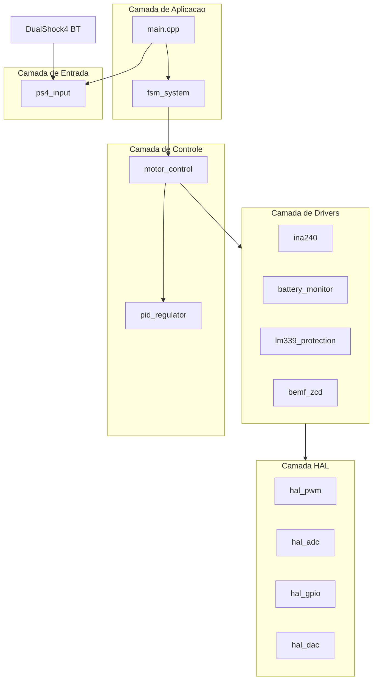
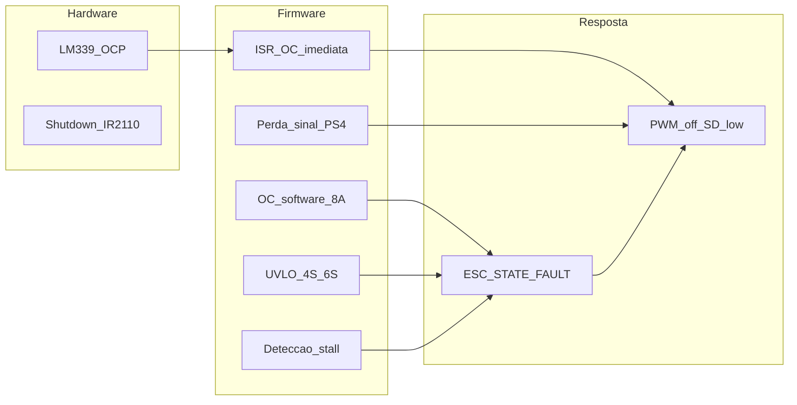

# Documentação de Programação, Firmware ESC BLDC (ESP32)

---

## Diretriz de Sincronização Contínua

> **REGRA DE MANUTENÇÃO:** Toda vez que o código C++ for alterado ou o texto em LaTeX sofrer revisões de escopo (ex.: mudança de motores, adição de sensores, alteração de limiares de proteção, inclusão de novos módulos de firmware), a IA atuante DEVE obrigatoriamente atualizar esta Documentação de Programação e a Memória do TCC (`MEMORIA_TCC.md`) em paralelo para evitar defasagem técnica entre o estado real do código e os documentos de referência do trabalho.

Esta regra é válida para toda e qualquer sessão de trabalho futura com assistência de IA neste projeto. A defasagem entre código e documentação invalida a rastreabilidade do projeto e compromete a integridade do Trabalho de Conclusão de Curso.

---

## Prefácio

Este documento descreve a arquitetura, os paradigmas de programação e o fluxo de execução do firmware de um **Controlador Eletrônico de Velocidade (ESC)** trifásico para motores **BLDC** (Brushless DC), implementado no microcontrolador **ESP32**. O texto destina-se a subsidiar o Trabalho de Conclusão de Curso (TCC) em Engenharia Elétrica, servindo como referência teórica e prática para leitores com conhecimentos básicos de C/C++ e eletrônica de potência.

O firmware controla a comutação do inversor, as malhas de corrente e velocidade, a leitura de sensores e as rotinas de proteção, utilizando uma arquitetura em camadas que separa a lógica de controle do acesso direto ao hardware. A especificação funcional de produto encontra-se em [`Docs/especificacao_esc.md`](../Docs/especificacao_esc.md); o roteamento de pinos da placa encontra-se em [`Hardware/PCB_Project/ESP32_PINMAP.md`](../Hardware/PCB_Project/ESP32_PINMAP.md).

Para consulta rápida de siglas e termos técnicos durante a leitura, utilize o [**Glossário de Termos**](GLOSSARIO_TERMOS.md) em arquivo separado — pode mantê-lo aberto em painel lateral ao lado deste documento.

O **passo a passo didático do código** está nos comentários em português dentro dos arquivos-fonte (`.c`, `.cpp`, `.h`). A [Seção 7](#7-leitura-didática-do-código-fonte) indica a ordem de leitura recomendada.

| Parâmetro | Valor |
|-----------|-------|
| MCU | ESP32-WROOM-32 (`esp32doit-devkit-v1`) |
| Framework | Arduino (PlatformIO), com drivers nativos ESP-IDF |
| PWM de comutação | 20 kHz, dead-time 500 ns (MCPWM) |
| Teto de duty cycle | 95 % (margem para recarga bootstrap IR2110) |
| Malha de controle | 1 kHz (`esp_timer`) |
| Interface de comando | DualShock 4 via Bluetooth (Bluepad32) |
| Telemetria | Serial 115200 baud, somente leitura |

---

## Índice

1. [Visão Geral da Arquitetura de Software](#1-visão-geral-da-arquitetura-de-software)
2. [Configuração do Ambiente e Dependências](#2-configuração-do-ambiente-e-dependências)
3. [Paradigmas de Programação Utilizados](#3-paradigmas-de-programação-utilizados)
4. [Estrutura de Diretórios e Módulos](#4-estrutura-de-diretórios-e-módulos)
5. [Máquina de Estados e Fluxo de Execução](#5-máquina-de-estados-e-fluxo-de-execução)
6. [Tratamento de Exceções e Segurança](#6-tratamento-de-exceções-e-segurança)
7. [Leitura didática do código-fonte](#7-leitura-didática-do-código-fonte)
8. [Referências](#8-referências)

**Consulta:** [Glossário de Termos](GLOSSARIO_TERMOS.md) — siglas e abreviações usadas neste documento.

---

## 1. Visão Geral da Arquitetura de Software

### 1.1 Motivação e princípios de projeto

O controle de um ESC impõe requisitos simultâneos de **tempo**, **segurança** e **manutenibilidade**. A comutação trifásica exige sinais PWM com dead-time definido; as malhas de corrente demandam amostragem periódica; as proteções de sobrecorrente e subtensão devem reagir em microssegundos ou milissegundos, conforme a camada.

A solução adotada consiste em uma **arquitetura em camadas** com inversão de dependência: módulos superiores dependem de abstrações; o acesso ao silício concentra-se na Camada de Abstração de Hardware (HAL). A regra de ouro é que o controlador PI (`pid_regulator`) processa apenas grandezas numéricas (`float`) referência, medição e limites sem conhecer pinos, periféricos ou topologia do inversor.

### 1.2 Modelo em camadas


```mermaid
flowchart TB
    subgraph aplicacao [Camada de Aplicacao]
        Main[main.cpp]
        FSM[fsm_system]
    end
    subgraph entrada [Camada de Entrada]
        PS4[ps4_input]
    end
    subgraph controle [Camada de Controle]
        MC[motor_control]
        PI[pid_regulator]
    end
    subgraph drivers [Camada de Drivers]
        INA[ina240]
        BAT[battery_monitor]
        LM[lm339_protection]
        ZCD[bemf_zcd]
    end
    subgraph hal [Camada HAL]
        PWM[hal_pwm]
        ADC[hal_adc]
        GPIO[hal_gpio]
        DAC[hal_dac]
    end
    PS4_BT[DualShock4 BT] --> PS4
    Main --> FSM
    Main --> PS4
    FSM --> MC
    MC --> PI
    MC --> drivers
    drivers --> hal
```

| Camada | Responsabilidade | Exemplos |
|--------|------------------|----------|
| **Aplicação** | Ciclo de vida do ESC, orquestração de entrada, telemetria | `main.cpp`, `fsm_system` |
| **Entrada** | Conversão de comandos externos em setpoints e eventos | `ps4_input` |
| **Controle** | Algoritmos de malha fechada e comutação BLDC | `motor_control`, `pid_regulator` |
| **Drivers** | Conversão entre sinais elétricos e grandezas de engenharia | `ina240`, `battery_monitor`, `lm339_protection`, `bemf_zcd` |
| **HAL** | Acesso aos periféricos do ESP32 | `hal_pwm`, `hal_adc`, `hal_gpio`, `hal_dac` |

O fluxo de dependências é **unidirecional**: aplicação → controle → drivers → HAL. Nenhum módulo da HAL ou dos drivers referencia a FSM ou o controlador PI.

### 1.3 A HAL como contrato de hardware

Os módulos `hal_*` encapsulam os periféricos do ESP32, MCPWM, ADC1, GPIO com EXTI, DAC1, expondo uma API em **C puro** independente do framework Arduino. Os pinos e limites operacionais centralizam-se em [`include/board_config.h`](include/board_config.h), única fonte de verdade para o mapeamento GPIO ↔ função.

A HAL não realiza conversões físicas: retorna milivolts no ADC, aplica duty cycle no MCPWM e manipula níveis digitais. A interpretação, corrente em ampères, tensão do barramento, limiar de sobrecorrente, compete aos drivers. Essa separação permite calibrar sensores ou substituir um amplificador de corrente sem alterar o código de comutação.

### 1.4 Híbrido Arduino e ESP-IDF

O ponto de entrada utiliza o paradigma Arduino (`setup()` / `loop()` em [`src/main.cpp`](src/main.cpp)), escolhido pela integração com **Bluepad32** para comando via Bluetooth. Entretanto, os módulos críticos de potência invocam diretamente as APIs do **ESP-IDF**, `driver/mcpwm.h`, `driver/adc.h`, `driver/gpio.h`, `driver/dac.h`, `esp_timer.h`, por oferecerem controle preciso de dead-time, atribuição de pinos e temporização de alta resolução, recursos nem sempre expostos de forma adequada pela camada Arduino de alto nível.

Essa abordagem híbrida equilibra produtividade na camada de aplicação com rigor na camada de potência. A especificação do projeto prevê, como evolução futura, migração integral para ESP-IDF com FreeRTOS; a arquitetura em camadas facilita essa transição, pois a lógica de controle já está desacoplada do `loop()` Arduino.

### 1.5 Estado de implementação

O firmware encontra-se em estágio **funcional de bancada**, com os seguintes componentes implementados:

| Componente | Status |
|------------|--------|
| HAL (MCPWM, ADC1, GPIO/EXTI, DAC1) | Implementado |
| Drivers (INA240, VBAT, LM339, BEMF opcional) | Implementado |
| FSM do ESC (`fsm_system`) | Implementado |
| Controle de motor (6-step, PI corrente/velocidade) | Implementado |
| Entrada PS4 (Bluepad32) | Implementado |
| Comutação com ZCD/BEMF | Opcional (`BOARD_ENABLE_BEMF_ZCD 0` por padrão) |
| FOC / sensores Hall | Não implementado (escopo futuro) |

Na configuração padrão, a comutação opera em **malha aberta** com rampa de frequência elétrica (5→300 Hz — motor A2212/10T 1400kV, `MOTOR_OPEN_LOOP_COMM_HZ_MAX = 300.0f`), adequada ao hardware inicial sem circuito de detecção de cruzamento por zero da BEMF.

### 1.6 Mapa de hardware (resumo)

O mapa segue o pinout **ESP32-DevKitC v4** e a PCB documentada na tese. Pinos reservados: **GPIO 12–15** (JTAG/ESP-Prog); **GPIO 6–11** (flash SPI interna).

| Sinal | GPIO | Função |
|-------|------|--------|
| AH / AL | 21 / 22 | MCPWM fase A (high/low) |
| BH / BL | 27 / 23 | MCPWM fase B |
| CH / CL | 18 / 19 | MCPWM fase C |
| SD A / B / C | 32 / 33 / 4 | Shutdown IR2110 (ativo baixo) |
| Isense A / B / C | 34 / 35 / 36 | ADC1 corrente de fase |
| VBAT | 39 | ADC1 tensão do barramento |
| Vdac Ref | 25 | DAC1 → referência OCP LM339 |
| OC Trip | 26 | Entrada digital LM339 (wired-OR, ativo baixo) |
| ZCD A / B / C | 16 / 17 / 5 | Comparadores BEMF (reserva; requer pull-up em GPIO5) |

A sequência de segurança em falha segue a ordem: ISR ou FSM detecta evento → `hal_shutdown_set_enabled(false)` (pinos SD em LOW) → `hal_pwm_disable_all()`.

---

## 2. Configuração do Ambiente e Dependências

### 2.1 Ferramentas de build

O projeto utiliza **PlatformIO** com configuração em [`platformio.ini`](platformio.ini):

| Parâmetro | Valor | Significado |
|-----------|-------|-------------|
| `platform` | `espressif32@6.10.0` | Toolchain e SDK do ESP32 (versão fixada para compatibilidade com Bluepad32) |
| `board` | `esp32doit-devkit-v1` | Placa de desenvolvimento de referência |
| `framework` | `arduino` | Ciclo `setup()`/`loop()` com core Arduino-ESP32 |
| `build_flags` | `-I include` | Expõe `board_config.h` a todas as bibliotecas em `lib/` |
| `monitor_speed` | `115200` | Taxa da porta serial de telemetria |
| `board_build.sdkconfig.defaults` | `sdkconfig.defaults` | Opções Kconfig do ESP-IDF embutidas no build |

A compilação executa-se com `pio run`. O **Library Dependency Finder (LDF)** do PlatformIO compila automaticamente cada pasta em `lib/` como biblioteca estática e realiza o link no firmware final, dispensando declaração explícita de dependências locais no `platformio.ini`.

### 2.2 Framework Arduino e core Bluepad32

O framework **Arduino** fornece o ambiente de execução principal (`Serial`, `millis()`, `delay()`), adequado à camada de aplicação. A interface de comando via **DualShock 4** requer **Bluetooth Classic**, suportado pela biblioteca **Bluepad32**, integrada por meio de um **core Arduino customizado**:

```ini
platform_packages =
    framework-arduinoespressif32@https://github.com/maxgerhardt/pio-framework-bluepad32/archive/refs/heads/main.zip
```

Bluepad32 **não** consta em `lib_deps`: substitui o pacote padrão `framework-arduinoespressif32`, embutindo a stack Bluetooth no core. Essa abordagem garante que o perfil HID do controle PS4 e o stack BT coexistam com o firmware do ESC no mesmo binário.

O arquivo [`sdkconfig.defaults`](sdkconfig.defaults) desabilita o console interativo do Bluepad32 (`CONFIG_BLUEPAD32_USB_CONSOLE_ENABLE=n`), pois este conflita com o uso de `Serial` para telemetria, ambos competiriam pela mesma UART.

### 2.3 Bibliotecas e dependências

| Origem | Componente | Papel |
|--------|------------|-------|
| Core customizado | Bluepad32 | Pareamento e leitura do DualShock 4 |
| ESP-IDF (via Arduino) | `driver/mcpwm`, `driver/adc`, `driver/gpio`, `driver/dac` | Periféricos de potência e aquisição |
| ESP-IDF (via Arduino) | `esp_timer` | Temporizador periódico da malha de controle |
| Repositório local | `lib/control/` | PI e controle de motor |
| Repositório local | `lib/hal/` | Abstração de hardware |
| Repositório local | `lib/drivers/` | Sensores e proteção analógica |
| Repositório local | `lib/input/` | Wrapper do gamepad |
| Repositório local | `src/` | Aplicação e FSM |

Não há dependências externas além do core PlatformIO/Arduino. Toda a lógica proprietária do ESC reside no repositório.

### 2.4 Periféricos do ESP32 e justificativa técnica

#### 2.4.1 MCPWM (Motor Control PWM)

O módulo **MCPWM** do ESP32 gera até seis saídas PWM sincronizadas, organizadas em três timers com dois canais complementares cada. O firmware utiliza MCPWM em [`lib/hal/hal_pwm.c`](lib/hal/hal_pwm.c) em detrimento do periférico **LEDC** pelos seguintes motivos:

- Suporte nativo a **dead-time** programável entre pernas high-side e low-side (500 ns, adequado aos drivers IR2110).
- Modos de operação **complementares** (AH/AL, BH/BL, CH/CL) com controle independente por fase.
- Frequência de 20 kHz configurável com resolução adequada para minimizar perdas de comutação audíveis e permitir filtragem RC nos sensores BEMF.

A API expõe três modos de condução por fase: **OFF** (ambas as pernas desligadas), **SOURCE** (PWM na perna high-side, low-side como sink complementar) e **SINK** (low-side condutora contínua). Esses modos mapeiam diretamente a tabela de comutação **6-step** trapezoidal.

#### 2.4.2 ADC1 (Analog-to-Digital Converter)

As leituras de corrente de fase (INA240) e de tensão do barramento utilizam o **ADC1** em [`lib/hal/hal_adc.c`](lib/hal/hal_adc.c), canais associados aos GPIO **34, 35, 36 e 39** (pinos input-only). A escolha do ADC1 em detrimento do ADC2 fundamenta-se em uma restrição documentada do ESP32: o **ADC2** compartilha recursos com o subsistema **Wi-Fi/Bluetooth** e torna-se indisponível ou não confiável quando o rádio está ativo. Como o firmware mantém Bluetooth ativo para o controle PS4, o ADC1 é o único conversor seguro para aquisição contínua.

Configuração: resolução de 12 bits, atenuação de 12 dB (faixa até ~3,3 V). A leitura é **síncrona** via `adc1_get_raw()`, sem DMA —, suficiente para a taxa de 1 kHz da malha de controle.

#### 2.4.3 DAC1 (Digital-to-Analog Converter)

O **DAC1** no GPIO 25 gera a tensão de referência **Vdac** para os comparadores LM339 de sobrecorrente (OCP). A saída analógica permite ajustar o limiar de corrente de hardware sem resistor fixo, programando a tensão conforme a equação de calibração (Seção 6). O módulo [`lib/hal/hal_dac.c`](lib/hal/hal_dac.c) encapsula essa funcionalidade.

#### 2.4.4 GPIO e EXTI (External Interrupt)

O módulo [`lib/hal/hal_gpio.c`](lib/hal/hal_gpio.c) configura:

- **Saídas SD** (GPIO 32, 33, 4): sinais de *shutdown* dos IR2110, ativos em nível baixo no CI.
- **Entrada OC Trip** (GPIO 26): interrupção externa na borda de **descida** (trip ativo baixo, pull-up interno). O handler ISR executa desarme imediato do PWM e do shutdown.

#### 2.4.5 esp_timer (temporizador de alta resolução)

A malha de controle de corrente, comutação e verificação de stall executa-se a **1 kHz** por meio de um temporizador periódico `esp_timer` em [`lib/control/motor_control.c`](lib/control/motor_control.c), configurado com `dispatch_method = ESP_TIMER_TASK`. O callback é despachado para uma **task FreeRTOS**, não para uma ISR de hardware, permitindo chamadas ao ADC, ao PI e à lógica de comutação, operações inviáveis em contexto de interrupção.

---

## 3. Paradigmas de Programação Utilizados

### 3.1 Coexistência de C e C++

O firmware combina **C** e **C++** de forma deliberada. Os módulos de controle, drivers, HAL e FSM encontram-se em **C** (`.c`), enquanto a aplicação (`main.cpp`) e a entrada PS4 (`ps4_input.cpp`) utilizam **C++**.

Os headers exportados para ambas as linguagens empregam o qualificador `extern "C"`:

```6:8:Firmware/src/fsm_system.h
#ifdef __cplusplus
extern "C" {
#endif
```

Sem esse bloco, o compilador C++ aplicaria *name mangling* aos símbolos, decorando os nomes de função conforme tipos de parâmetro —, impedindo o linker de resolver chamadas como `fsm_system_init()` a partir de `main.cpp`. O `extern "C"` garante convenção de linkage C e compatibilidade binária entre módulos.

> **Leitura no código:** o cabeçalho de [`src/fsm_system.h`](src/fsm_system.h) documenta o propósito do bloco `extern "C"`.

### 3.2 Gerenciamento de memória

Em sistemas embarcados de potência, a alocação dinâmica (`malloc` / `free`) introduz **não determinismo**, o tempo de alocação varia conforme o estado do heap, e risco de **fragmentação** em execução prolongada. O firmware adota **alocação estática exclusiva**:

- Variáveis de estado por módulo declaradas `static` no escopo do arquivo (ex.: `s_state` em `fsm_system.c`, `s_current_pi` em `motor_control.c`).
- Instâncias de controladores PI como estruturas globais estáticas, não ponteiros para memória alocada em runtime.
- O handle do temporizador `esp_timer_handle_t` criado uma vez em `motor_control_init()`.

Os **ponteiros** aparecem como *handles* para estruturas já existentes, por exemplo, `pi_compute(pi_controller_t *pi, float setpoint, float measurement)`, sem transferência de propriedade de memória. O parâmetro `pi` referencia uma instância estática; a verificação `if (pi == NULL)` constitui proteção defensiva que retorna saída zero em caso de erro de chamada.

### 3.3 Rotinas de tempo real e concorrência

O firmware opera com **duas cadências temporais** distintas:

| Cadência | Contexto | Período | Responsabilidades |
|----------|----------|---------|-------------------|
| **Loop principal** | `loop()` Arduino | ~20 ms (PS4), 500 ms (telemetria) | Polling do gamepad, UVLO debounce, `fsm_system_tick()`, impressão serial |
| **Malha de controle** | `esp_timer` → task FreeRTOS | 1 ms (1 kHz) | PI, comutação 6-step, leitura de corrente, detecção de stall |

A malha de controle **não** reside no `loop()` porque este acumula jitter variável, operações de Bluetooth, `Serial.printf()` e `battery_monitor_tick()`, incompatível com a integração numérica do termo integral do PI e com a temporização da comutação trapezoidal. O `esp_timer` garante período estável de 1 ms, alinhado ao campo `dt` do controlador PI.

O FreeRTOS, subjacente ao framework Arduino no ESP32, permite que a ISR de sobrecorrente (microssegundos) coexistam com a task do temporizador (milissegundos) e com o loop principal, desde que se respeitem as regras de reentrância e sincronização.

### 3.4 Interrupções de hardware (ISRs)

Duas fontes utilizam interrupções: o **OC Trip** do LM339 ([`hal_gpio.c`](lib/hal/hal_gpio.c)) e, opcionalmente, os comparadores **BEMF ZCD** ([`bemf_zcd.c`](lib/drivers/bemf_zcd.c)). Os handlers são marcados com `IRAM_ATTR`, instruindo o compilador a colocar o código na RAM interna de instrução, evitando falhas caso a flash esteja ocupada por operações de cache durante a interrupção.

Adota-se o padrão **deferred processing** (processamento diferido):

1. A ISR executa apenas o mínimo necessário: desarme de PWM, shutdown dos drivers, sinalização por flag.
2. Uma flag `volatile bool` (`s_fault_pending`, `s_fault_latched`, `s_sw_fault_pending`) comunica o evento ao código de fundo.
3. A FSM em `fsm_system_tick()` consome a flag e executa `enter_fault_state()` com operações mais elaboradas.

Restrições **ISR-safe**: proibido chamar `Serial`, alocar memória, bloquear mutexes ou executar operações de longa duração. A ISR de OCP hardware desarma o PWM imediatamente; a transição formal para `ESC_STATE_FAULT` ocorre na thread principal.

O qualificador **`volatile`** nas flags garante que o compilador não otimize leituras repetidas da variável, essencial quando um campo é escrito na ISR e lido no loop principal sem barreira de sincronização formal.

### 3.5 Máquinas de estado e tabelas de comutação

Em vez de combinações de flags booleanas (`motor_on`, `fault`, `armed`), o firmware emprega **máquinas de estados finitas (FSM)** com conjunto de estados enumerado e transições explícitas. Esse paradigma oferece:

- **Segurança**: o PWM só arma em `ESC_STATE_IDLE`; em `ESC_STATE_FAULT` a operação permanece bloqueada até *clear* explícito.
- **Rastreabilidade**: o estado atual aparece na telemetria serial (`[IDLE]`, `[RUNNING]`, `[FAULT]`).
- **Manutenibilidade**: novas condições de transição centralizam-se na FSM, não espalhadas pela aplicação.

A comutação BLDC 6-step implementa-se por uma **tabela estática** em `motor_control.c` que mapeia o passo (0–5) e o sentido (CW/CCW) aos modos de condução das três fases (SOURCE/SINK/OFF). Essa tabela materializa a sequência trapezoidal de energização do estator, determinística e independente de alocação dinâmica.

### 3.6 Configuração em tempo de compilação

Parâmetros críticos definem-se em [`board_config.h`](include/board_config.h) e em macros de seleção de modo:

| Macro | Efeito |
|-------|--------|
| `MOTOR_CONTROL_USE_SPEED_MODE` | Seleção entre malha de corrente (0) e malha de velocidade (1) |
| `BOARD_ENABLE_BEMF_ZCD` | Habilita ou desabilita comutação por cruzamento por zero da BEMF |
| `MOTOR_SOFTWARE_OC_AMPS` | Limiar de sobrecorrente em software e referência do OCP hardware |
| `PWM_FREQUENCY_HZ`, `DEAD_TIME_NS` | Parâmetros imutáveis do MCPWM |
| `MOTOR_POLE_PAIRS` | Número de pares de polos do motor de teste; governa a relação \(f_e = p \cdot n/60\) entre frequência elétrica de comutação e velocidade mecânica do rotor. **Motor A2212/10T 1400kV (14 polos magnéticos):** `7U` |
| `MOTOR_OPEN_LOOP_COMM_HZ_MAX` | Frequência elétrica máxima da rampa em malha aberta; limita a comutação forçada para prevenir perda de sincronismo magnético (stall/engasgo) durante a aceleração inicial, garantindo FCEM suficiente para handover ao ZCD. **Motor A2212/10T 1400kV:** `300.0f` Hz → teto de ≈ 2571 RPM mecânicos |

A configuração em tempo de compilação sacrifica flexibilidade em runtime em favor de **determinismo** e **otimização**, constantes podem ser inlined pelo compilador, e o binário resultante contém apenas os caminhos de código necessários.

### 3.7 Controlador PI proporcional-integral

O módulo [`pid_regulator`](lib/control/pid_regulator.c) implementa um controlador **PI** (sem termo derivativo) com **anti-windup** por limitação (*clamping*) do integrador. A estrutura de estado:

```8:17:Firmware/lib/control/pid_regulator.h
typedef struct {
    float kp;
    float ki;
    float dt;             // [s]
    float integral_term;  // integrator state
    float out_max;        // output saturation max
    float out_min;        // output saturation min
    float integ_max;      // anti-windup clamp max
    float integ_min;      // anti-windup clamp min
} pi_controller_t;
```

**Equações em tempo discreto** (a cada amostra \(k\), com período \(\Delta t\)):

\[
e_k = r - y_k
\]

\[
P_k = K_p \cdot e_k
\]

\[
I_k = \mathrm{clamp}\big(I_{k-1} + K_i \cdot e_k \cdot \Delta t,\; I_{min},\, I_{max}\big)
\]

\[
u_k = \mathrm{clamp}(P_k + I_k,\; u_{min},\, u_{max})
\]

Onde \(r\) é a referência (*setpoint*), \(y_k\) a medição e \(u_k\) a saída do controlador, duty cycle (%) ou corrente de comando (A), conforme a malha.

O **anti-windup** impede que o integrador acumule valor enquanto a saída está saturada (ex.: duty em 95 %). Sem essa limitação, ao liberar a saturação o sistema apresentaria *overshoot* e resposta lenta. O módulo é **agnóstico de hardware**: não inclui `board_config.h` nem acessa periféricos.

> **Leitura no código:** [`lib/control/pid_regulator.c`](lib/control/pid_regulator.c) contém comentário **linha a linha** em `pi_compute()`; [`lib/control/pid_regulator.h`](lib/control/pid_regulator.h) documenta cada campo de `pi_controller_t`.

---

## 4. Estrutura de Diretórios e Módulos

### 4.1 Árvore de diretórios

```text
Firmware/
├── DOCUMENTACAO_PROGRAMACAO.md
├── GLOSSARIO_TERMOS.md           # Siglas e termos técnicos (consulta paralela)
├── platformio.ini                # Fontes .c/.cpp/.h com comentários didáticos inline
├── sdkconfig.defaults
├── include/
│   └── board_config.h            # Pinos, limites e macros de configuração
├── src/
│   ├── main.cpp                  # Aplicação: setup/loop, PS4, telemetria
│   ├── fsm_system.h / .c         # FSM do ESC
├── lib/
│   ├── input/
│   │   └── ps4_input.h / .cpp    # DualShock 4 via Bluepad32
│   ├── control/
│   │   ├── pid_regulator.h / .c  # Controlador PI
│   │   └── motor_control.h / .c  # Comutação 6-step e malhas de controle
│   ├── hal/
│   │   ├── hal_pwm.h / .c        # MCPWM
│   │   ├── hal_adc.h / .c        # ADC1
│   │   ├── hal_gpio.h / .c       # GPIO, EXTI, shutdown
│   │   └── hal_dac.h / .c        # DAC1 (Vdac OCP)
│   └── drivers/
│       ├── ina240_current_sensors.h / .c
│       ├── battery_monitor.h / .c
│       ├── lm339_protection.h / .c
│       └── bemf_zcd.h / .c
└── test/                         # Testes automatizados (futuro)
```

### 4.2 Padrão de comunicação entre módulos

```text
┌─────────────────────────────────────────────────────────────┐
│  main.cpp                                                    │
│    ps4_input ──► apply_ps4_to_esc() ──► fsm_system          │
│                      │                      │                │
│                      └──── motor_control_set_target_*()      │
└─────────────────────────────────────────────────────────────┘
                              │
┌─────────────────────────────▼───────────────────────────────┐
│  fsm_system.c                                                │
│    init: hal_adc/gpio → lm339 → hal_pwm → ina240 → battery   │
│          → bemf_zcd (opcional) → motor_control_init          │
│    arm/disarm: hal_shutdown, hal_pwm, motor_control_on_*     │
│    tick: UVLO, LM339, falhas de software                     │
└─────────────────────────────────────────────────────────────┘
         │                    │                    │
         ▼                    ▼                    ▼
┌──────────────┐    ┌──────────────────┐    ┌──────────────┐
│ lm339_prot   │    │ motor_control    │    │ battery_mon  │
│  → hal_dac   │    │  → hal_pwm       │    │  → hal_adc   │
│  → hal_gpio  │    │  → ina240        │    └──────────────┘
└──────────────┘    │  → pid_regulator │
                    │  → bemf_zcd      │
                    └──────────────────┘
```

**Convenções transversais:**

- APIs públicas em C com `extern "C"` nos headers.
- `board_config.h` incluído onde necessário; o PI permanece isolado.
- Fluxo de dados descendente: setpoints descem; medições ascendem.
- Proteções de hardware notificam por ISR → flag → FSM; proteções de software sinalizam em `motor_control_tick()` → FSM.

### 4.3 Módulos por camada

#### 4.3.1 Aplicação

**[`src/main.cpp`](src/main.cpp)**, Ponto de entrada Arduino. Responsabilidades: inicialização serial; chamada a `ps4_input_init()` e `fsm_system_init()`; loop com `battery_monitor_tick()`, `fsm_system_tick()`, polling do PS4 a cada `PS4_INPUT_POLL_MS` (20 ms) e telemetria a cada 500 ms. A função `apply_ps4_to_esc()` traduz o estado do gamepad em requisições de arm/disarm, setpoints e troca de sentido. Após cada poll do PS4, `ps4_input_set_led_status()` atualiza a lightbar do controle conforme conexão e estado da FSM.

**[`src/fsm_system.c`](src/fsm_system.c)**, FSM de alto nível do ESC. Estados: `INIT`, `IDLE`, `RUNNING`, `FAULT`. Orquestra a sequência de inicialização dos periféricos e drivers, autoriza ou bloqueia a operação do motor e centraliza a resposta a falhas. Não executa comutação nem cálculo de PI.

#### 4.3.2 Entrada

**[`lib/input/ps4_input.cpp`](lib/input/ps4_input.cpp)**, Encapsula a API **Bluepad32** (`BP32.setup`, `BP32.update`). Lê o gatilho **R2** via `ControllerPtr::throttle()` (não `brake()`, que corresponde ao L2). Expõe `ps4_input_state_t` com campos: `connected`, `r2_raw`, `target_amps`, `target_rpm`, `direction`, `options_pressed`, `circle_pressed`. Feedback visual da lightbar via `ps4_input_set_led_status(ps4_led_status_t)`: um valor por estado da FSM (`PS4_LED_INIT`, `PS4_LED_IDLE`, `PS4_LED_RUNNING`, `PS4_LED_FAULT`) ou `PS4_LED_OFF` (desconectado, sem alteração forçada). **Não** referencia `fsm_system`; `main.cpp` traduz `esc_state_t` → `ps4_led_status_t`.

#### 4.3.3 Controle

**[`lib/control/pid_regulator.c`](lib/control/pid_regulator.c)**, Implementa `pi_compute()`: erro, termo proporcional, integração Euler com clamping, saturação da saída. Uma instância por malha; no ESC existem `s_current_pi` (corrente) e `s_speed_pi` (velocidade, modo SPEED).

**[`lib/control/motor_control.c`](lib/control/motor_control.c)**, Núcleo do controle de motor. Integra:

- Temporizador `esp_timer` a 1 kHz.
- Malha de corrente: leitura INA240 → PI → duty cycle.
- Malha de velocidade (opcional): PI de velocidade em cascata → comando de corrente → PI de corrente.
- Comutação 6-step trapezoidal (malha aberta ou ZCD).
- Sequência de partida: ALIGN → RUN / RUN_OPEN → RUN_SPEED.
- Detecção de stall e sobrecorrente em software.

API principal: `motor_control_init()`, `motor_control_on_arm()` / `on_disarm()`, `motor_control_tick()`, `motor_control_set_target_amps()` / `set_target_rpm()`, `motor_control_set_direction()`.

#### 4.3.4 Drivers

| Módulo | Função | API principal |
|--------|--------|---------------|
| **`ina240_current_sensors`** | Converte mV do ADC em ampères: \((V_{ADC} - V_{offset}) / (20 \times 0{,}001)\) | `ina240_init()`, `ina240_calibrate_offset()`, `ina240_read_amps()` |
| **`battery_monitor`** | Escala divisor 39 kΩ/4,7 kΩ para tensão do barramento; UVLO com histerese | `battery_monitor_tick()`, `battery_monitor_read_volts()`, `battery_monitor_uvlo_active()` |
| **`lm339_protection`** | Programa Vdac; arma EXTI no OC Trip; latch de falha | `lm339_protection_init()`, `lm339_protection_arm()`, `lm339_protection_fault_active()` |
| **`bemf_zcd`** | EXTI nos comparadores BEMF; valida fase flutuante por passo | `bemf_zcd_init()`, `bemf_zcd_consume_edge()` (opcional) |

#### 4.3.5 HAL

| Módulo | Função | API principal |
|--------|--------|---------------|
| **`hal_pwm`** | MCPWM 6 canais, dead-time, modos OFF/SOURCE/SINK | `hal_pwm_init()`, `hal_pwm_set_armed()`, `hal_pwm_set_phase_conduction()`, `hal_pwm_disable_all()` |
| **`hal_adc`** | ADC1, leitura em mV | `hal_adc_init()`, `hal_adc_read_mv()` |
| **`hal_gpio`** | SD IR2110; EXTI OC Trip | `hal_shutdown_set_enabled()`, `hal_gpio_attach_oc_trip_isr()`, `hal_gpio_oc_trip_asserted()` |
| **`hal_dac`** | DAC1 em GPIO 25 | `hal_dac_init()`, `hal_dac_set_voltage()` |

#### 4.3.6 Configuração central

**[`include/board_config.h`](include/board_config.h)**, Centraliza pinos, frequências, ganhos PI padrão, limiares de proteção, parâmetros de partida e macros de modo. Toda alteração de hardware ou limite operacional deve refletir-se neste arquivo.

---

## 5. Máquina de Estados e Fluxo de Execução

### 5.1 FSM do ESC (`fsm_system`)

A FSM de alto nível responde à pergunta: *em que modo operacional o controlador se encontra?*, distinta de *como comutar o motor* (`motor_control`) ou *como ler sensores* (drivers).

| Estado | Significado |
|--------|-------------|
| `ESC_STATE_INIT` | Estado transitório no boot; executa `fsm_system_init()` |
| `ESC_STATE_IDLE` | Pronto para operação; PWM desarmado; aguarda comando de arm |
| `ESC_STATE_RUNNING` | PWM armado; `motor_control` ativo |
| `ESC_STATE_FAULT` | Falha detectada; PWM desarmado; requer *clear* para retornar |

**Diagrama de transições:**

```text
INIT ──(init OK)──► IDLE ──(arm)──► RUNNING ──(disarm)──► IDLE
                      │                │
                      └──── falhas ────┴────► FAULT ──(clear)──► IDLE
```

**Sequência de inicialização** (`fsm_system_init()`):

1. `hal_adc_init()`, configura ADC1.
2. `hal_gpio_init()`, saídas SD em LOW; entrada OC Trip com pull-up.
3. `lm339_protection_init()`, DAC1 com tensão de referência OCP.
4. `hal_pwm_init()`, MCPWM 20 kHz; PWM desarmado.
5. `ina240_calibrate_offset(64)`, média de offset com corrente zero.
6. `battery_monitor_init()`, detecção automática de células LiPo (4S–6S).
7. `bemf_zcd_init()`, somente se `BOARD_ENABLE_BEMF_ZCD == 1`.
8. `lm339_protection_arm()`, habilita ISR no OC Trip.
9. `motor_control_init()`, cria temporizador 1 kHz.

Falha em qualquer etapa invoca `enter_fault_state()` e o ESC permanece em `FAULT`.

**API de transição:**

| Função | Transição | Condições |
|--------|-----------|-----------|
| `fsm_system_request_arm()` | IDLE → RUNNING | Sem UVLO; sem falha LM339 ativa |
| `fsm_system_request_disarm()` | RUNNING → IDLE |, |
| `fsm_system_clear_fault()` | FAULT → IDLE | Hardware OC liberado; sem UVLO |
| `fsm_system_tick()` |, | Processa flags de falha, UVLO, OC |

Ao armar: `hal_shutdown_set_enabled(true)` → `hal_pwm_set_armed(true)` → `motor_control_on_arm()`. Ao desarmar, a ordem inverte-se e o shutdown retorna a LOW.

### 5.2 Sub-FSM de partida do motor (`motor_control`)

Dentro de `ESC_STATE_RUNNING`, o módulo `motor_control` executa uma **sequência de partida** independente, crítica em operação *sensorless* sem BEMF suficiente na velocidade zero.

#### 5.2.1 Fundamento: por que alinhar antes de comutar?

Sem detecção de posição do rotor, a comutação imediata em malha aberta provoca vibração, ausência de rotação ou perda de sincronismo (*stall*). O estágio **ALIGN** aplica um vetor estático fixo no estator (passo 6-step 0 para CW ou passo 3 para CCW) com duty de 12 % por 500 ms, puxando o rotor para uma posição angular conhecida \(\theta_0\) antes de iniciar a sequência trapezoidal.

#### 5.2.2 Fases de partida

| Fase | Modo CURRENT | Modo SPEED |
|------|--------------|------------|
| `MOTOR_START_IDLE` | Referência zero; sem torque | Idem |
| `MOTOR_START_ALIGN` | Alinhamento estático 500 ms | Idem |
| `MOTOR_START_RUN` | PI corrente + rampa OPEN |, |
| `MOTOR_START_RUN_OPEN` |, | Rampa OPEN; corrente fixa 0,5 A |
| `MOTOR_START_RUN_SPEED` |, | PI velocidade + feedforward \(f_{el}\) |

**Modo CURRENT** (`MOTOR_CONTROL_USE_SPEED_MODE 0`):

```text
IDLE ──► ALIGN (500 ms) ──► RUN (PI + rampa f_el 5→300 Hz)
```

**Modo SPEED** (padrão, `MOTOR_CONTROL_USE_SPEED_MODE 1`):

```text
IDLE ──► ALIGN ──► RUN_OPEN ──► RUN_SPEED
                      │              ▲
                      └─ RPM_med ≥ 600 RPM por 200 ms
```

Em `RUN_SPEED`, se \(|RPM_{med} - RPM_{cmd}| > 200\) por 300 ms, o sistema retorna a `RUN_OPEN` e reinicia a rampa.

**Relação entre velocidade mecânica e frequência elétrica** (motor A2212/10T 1400kV — 7 pares de polos):

\[
f_{el} = \frac{RPM \times p}{60}, \quad RPM = f_{el} \times \frac{60}{p} = f_{el} \times \frac{60}{7}
\]

Com \(p = 7\) (motor A2212/10T — 14 polos magnéticos, 7 pares): `MOTOR_OPEN_LOOP_COMM_HZ_MAX = 300.0f` Hz corresponde a ≈ **2571 RPM** mecânicos (`MOTOR_SPEED_MAX_RPM`).

#### 5.2.3 Comutação: malha aberta e ZCD

Com `BOARD_ENABLE_BEMF_ZCD 0` (padrão), a comutação permanece em **malha aberta** (`MOTOR_COMM_OPEN_LOOP`): os passos 6-step avançam por temporizador, com rampa de \(f_{el}\) de 5 Hz até **300 Hz** (`MOTOR_OPEN_LOOP_COMM_HZ_MAX = 300.0f` — motor A2212/10T 1400kV) (+1,5 Hz por passo comutado).

Com `BOARD_ENABLE_BEMF_ZCD 1`, após velocidade e duty suficientes, o firmware pode realizar *handover* para **malha fechada por ZCD** (`MOTOR_COMM_ZCD_CLOSED`): comparadores LM339 detectam o cruzamento por zero da BEMF na fase flutuante; após flanco válido, a comutação agenda-se com atraso de 30° elétricos (`BEMF_COMM_DELAY_DEG_ELEC`). O hardware de ZCD requer neutro virtual, divisores RC e comparadores dedicados conforme descrito na tese.

**Nota sobre FOC:** O *Field-Oriented Control* não depende dos pinos ZCD (estes servem à comutação trapezoidal). FOC exige estimativa contínua do ângulo do rotor, por sensores Hall/encoder ou observador *sensorless* em software, e malha de controle substancialmente mais rápida que 1 kHz. A arquitetura em camadas atual não impede essa evolução, mas o `motor_control` v1 implementa exclusivamente comutação 6-step.

### 5.3 Fluxo de execução temporal

```mermaid
sequenceDiagram
    participant Loop as Arduino_loop
    participant FSM as fsm_system_tick
    participant PS4 as ps4_input_update
    participant Timer as esp_timer_1kHz
    participant MC as motor_control_tick
    participant ISR as OC_Trip_ISR

    Loop->>FSM: cada iteracao
    Loop->>PS4: a cada 20ms
    PS4->>FSM: arm_disarm
    Timer->>MC: 1000Hz
    MC->>MC: PI_comutacao_stall_check
    ISR->>FSM: s_fault_pending
    FSM->>FSM: enter_fault_state
```

O `motor_control_tick()` executa somente quando `s_active == true`, definido por `motor_control_on_arm()` na transição para `RUNNING`. Fora desse estado, o temporizador continua ativo, mas a função retorna sem atuar no PWM.

### 5.4 Interface de comando (DualShock 4)

O controle opera exclusivamente via **Bluetooth**; a porta serial (115200 baud) emite apenas telemetria de diagnóstico, sem comandos interativos.

| Entrada | Ação |
|---------|------|
| R2 (gatilho direito, `throttle()`) > `PS4_R2_ARM_THRESHOLD` (10) | Arma o ESC; mapeia referência de corrente (0–5 A) ou RPM (0–2571) |
| R2 ≤ limiar | Desarma; referência zero; permite troca de sentido |
| Circle (○) solto / pressionado | Sentido CW / CCW (troca efetiva somente com R2 solto) |
| Options (Start) | *Clear fault* em `FAULT`; exige soltar R2 antes de re-armar |
| Desconexão Bluetooth | Desarme imediato |

O firmware lê o **R2 físico** (gatilho direito) através de `throttle()` na API Bluepad32. O L2 (`brake()`) não participa do controle do ESC.

**Feedback da lightbar** (DualShock 4, via `setColorLED`), uma cor por estado da FSM:

| Estado FSM | `ps4_led_status_t` | Cor RGB | Significado |
|------------|-------------------|---------|-------------|
| Desconectado | `PS4_LED_OFF` |, | Sem comando de cor (controle retorna ao padrão) |
| `INIT` | `PS4_LED_INIT` | (255, 165, 0) âmbar | Inicialização de periféricos |
| `IDLE` | `PS4_LED_IDLE` | (0, 120, 255) azul | Pronto, aguardando R2 para armar |
| `RUNNING` | `PS4_LED_RUNNING` | (0, 255, 0) verde | Motor armado / em operação |
| `FAULT` | `PS4_LED_FAULT` | (255, 0, 0) vermelho | Falha ativa, requer clear fault |

A lightbar é atualizada na conexão (azul `IDLE` por padrão) e no poll de 20 ms quando o estado muda.

**Mapeamento do gatilho R2** (após zona morta):

- Modo CURRENT: \(I_{cmd} = \dfrac{R2_{eff}}{255 - threshold} \times 5\) A
- Modo SPEED: \(RPM_{cmd} = \dfrac{R2_{eff}}{255 - threshold} \times 2571\) RPM

#### 5.4.1 Comportamento da troca de sentido (Circle) com motor em operação

A troca de sentido via Circle (○) é **intencionalmente bloqueada** enquanto o R2 estiver acima do limiar de arm. Isso significa que pressionar Circle com o motor em qualquer velocidade (incluindo velocidade máxima) **não produz efeito**: o sentido permanece inalterado e nenhuma falha é gerada.

O bloqueio ocorre em `motor_control_set_direction()` (`motor_control.c`):

```c
bool motor_control_set_direction(int8_t direction)
{
    if (s_active && motor_control_torque_command_active()) {
        return false;   // rejeição silenciosa — main.cpp não verifica o retorno
    }
    s_comm_direction = (direction >= 0) ? 1 : -1;
    return true;
}
```

A condição de bloqueio é `s_active == true` **e** comando de torque ativo (no modo SPEED: `s_target_rpm_cmd > 0`; no modo CURRENT: `s_target_amps_cmd > 0`).

**Procedimento correto para inversão de sentido:**

| Passo | Ação do operador | Resposta do firmware |
|-------|-----------------|----------------------|
| 1 | Soltar R2 (≤ 10) | Desarme; PWM cortado; `s_measured_rpm` zerado |
| 2 | Pressionar Circle | `s_comm_direction` alterado (CW ↔ CCW) |
| 3 | Pressionar R2 | Re-arme; nova sequência ALIGN → malha aberta → PI |

Após o corte do PWM (passo 1), o rotor **desacelera por inércia** (coast-down) — não há frenagem ativa. O novo arm (passo 3) inicia o ALIGN independentemente do RPM residual mecânico; por isso, aguardar a parada completa antes de pressionar R2 novamente é recomendável em velocidades elevadas (ver Seção 6.10).

### 5.5 Modos de controle: CURRENT e SPEED

A seleção do modo ocorre em **tempo de compilação** via `MOTOR_CONTROL_USE_SPEED_MODE` em `board_config.h` (`1` = SPEED, padrão do projeto; `0` = CURRENT).

| Aspecto | Modo **CURRENT** | Modo **SPEED** |
|---------|------------------|----------------|
| O que o R2 define | Corrente alvo (0–5 A) | RPM alvo (0–2571) |
| Malhas de controle | 1 PI (corrente → duty) | 2 PIs em cascata (RPM → corrente → duty) |
| Intuição operacional | Comanda **esforço/torque** (corrente ≈ torque) | Comanda **velocidade de rotação** |
| Velocidade resultante | Consequência da corrente + carga mecânica | Regulada ativamente (dentro dos limites) |
| Uso típico | Bancada, limitar esforço elétrico | Operação “tipo ESC”, RPM previsível |

**Nomenclatura:** o modo CURRENT também pode ser chamado de **modo corrente** ou **modo torque**; o modo SPEED corresponde ao **modo velocidade**. A expressão “modo carga” é imprecisa — o firmware não regula a carga mecânica, apenas a corrente elétrica, embora a velocidade final varie conforme a carga nesse modo.

#### 5.5.1 Modo CURRENT — controle somente de corrente

O gatilho R2 define diretamente a corrente alvo; um único PI (`s_current_pi`) regula a corrente de fase máxima medida pelo INA240 → duty cycle. **Não há PI de velocidade** nem referência de RPM a partir do R2.

```text
R2 ──► I_cmd ──► PI_corrente ──► duty % ──► motor
                    ▲
               I_med (INA240)
```

**Partida:** `ALIGN` (500 ms) → `MOTOR_START_RUN` — PI de corrente ativo com rampa de comutação em malha aberta (5→300 Hz elétricos, motor A2212/10T — `MOTOR_POLE_PAIRS = 7U`, `MOTOR_OPEN_LOOP_COMM_HZ_MAX = 300.0f`).

**Comportamento em regime:**

- \(I_{med} \approx I_{cmd}\) (regulado pelo PI de corrente).
- A **velocidade mecânica não é comandada**; depende da carga, do atrito e da taxa de comutação em malha aberta (teto ≈ 2571 RPM mecânicos com 7 pares de polos — motor A2212/10T — e `MOTOR_OPEN_LOOP_COMM_HZ_MAX` = 300 Hz).
- **A vazio com R2 alto:** a corrente segue o setpoint, mas o RPM pode subir até o teto da rampa OPEN — **não** implica velocidade máxima automática com qualquer valor de R2; com corrente baixa o rotor pode não acompanhar a rampa (stall ou RPM baixo).
- **Com carga:** a corrente permanece próxima de \(I_{cmd}\); o RPM **cai** conforme a carga aumenta.

#### 5.5.2 Modo SPEED — controle de velocidade em cascata

Estrutura **cascata** com feedforward de comutação:

```text
R2 ──► RPM_cmd (slew) ──┬─► feedforward: f_el = RPM × p / 60  → taxa 6-step
                        │
                        └─► PI_velocidade ──► I_cmd ──► PI_corrente ──► duty %
                                ▲                              │
                                └── RPM_med (estimado)           └── I_med (INA240)
```

**Partida:** `ALIGN` → `RUN_OPEN` (corrente fixa 0,5 A, rampa OPEN) → `RUN_SPEED` (handover quando RPM_med ≥ 600 por 200 ms).

**Mecanismo do controle de velocidade** (fase `RUN_SPEED`, em `motor_control_tick()`):

1. `s_open_loop_comm_hz = rpm_to_f_el_hz(s_target_rpm)` — a frequência elétrica de comutação segue o RPM alvo (feedforward).
2. `s_measured_rpm = measure_rpm_from_commutation()` — RPM inferido do intervalo entre passos 6-step (média móvel 7/8 + 1/8).
3. `s_target_amps_cmd = pi_compute(&s_speed_pi, s_target_rpm, s_measured_rpm)` — PI externo gera corrente de comando (0–5 A).
4. `s_duty_percent = pi_compute(&s_current_pi, s_target_amps, s_measured_amps)` — PI interno regula duty para atingir a corrente pedida.

O PI de velocidade possui saída limitada a `MOTOR_CONTROL_MAX_TARGET_AMPS` (5 A). A estimativa de RPM deriva do período entre passos 6-step:

\[
RPM_{med} = \frac{10^6}{6 \times T_{step}} \times \frac{60}{2 \times p}
= \frac{10^6}{6 \times T_{step}} \times \frac{60}{14} \approx \frac{10^6}{6 \times T_{step}} \times 4{,}286 \quad (p = 7,\ \text{motor A2212/10T})
\]

**Comportamento em regime:**

- \(RPM_{med} \approx RPM_{cmd}\) após slew e sincronismo (slew: `MOTOR_SPEED_SLEW_RPM_PER_S` = 1500 RPM/s).
- \(I_{med}\) **não** vem do R2; é calculada pelo PI de velocidade: **baixa a vazio** (vence atrito/inércia), **sobe sob carga** (até 5 A).
- Na fase `RUN_OPEN` (antes do handover), a corrente é fixa em 0,5 A e o RPM segue a rampa OPEN, **independente** do \(RPM_{cmd}\) do R2.

#### 5.5.3 RPM estimado vs velocidade mecânica real

`RPM_med` **não** provém de encoder, Hall ou tacômetro — reflete **a taxa à qual o firmware comuta**, não uma medição independente do eixo.

| Condição | Relação RPM_med vs eixo real |
|----------|------------------------------|
| Motor sincronizado com a sequência 6-step | RPM_med ≈ velocidade mecânica |
| Carga leve/moderada, malha estável | Diferença pequena |
| Dessincronismo em malha aberta (`BOARD_ENABLE_BEMF_ZCD 0`, padrão) | RPM_med pode indicar ~RPM_cmd enquanto o eixo gira mais devagar ou trava |
| Malha fechada ZCD (`BOARD_ENABLE_BEMF_ZCD 1`) | Passos seguem BEMF do rotor; estimativa mais fiel à velocidade real |

Com `BOARD_ENABLE_BEMF_ZCD 0` e fase `RUN_SPEED`, o feedforward fixa a comutação na taxa do RPM alvo; se o rotor “escorregar”, o PI de velocidade pode ver erro ≈ 0 (porque RPM_med acompanha a comutação por timer, não o rotor). Proteções complementares: corrente alta sustentada (stall), passo sem avanço, dessincronismo (`MOTOR_SPEED_DESYNC_RPM` / timeout) com retorno a `RUN_OPEN`.

#### 5.5.4 Mapeamento R2 e estimativas de regime

Com `PS4_R2_ARM_THRESHOLD` = 10 e faixa útil \(255 - 10 = 245\):

\[
R2_{eff} = R2 - 10 \quad (R2 > 10)
\]

\[
I_{cmd} = \frac{R2_{eff}}{245} \times 5 \text{ A} \qquad
RPM_{cmd} = \frac{R2_{eff}}{245} \times 2571 \text{ RPM}
\]

R2 ≤ 10: desarme; comandos zero. Slew limita transições: corrente a 2 A/s (`MOTOR_TARGET_SLEW_AMPS_PER_S`); RPM a 1500 RPM/s (`MOTOR_SPEED_SLEW_RPM_PER_S`).

- Modo CURRENT: teto ≈ 2571 RPM a vazio (rampa OPEN, `MOTOR_OPEN_LOOP_COMM_HZ_MAX` = 300 Hz, `MOTOR_POLE_PAIRS` = 7 — motor A2212/10T).
- Modo SPEED: \(RPM_{cmd}\) em 0–2571 RPM; corrente adapta-se à carga (até 5 A).

**Comandos imediatos (mapeamento, antes do slew e dos PIs):**

| R2 | % curso | CURRENT \(I_{cmd}\) | SPEED \(RPM_{cmd}\) |
|----|---------|---------------------|---------------------|
| 11 | ~0 % | 0,02 A | ~10 RPM |
| 32 | ~9 % | 0,45 A | ~231 RPM |
| 64 | ~22 % | 1,10 A | ~567 RPM |
| 128 | ~48 % | 2,41 A | ~1238 RPM |
| 192 | ~74 % | 3,71 A | ~1909 RPM |
| 255 | 100 % | 5,0 A | 2571 RPM |

**Estimativas de regime** (motor sincronizado, sem fault, `BOARD_ENABLE_BEMF_ZCD 0`; valores indicativos — carga e atrito alteram o comportamento real):

*Modo CURRENT — \(I_{med}\) regulado; RPM não comandado:*

| R2 | \(I_{med}\) (est.) | RPM mecânico (est.) |
|----|--------------------|---------------------|
| 11 | ~0 A | ~0 (torque insuficiente) |
| 64 | ~1,0–1,1 A | ~500–1400 RPM (carga leve → mais RPM) |
| 128 | ~2,3–2,5 A | ~900–2571 RPM |
| 255 | ~4,8–5,0 A | ~2571 RPM a vazio (teto da rampa OPEN) |

*Modo SPEED — fase `RUN_SPEED`; \(RPM_{med}\) ≈ alvo; corrente pelo PI:*

| R2 | \(RPM_{med}\) (est.) | \(I_{med}\) a vazio (est.) | \(I_{med}\) com carga (est.) |
|----|----------------------|----------------------------|------------------------------|
| 64 | ~540–580 | ~0,4–0,8 A | ~1–3 A |
| 128 | ~1180–1250 | ~0,5–1,0 A | ~2–4 A |
| 255 | ~2450–2571 | ~0,8–1,5 A | até 5 A |

**Comparação ilustrativa** (R2 ≈ 50 %, regime estável):

| Grandeza | CURRENT | SPEED |
|----------|---------|-------|
| Comando | 2,4 A | 1238 RPM |
| \(I_{med}\) a vazio | ~2,4 A | ~0,5–1,0 A |
| RPM a vazio | ~1200–2571 (não fixo) | ~1200–1250 |
| RPM com carga moderada | ~500–1000 (cai) | ~1200–1250 (PI aumenta corrente) |

**Analogia:** no modo CURRENT o operador fixa o **esforço** (corrente/torque) e a velocidade “obedece” à carga; no modo SPEED fixa a **velocidade** (cruise control) e a corrente adapta-se automaticamente.

---

## 6. Tratamento de Exceções e Segurança

### 6.1 Filosofia: defesa em profundidade

A segurança do ESC estrutura-se em **camadas independentes**, hardware analógico, firmware de supervisão e lógica de entrada, de modo que a falha de um mecanismo não elimine toda a proteção. O princípio orientador é **fail-safe**: qualquer condição anômala deve conduzir ao desarme do PWM e à desabilitação dos drivers IR2110.


```mermaid
flowchart LR
    subgraph hw [Hardware]
        LM339[LM339_OCP]
        SD[Shutdown_IR2110]
    end
    subgraph fw [Firmware]
        ISR[ISR_OC_imediata]
        SW_OC[OC_software_8A]
        UVLO[UVLO_4S_6S]
        STALL[Deteccao_stall]
        BT[Perda_sinal_PS4]
    end
    subgraph fsm [Resposta]
        FAULT[ESC_STATE_FAULT]
        DISARM[PWM_off_SD_low]
    end
    LM339 --> ISR --> DISARM
    SW_OC --> FAULT
    UVLO --> FAULT
    STALL --> FAULT
    BT --> DISARM
    FAULT --> DISARM
```

### 6.2 Proteção de sobrecorrente em hardware (OCP)

| Aspecto | Detalhe |
|---------|---------|
| **Mecanismo** | Amplificadores INA240 → comparadores LM339 em wired-OR → GPIO 26 (OC Trip) |
| **Referência** | DAC1 (GPIO 25) programado em `lm339_protection_init()` |
| **Equação** | \(V_{dac} = 1{,}65 + I_{limit} \times 0{,}001 \times 20\) V (shunt 1 mΩ, ganho 20 V/V, offset 1,65 V) |
| **Limiar padrão** | 8 A → \(V_{dac} \approx 1{,}81\) V |
| **Tempo de resposta** | Microssegundos (ISR `IRAM_ATTR` em `hal_gpio.c`) |
| **Ação** | Shutdown LOW nos três IR2110; PWM desarmado; `s_fault_pending = true` |
| **Recuperação** | Botão Options após o pino OC Trip retornar a HIGH (hardware liberado) |

A proteção em hardware opera **independentemente** do loop de controle e do estado da FSM, requisito essencial em aplicações de potência.

### 6.3 Proteção de sobrecorrente em software

| Aspecto | Detalhe |
|---------|---------|
| **Mecanismo** | `motor_control_tick()` monitora \(\max(|I_a|, |I_b|, |I_c|)\) via INA240 |
| **Limiar** | `MOTOR_SOFTWARE_OC_AMPS` = 8 A (com torque ativo) |
| **Tempo de resposta** | Até 1 ms (período da malha) |
| **Ação** | `trip_software_overcurrent()` → `s_sw_fault_pending`; FSM transita a `FAULT` (`falha=OC_SW`) |
| **Recuperação** | *Clear fault* via Options |

Complementa o OCP hardware em cenários de bancada, por exemplo, corrente elevada durante ALIGN com duty fixo antes do disparo analógico, e permite coerência entre limiares SW e HW via `LM339_HW_OC_AMPS`.

### 6.4 Proteção de subtensão (UVLO)

| Aspecto | Detalhe |
|---------|---------|
| **Mecanismo** | Divisor resistivo no barramento → ADC GPIO 39 → `battery_monitor` |
| **Detecção de pack** | Automática no boot (4S–6S) a partir da tensão medida |
| **Limiares** | Cutoff: 3,3 V/célula; recuperação: 3,5 V/célula (histerese) |
| **Debounce** | 100 ms contínuos abaixo do cutoff |
| **Ação em IDLE** | `fsm_system_request_arm()` recusado |
| **Ação em RUNNING** | `motor_control_trip_uvlo_fault()` → `FAULT` (`falha=UVLO`) |
| **Recuperação** | Somente após tensão ≥ limiar de recuperação; *clear fault* via Options |

A detecção de células *latcha* no boot: troca de pack (4S ↔ 6S) exige *power-cycle* do ESC.

### 6.5 Detecção de stall (dessincronismo)

Em malha aberta, o rotor pode perder sincronismo com a sequência 6-step, fenômeno distinto de sobrecorrente instantânea. O firmware detecta *stall* por três critérios independentes (qualquer um suficiente):

| Critério | Condição | Constantes |
|----------|----------|------------|
| Corrente elevada sustentada | \(I_{med} \geq 6\) A por 300 ms em fase RUN | `MOTOR_STALL_CURRENT_AMPS`, `MOTOR_STALL_TIMEOUT_MS` |
| Comutação parada | Sem avanço de passo por \(4 \times T_{passo\_esperado}\) | `MOTOR_STALL_STEP_TIMEOUT_MULT` = 4 |
| RPM baixo em RUN_SPEED | \(RPM_{med} < 300\) com \(RPM_{cmd} > 600\) por 300 ms | `MOTOR_SPEED_MIN_RPM`, `MOTOR_SPEED_DESYNC_TIMEOUT_MS` |

Ação: `MOTOR_FAULT_STALL` → `FAULT` (`falha=STALL`). Recuperação: *clear fault* e nova sequência de partida.

### 6.6 Perda de sinal de comando

| Aspecto | Detalhe |
|---------|---------|
| **Mecanismo** | `ps4_input_state_t.connected == false` em `apply_ps4_to_esc()` |
| **Ação** | `fsm_system_request_disarm()` imediato se em `RUNNING` |
| **Fundamento** | Ausência de comando não deve manter o motor energizado |

### 6.7 Dessincronismo de velocidade (modo SPEED)

Em `RUN_SPEED`, se o erro de velocidade exceder 200 RPM por 300 ms, o sistema retorna a `RUN_OPEN`, reinicia a rampa de \(f_{el}\) e tenta novo *handover*. Trata-se de proteção de regime, não de falha fatal, o ESC permanece em `RUNNING`.

### 6.8 Sequência unificada de entrada em falha

A função `enter_fault_state()` em [`fsm_system.c`](src/fsm_system.c) centraliza a resposta:

```25:32:Firmware/src/fsm_system.c
static void enter_fault_state(void)
{
    hal_shutdown_set_enabled(false);
    motor_control_on_disarm();
    hal_pwm_set_armed(false);
    hal_pwm_disable_all();
    s_state = ESC_STATE_FAULT;
}
```

Ordem de prioridade: **desabilitar drivers de potência antes de qualquer outra ação**. O integrador do PI zera-se em `motor_control_on_disarm()` para evitar *windup* residual na re-armagem.

> **Leitura no código:** cada linha de `enter_fault_state()` em [`src/fsm_system.c`](src/fsm_system.c) está comentada com a ordem fail-safe e o papel de cada chamada HAL/motor_control.

### 6.9 Recuperação de falha

A recuperação exige três condições simultâneas:

1. Estado `ESC_STATE_FAULT` ativo.
2. Hardware OC liberado (`lm339_protection_clear_fault()` bem-sucedido).
3. UVLO inativo (`battery_monitor_uvlo_active() == false`).

O operador aciona o botão **Options**; a FSM transita a `IDLE` e impõe a flag `aguardando_R2=0`, o gatilho R2 deve ser liberado antes de nova armagem, evitando re-arme acidental com referência não nula.

### 6.10 Análise de segurança: inversão automática de sentido com motor em movimento

Esta seção documenta a análise de viabilidade e riscos de uma possível função de **inversão automática**: ao pressionar Circle com R2 acima do limiar, o firmware executaria sozinho a sequência disarm → troca de sentido → re-arm, sem exigir que o operador solte o R2.

#### 6.10.1 O que seria necessário implementar

A sequência equivalente ao procedimento manual seria executada em `apply_ps4_to_esc()` (`main.cpp`), detectando a borda de Circle durante `RUNNING`:

1. `fsm_system_request_disarm()` — corta PWM, zera referências
2. `motor_control_set_direction(novo_sentido)` — troca `s_comm_direction`
3. `fsm_system_request_arm()` — inicia novo ciclo ALIGN → malha aberta → PI
4. Reaplica setpoint de RPM/corrente equivalente ao R2 atual

Implementável em ~15 linhas, sem alterações em `motor_control.c` ou `fsm_system.c`.

#### 6.10.2 Riscos do re-arm imediato com rotor em movimento

O principal problema é a **fase de alinhamento (ALIGN)** executada em todo re-arm. Nela, `begin_align_sequence()` aplica um vetor eletromagnético fixo ao estator por `MOTOR_ALIGN_DURATION_MS` = 500 ms a `MOTOR_ALIGN_DUTY_PERCENT` = 12 % de duty cycle, com o objetivo de posicionar mecanicamente o rotor antes da rampa em malha aberta.

Se o rotor ainda estiver girando com RPM residual significativo no momento do re-arm:

**a) BEMF presente durante o ALIGN**

O motor girando gera FCEM nos terminais das fases não energizadas. Ao aplicar o vetor de ALIGN, o firmware impõe uma tensão de estator que pode atuar **em oposição** ao movimento, criando um efeito de frenagem regenerativa não controlada. A corrente resultante pode disparar a proteção OC de software (`MOTOR_SOFTWARE_OC_AMPS` = 8 A) em menos de 1 ms, transitando imediatamente para `FAULT`.

**b) Proteção de stall inativa durante o ALIGN**

`trip_stall_high_current()` e `trip_stall_no_commutation()` só atuam quando `is_run_phase(s_start_phase)` é verdadeiro — o que **exclui** `MOTOR_START_ALIGN`. Durante o alinhamento, o único protetor ativo contra corrente elevada é o OC de software (8 A); correntes entre `MOTOR_STALL_CURRENT_AMPS` (6 A) e 8 A não disparam nenhum mecanismo.

**c) Ausência de medição de RPM residual fora do ciclo ativo**

`motor_control_on_disarm()` zera `s_measured_rpm`. O firmware não possui estimativa de velocidade no estado coast-down (motor desarmado girando por inércia), portanto não há como condicionar o re-arm ao RPM real do rotor.

#### 6.10.3 Faixa de segurança estimada

| Velocidade no momento do Circle | Avaliação |
|----------------------------------|-----------|
| Motor parado ou < ~200 RPM | Seguro — inércia baixa, ALIGN domina o rotor sem corrente expressiva |
| 200–600 RPM | Risco moderado — possível pico de corrente no início do ALIGN; OC pode ou não disparar |
| > 600 RPM (handover ZCD / velocidade cruzeiro) | **Risco elevado** — BEMF suficiente para gerar corrente acima de 8 A durante o ALIGN; trip de OC provável |

#### 6.10.4 Pré-requisitos para uma implementação segura

Para que a inversão automática seja considerada segura, ao menos uma das seguintes salvaguardas precisaria ser adicionada:

1. **Timeout de coast-down fixo** — aguardar um intervalo conservador (p. ex., 2–5 s em RPM máximo) entre o disarm e o re-arm, estimado a partir da inércia mecânica do motor.
2. **Detecção de BEMF zero no coast-down** — leitura dos comparadores ZCD com o motor desarmado para confirmar que o rotor parou; a arquitetura atual (`bemf_zcd`) não opera em estado desarmado.
3. **Redução dinâmica do duty de ALIGN** (`s_align_duty_percent`) em função do RPM medido antes do disarm, limitando o torque eletromagnético aplicado ao rotor ainda em movimento.

#### 6.10.5 Conclusão

O design atual — que exige soltar o R2 antes de trocar o sentido — é a salvaguarda que transfere para o operador a responsabilidade de aguardar a parada do rotor. Sem pelo menos o item (1) da seção anterior, a inversão automática com motor em velocidade elevada resultará sistematicamente em trip de sobrecorrente e transição para `FAULT`.

---

## 7. Leitura didática do código-fonte

A explicação passo a passo do firmware está **nos comentários inline** dos arquivos-fonte, em português, seguindo três níveis:

| Nível | Formato | Exemplo |
|-------|---------|---------|
| Cabeçalho de arquivo | Bloco `/* ... */` no topo | Papel do módulo, camada, cadência |
| Função | `/** @brief ... */` | Propósito e chamadores |
| Algoritmo | `// Etapa N:` ou `//` por linha | `motor_control_tick`, `apply_ps4_to_esc`, `pi_compute` |

Consulte o [Glossário de Termos](GLOSSARIO_TERMOS.md) para siglas usadas nos comentários.

### 7.1 Ordem de leitura recomendada

Seguir o fluxo de execução (boot → operação → falha):

| Ordem | Arquivo | Foco didático |
|-------|---------|---------------|
| 1 | [`include/board_config.h`](include/board_config.h) | Pinos, limites, ganhos PI, modo SPEED/CURRENT |
| 2 | [`lib/control/pid_regulator.c`](lib/control/pid_regulator.c) | Algoritmo PI + anti-windup (linha a linha) |
| 3 | [`lib/hal/hal_adc.c`](lib/hal/hal_adc.c), [`hal_dac.c`](lib/hal/hal_dac.c), [`hal_pwm.c`](lib/hal/hal_pwm.c), [`hal_gpio.c`](lib/hal/hal_gpio.c) | Periféricos ESP32 e ISR de OCP |
| 4 | [`lib/drivers/ina240_current_sensors.c`](lib/drivers/ina240_current_sensors.c), [`battery_monitor.c`](lib/drivers/battery_monitor.c), [`lm339_protection.c`](lib/drivers/lm339_protection.c), [`bemf_zcd.c`](lib/drivers/bemf_zcd.c) | Sensores e proteções |
| 5 | [`lib/control/motor_control.c`](lib/control/motor_control.c) | Tabela 6-step, `motor_control_tick` (11 etapas), partida e stall |
| 6 | [`src/fsm_system.c`](src/fsm_system.c) | FSM INIT/IDLE/RUNNING/FAULT, init e `enter_fault_state` |
| 7 | [`lib/input/ps4_input.cpp`](lib/input/ps4_input.cpp) | Mapeamento R2 → setpoint |
| 8 | [`src/main.cpp`](src/main.cpp) | `setup`/`loop`, `apply_ps4_to_esc` (7 etapas) |

### 7.2 Funções de referência para o TCC

| Função | Arquivo | Granularidade dos comentários |
|--------|---------|-------------------------------|
| `pi_compute` | `pid_regulator.c` | Linha a linha |
| `motor_control_tick` | `motor_control.c` | 11 etapas numeradas |
| `apply_ps4_to_esc` | `main.cpp` | 7 etapas numeradas |
| `enter_fault_state` | `fsm_system.c` | Linha a linha (ordem fail-safe) |
| `oc_trip_isr_handler` | `hal_gpio.c` | ISR mínima + contexto |

---

## 8. Referências

- Especificação do ESC: [`Docs/especificacao_esc.md`](../Docs/especificacao_esc.md)
- Mapa de pinos da PCB: [`Hardware/PCB_Project/ESP32_PINMAP.md`](../Hardware/PCB_Project/ESP32_PINMAP.md)
- Pinout ESP32-DevKitC v4: [`Docs/Thesis/imagens/esp32_devkitC_v4_pinlayout.png`](../Docs/Thesis/imagens/esp32_devkitC_v4_pinlayout.png)
- Texto da tese (BEMF, ZCD, partida *sensorless*): [`Docs/Thesis/main.tex`](../Docs/Thesis/main.tex)
- PlatformIO, documentação: [https://docs.platformio.org/](https://docs.platformio.org/)
- ESP-IDF, MCPWM: [https://docs.espressif.com/projects/esp-idf/en/latest/esp32/api-reference/peripherals/mcpwm.html](https://docs.espressif.com/projects/esp-idf/en/latest/esp32/api-reference/peripherals/mcpwm.html)
- Bluepad32: [https://github.com/ricardoquesada/bluepad32](https://github.com/ricardoquesada/bluepad32)

---

*Documento reestruturado para referência acadêmica (TCC), junho de 2026.*
