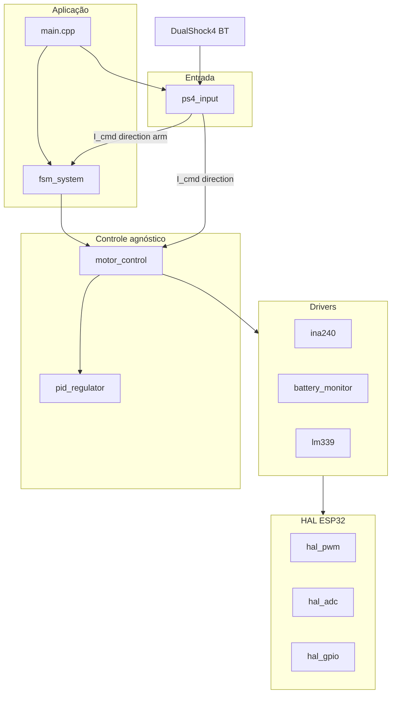

# Documentação de Programação — Firmware ESC BLDC (ESP32)

> **Documento vivo:** complemente e revise este arquivo **sempre** que criar, alterar ou revisar código em `Firmware/`.  
> Especificação de arquitetura (visão de produto): [`../Docs/especificacao_esc.md`](../Docs/especificacao_esc.md).

---

## Índice

1. [Política de manutenção](#1-política-de-manutenção)
2. [Visão geral do firmware](#2-visão-geral-do-firmware)
3. [Ambiente de build](#3-ambiente-de-build)
4. [Estrutura de diretórios](#4-estrutura-de-diretórios)
5. [Estado atual vs. planejado](#5-estado-atual-vs-planejado)
6. [Arquitetura em camadas](#6-arquitetura-em-camadas)
7. [Máquina de estados (planejada)](#7-máquina-de-estados-planejada)
8. [Mapa de hardware (`board_config.h`)](#8-mapa-de-hardware-board_configh)
9. [Módulo `lib/control/pid_regulator` (documentação de código)](#9-módulo-libcontrolpid_regulator-documentação-de-código)
10. [Módulos `lib/hal/*` (documentação de código)](#10-módulos-libhal-documentação-de-código)
11. [Módulos `lib/drivers/*` (documentação de código)](#11-módulos-libdrivers-documentação-de-código)
12. [Módulo `lib/control/motor_control`](#12-módulo-libcontrolmotor_control)
13. [Módulo `lib/drivers/bemf_zcd`](#13-módulo-libdriversbemf_zcd)
14. [Histórico de revisões](#14-histórico-de-revisões)
15. [Registro de dúvidas (modo Ask)](#15-registro-de-dúvidas-modo-ask)
16. [Módulo `lib/input/ps4_input`](#16-módulo-libinputps4_input)

---

## 1. Política de manutenção

| Regra | Descrição |
|-------|-----------|
| **Quando atualizar** | Ao adicionar, remover ou modificar arquivos em `src/`, `include/`, `lib/` ou `platformio.ini`. |
| **O que registrar** | Data, autor, arquivos afetados, resumo da mudança e impacto em API/comportamento. |
| **Onde registrar** | Seção [14. Histórico de revisões](#14-histórico-de-revisões) + seção do módulo correspondente. |
| **Dúvidas no modo Ask** | Sempre que o autor fizer uma pergunta em modo **Ask** cuja resposta seja útil para o projeto, acrescentar (ou atualizar) a entrada correspondente na seção [15. Registro de dúvidas](#15-registro-de-dúvidas-modo-ask). |
| **Divergência da spec** | Se o código diferir de `Docs/especificacao_esc.md`, explicar **por quê** (ex.: pinos inválidos no ESP32-WROOM-32). |
| **Padrão de escrita** | Preferir explicação em prosa + tabelas + passo a passo; não apenas listas de arquivos. |

---

## 2. Visão geral do firmware

Este firmware controla um **ESC trifásico** para motor **BLDC**. A ideia central da arquitetura é **separar responsabilidades**:

- **Aplicação** (`src/`): quando ligar o motor, em que estado está, regras de segurança, telemetria serial.
- **Entrada** (`lib/input/`): DualShock 4 via Bluetooth (Bluepad32) — throttle e sentido.
- **Controle** (`lib/control/`): matemática de malha fechada (PI), sem saber qual pino é PWM.
- **Drivers** (`lib/drivers/`): conversão de sinais físicos (INA240, divisor de tensão, LM339) para grandezas de engenharia (A, V).
- **HAL** (`lib/hal/`): acesso direto ao silício (MCPWM, ADC, GPIO/EXTI).

Assim, você pode testar o PI no PC ou na bancada sem reescrever código quando mudar um pino ou sensor.

| Item | Valor atual / alvo |
|------|-------------------|
| MCU | ESP32 (`esp32doit-devkit-v1`) |
| Framework hoje | **Arduino** (via PlatformIO) |
| Framework alvo (spec) | ESP-IDF + FreeRTOS |
| PWM de comutação | 20 kHz, dead-time 500 ns (planejado, MCPWM) |
| Teto de duty | 95 % (recarga bootstrap IR2110) |
| Debug | GPIO 12–15 reservados para **JTAG** (ICE) |
| Interface principal | **PS4 DualShock 4** via Bluetooth (Bluepad32) |
| Serial | Telemetria somente leitura (115200 baud) |

---

## 3. Ambiente de build

Configuração em `platformio.ini`:

| Parâmetro | Valor | Significado |
|-----------|--------|-------------|
| `platform` | `espressif32@6.10.0` | Toolchain e SDK do ESP32 (versão fixada para Bluepad32) |
| `board` | `esp32doit-devkit-v1` | Placa de desenvolvimento de referência |
| `framework` | `arduino` | API Arduino (`setup`/`loop`) com core Bluepad32 |
| `monitor_speed` | `115200` | Baud rate do monitor serial |
| `build_flags` | `-I include` | Expõe `board_config.h` às bibliotecas em `lib/` |
| `platform_packages` | `framework-arduinoespressif32@…/pio-framework-bluepad32` | Core Arduino-ESP32 com Bluepad32 embutido |
| `board_build.sdkconfig.defaults` | `sdkconfig.defaults` | Desabilita console Bluepad32 (conflito com `Serial`) |

**Compilar:** `pio run` ou `platformio run`.

**Bluepad32:** não é `lib_deps` comum — o core Arduino substituído inclui a biblioteca. Ver [`sdkconfig.defaults`](sdkconfig.defaults) (`CONFIG_BLUEPAD32_USB_CONSOLE_ENABLE=n`).

**Bibliotecas em `lib/`:** o PlatformIO compila automaticamente cada pasta como biblioteca estática e linka no firmware. Para usar o controlador PI em outro arquivo:

```c
#include "pid_regulator.h"
```

Não é necessário editar `platformio.ini` só por causa de `lib/control/`.

---

## 4. Estrutura de diretórios

```text
Firmware/
├── DOCUMENTACAO_PROGRAMACAO.md   ← este arquivo (documentação viva)
├── platformio.ini
├── sdkconfig.defaults            ← opções ESP-IDF (console Bluepad32 off)
├── include/
│   └── board_config.h            ← mapa de pinos e limites operacionais
├── src/
│   ├── main.cpp                  ← FSM + PS4 + telemetria serial
│   ├── fsm_system.h / fsm_system.c   ← máquina de estados do ESC
├── lib/
│   ├── input/
│   │   └── ps4_input.h / .cpp    ← DualShock 4 via Bluepad32
│   ├── control/
│   │   ├── pid_regulator.h / .c  ← PI com anti-windup
│   │   └── motor_control.h / .c  ← corrente + comutação 6-step
│   ├── hal/
│   │   ├── hal_pwm.h / hal_pwm.c     ← MCPWM 6 canais, dead-time
│   │   ├── hal_adc.h / hal_adc.c     ← ADC1, leitura em mV
│   │   └── hal_gpio.h / hal_gpio.c   ← GPIO digital, EXTI OC trip
│   └── drivers/
│       ├── ina240_current_sensors.h / .c  ← corrente de fase (A)
│       ├── battery_monitor.h / .c         ← tensão barramento (V)
│       ├── lm339_protection.h / .c        ← trip OC + desarme PWM
│       └── bemf_zcd.h / .c                ← cruzamento zero BEMF (LM339)
└── test/                         ← testes (futuro)
```

---

## 5. Estado atual vs. planejado

| Componente | Status | O que faz / fará |
|------------|--------|------------------|
| `src/main.cpp` | **Implementado** | FSM + PS4 + telemetria serial (somente leitura) |
| `lib/input/ps4_input` | **Implementado** | DualShock 4 via Bluepad32; R2 → I_cmd ou RPM (modo compile-time), Bolinha → sentido |
| `fsm_system` | **Implementado** | INIT → IDLE → RUNNING / FAULT; arm/disarm via PS4 |
| `lib/control/pid_regulator` | **Implementado** | Malha PI com anti-windup; pronto para integração |
| `include/board_config.h` | **Implementado** | Mapa de pinos revisado (ESP32-WROOM-32) e limites operacionais |
| `lib/hal/*` | **Implementado** | MCPWM (20 kHz, dead-time 500 ns), ADC1 (mV), GPIO/EXTI (OC trip) |
| `lib/drivers/*` | **Implementado** | INA240 → A, divisor VBAT → V + **UVLO**, LM339 → ISR + desarme PWM |
| `motor_control` | **Implementado (v7 bancada)** | Modo dual CURRENT/SPEED; cascata PI_vel→PI_cor; fases RUN_OPEN/RUN_SPEED |
| `bemf_zcd` | **Opcional** (`BOARD_ENABLE_BEMF_ZCD`) | Desligado por padrão (hardware inicial sem BEMF) |
| Comutação com feedback de posição | **Parcial** | ZCD disponível no código; FOC / halls pendentes |

**Resumo:** Padrão alinhado ao **projeto inicial** (sem pinos ZCD): malha aberta com rampa 5→120 Hz elétricos. ZCD reativável em `board_config.h` quando a PCB tiver comparadores BEMF.

---

## 6. Arquitetura em camadas


```mermaid
flowchart TB
    subgraph app [Aplicação]
        MAIN[main.cpp]
        FSM[fsm_system]
    end
    subgraph input [Entrada]
        PS4[ps4_input]
    end
    subgraph ctrl [Controle agnóstico]
        MC[motor_control]
        PI[pid_regulator]
    end
    subgraph drv [Drivers]
        INA[ina240]
        BAT[battery_monitor]
        LM[lm339]
    end
    subgraph hal [HAL ESP32]
        PWM[hal_pwm]
        ADC[hal_adc]
        GPIO[hal_gpio]
    end
    DS4[DualShock4 BT] --> PS4
    MAIN --> FSM --> MC --> PI
    MAIN --> PS4
    PS4 -->|I_cmd direction arm| FSM
    PS4 -->|I_cmd direction| MC
    MC --> drv --> hal
```

**Regra de ouro:** `pid_regulator` recebe apenas números (`float`): referência, medição, saída. Não inclui `board_config.h`, não acessa GPIO, não conhece MCPWM.

---

## 7. Máquina de estados (`fsm_system`)

Implementação em `src/fsm_system.h` e `src/fsm_system.c`.

| Estado | Nome | O que acontece |
|--------|------|----------------|
| `ESC_STATE_INIT` | Inicialização | Calibra ADC/INA240; configura PWM e EXTI LM339 (transitório no boot) |
| `ESC_STATE_IDLE` | Espera | PWM desarmado; aguarda R2 > limiar no PS4 |
| `ESC_STATE_RUNNING` | Ativo | PWM armado; `motor_control` ativo |
| `ESC_STATE_FAULT` | Falha | Trip LM339 ou falha SW; PWM desarmado; Options limpa → IDLE |

**Transições:**

```text
INIT ──(ok)──► IDLE ──(R2>limiar)──► RUNNING ──(R2=0)──► IDLE
                  │                      │
                  └──── LM339 / OC_SW ───┴────► FAULT ──(Options)──► IDLE
```

| API | Descrição |
|-----|-----------|
| `fsm_system_init()` | Sequência de boot; sucesso → `IDLE` |
| `fsm_system_tick()` | Processa `s_fault_pending` e monitora pino OC |
| `fsm_system_request_arm()` | `IDLE` → `RUNNING` (chamado quando R2 > limiar) |
| `fsm_system_request_disarm()` | `RUNNING` → `IDLE` (chamado quando R2 = 0) |
| `fsm_system_clear_fault()` | `FAULT` → `IDLE` se hardware liberou (Options no PS4) |

**Controle PS4 (via `main.cpp` + `ps4_input`):**

| Entrada PS4 | Ação |
|-------------|------|
| R2 > `PS4_R2_ARM_THRESHOLD` (10) | Arma ESC e define `I_cmd` proporcional (0…5 A) |
| R2 = 0 | Desarma; `I_cmd = 0`; permite trocar sentido (Bolinha) |
| Bolinha solta | Sentido CW |
| Bolinha pressionada | Sentido CCW (só com R2 = 0 para trocar em torque) |
| Options (Start) | Clear fault em `FAULT`; exige soltar R2 antes de re-armar |
| UVLO (VBAT baixo) | Bloqueia arm; RUNNING → `FAULT` (`falha=UVLO`); Options só se VBAT ≥ recover |
| Desconexão BT | Desarme imediato |

**Serial (115200):** telemetria somente leitura a cada 500 ms (`BT=`, `R2=`, correntes, VBAT, estado FSM). Sem comandos de controle.

---

## 8. Mapa de hardware (`board_config.h`)

### 8.1 Fonte de verdade: DevKitC v4 + PCB (pré-fabricação)

O mapa em [`include/board_config.h`](include/board_config.h) segue o pinout **ESP32-DevKitC v4** ([`esp32_devkitC_v4_pinlayout.png`](../Docs/Thesis/imagens/esp32_devkitC_v4_pinlayout.png)). Roteamento Altium: [`Hardware/PCB_Project/ESP32_PINMAP.md`](../Hardware/PCB_Project/ESP32_PINMAP.md). Re-exportar `esp32_schematic.png` após atualizar `Control.SchDoc`.

### 8.2 Tabela PCB ↔ DevKit ↔ firmware

| Sinal PCB | GPIO | Label DevKit | `#define` | Função |
|-----------|------|--------------|-----------|--------|
| AH | 21 | 21 | `PIN_PWM_AH` | MCPWM high-side fase A |
| AL | 22 | 22 | `PIN_PWM_AL` | MCPWM low-side fase A |
| BH | 27 | 27 | `PIN_PWM_BH` | MCPWM high-side fase B |
| BL | **23** | 23 | `PIN_PWM_BL` | MCPWM low-side fase B |
| CH | 18 | 18 | `PIN_PWM_CH` | MCPWM high-side fase C |
| CL | 19 | 19 | `PIN_PWM_CL` | MCPWM low-side fase C |
| Shutdown A | 32 | 32 | `PIN_SD_A` | SD IR2110 fase A (ativo baixo) |
| Shutdown B | 33 | 33 | `PIN_SD_B` | SD IR2110 fase B |
| Shutdown C | **4** | 4 | `PIN_SD_C` | SD IR2110 fase C |
| Isense A Out | 34 | 34 | `PIN_ADC_IA` | ADC1_CH6 |
| Isense B Out | 35 | 35 | `PIN_ADC_IB` | ADC1_CH7 |
| Isense C Out | 36 | VP | `PIN_ADC_IC` | ADC1_CH0 |
| Vcc Supply Sense | 39 | VN | `PIN_ADC_VBAT` | ADC1_CH3 |
| Vdac Ref | 25 | 25 | `PIN_VDAC_REF` | **DAC1** → LM339 (+) OCP |
| OC Trip | 26 | 26 | `PIN_OC_TRIP` | Entrada LM339 wired-OR (ativo baixo) |
| ZCD A (reserva) | **16** | RX2 | `PIN_ZCD_A` | BEMF fase A (U3 pino 6) |
| ZCD B (reserva) | **17** | TX2 | `PIN_ZCD_B` | BEMF fase B (U3 pino 7) |
| ZCD C (reserva) | **5** | D5 | `PIN_ZCD_C` | BEMF fase C (U3 pino 8; pull-up 10k) |
| JTAG (ESP-Prog) | **12–15** | D12–D15 | — | MTDI/MTCK/TMS/MTDO — **sem nets ESC** |

**Sequência de segurança em fault:** `OC Trip` ISR ou FSM → `hal_shutdown_set_enabled(false)` (SD LOW) → `hal_pwm_disable_all()`.

**Vdac (OCP hardware):** `lm339_protection_init()` programa DAC1 antes de armar drivers:

```text
Vdac = 1,65 V + (I_limit × 1 mΩ × 20 V/V)
```

Default `I_limit = LM339_HW_OC_AMPS` (= `MOTOR_SOFTWARE_OC_AMPS`, 8 A) → ~1,81 V em GPIO25.

### 8.3 Grupos de pinos

#### PWM — GPIO 21, 22, 27, 23, 18, 19

Seis sinais MCPWM com dead-time 500 ns.

#### Shutdown — GPIO 32, 33, 4

Saídas digitais para pino SD dos IR2110. **Ativo baixo no driver:** HIGH = operação, LOW = shutdown. Boot e IDLE/FAULT mantêm LOW; `fsm_system_request_arm()` sobe para HIGH.

#### ADC — GPIO 34, 35, 36, 39

Todos **ADC1** (compatível com Wi-Fi/Bluepad32). Input-only.

#### OCP — GPIO 25 (DAC) + GPIO 26 (OC Trip)

- `hal_dac` (`lib/hal/hal_dac.c`): saída analógica Vdac Ref.
- `hal_gpio`: EXTI em GPIO26, pull-up interno.

#### ZCD — GPIO 16, 17, 5 (reserva)

Reserva para LM339 BEMF na PCB. Rotulados no Altium U3 como **RX2, TX2, D5** (pinos símbolo 6, 7, 8). Coexistem com **JTAG em GPIO 12–15** (header ESP-Prog, sem nets ESC). **GPIO5 (D5):** strapping VSPI CS — pull-up externo 10 kΩ no comparador obrigatório. Manter `BOARD_ENABLE_BEMF_ZCD 0` até hardware soldado.

#### JTAG — GPIO 12, 13, 14, 15

Reservados para depuração ICE via ESP-Prog (MTDI, MTCK, TMS, MTDO). Nenhuma net ESC nestes pinos.

#### GPIO livres

| GPIO | Uso sugerido |
|------|----------------|
| 0, 2 | Boot / LED DevKit |
| 1, 3 | UART0 programação |

#### Reservados — não usar em aplicação

| GPIO | Motivo |
|------|--------|
| 6, 7, 8, 9, 10, 11 | Flash SPI interna |

### 8.4 Mapa obsoleto (não usar)

Versão intermediária do firmware (pré-alinhamento PCB) usava PWM em 25/26/…, ADC em 32–35, OC Trip em GPIO4 — **incompatível com a PCB fabricada**.

```c
// OBSOLETO — não corresponde ao esp32_schematic.png
#define PIN_PWM_AH    25
#define PIN_OC_TRIP   4
```

---

## 9. Módulo `lib/control/pid_regulator` (documentação de código)

Biblioteca de controle **Proporcional-Integral (PI)** para o ESC. É **agnóstica de hardware**: não sabe se a saída é duty cycle, corrente ou velocidade — apenas processa referência, medição e limites configurados.

**Localização:**

```text
lib/control/
├── pid_regulator.h   ← tipos e protótipo público
└── pid_regulator.c   ← implementação
```

---

### 9.1 Arquivo `pid_regulator.h` — interface pública

#### Proteção contra inclusão dupla

```1:2:lib/control/pid_regulator.h
#ifndef PID_REGULATOR_H
#define PID_REGULATOR_H
```

Se outro arquivo incluir `pid_regulator.h` duas vezes, o pré-processador ignora a segunda inclusão. Evita erro de “redefinição de tipo”.

#### Compatibilidade C e C++

```4:6:lib/control/pid_regulator.h
#ifdef __cplusplus
extern "C" {
#endif
```

O projeto usa `main.cpp` (C++). Sem `extern "C"`, o linker do C++ aplicaria *name mangling* e não encontraria `pi_compute`. Com esse bloco, o símbolo exportado segue a convenção C.

#### Estrutura `pi_controller_t` — cada campo explicado

```8:17:lib/control/pid_regulator.h
typedef struct {
    float kp;
    float ki;
    float dt;             // [s]
    float integral_term;  // integrator state
    float out_max;        // output saturation max
    float out_min;        // output saturation min
    float integ_max;      // anti-windup clamp max
    float integ_min;      // anti-windup clamp min
} pi_controller_t;
```

| Campo | Papel no controle | Como usar na prática |
|-------|-------------------|----------------------|
| `kp` | Ganho **proporcional**. Multiplica o erro atual. | Valores maiores → resposta mais rápida, mas mais oscilação/ruído. |
| `ki` | Ganho **integral**. Define quanto o acumulador corrige erro persistente. | Valores maiores → elimina erro em regime, mas pode causar overshoot se alto demais. |
| `dt` | Período de amostragem em **segundos**. | Deve ser **igual** ao intervalo real entre chamadas de `pi_compute()`. Ex.: 10 kHz → `dt = 0.0001f`. |
| `integral_term` | **Estado** do integrador. Persiste entre chamadas. | Não zerar a cada ciclo. Zerar só em reset seguro (ex.: ao armar motor). |
| `out_max`, `out_min` | Limites da **saída final** do controlador. | No ESC: tipicamente `0` e `95` (% duty), alinhado a `MAX_DUTY_CYCLE_PERCENT`. |
| `integ_max`, `integ_min` | Limites do integrador (**anti-windup**). | Impedem que `integral_term` cresça sem limite quando a saída já está saturada. |

> **Nota:** a especificação em `Docs/especificacao_esc.md` lista apenas `kp`, `ki`, `integral_term`, `out_max` e `out_min`. A implementação atual **adiciona** `dt`, `integ_max` e `integ_min` porque controle discreto e anti-windup exigem esses parâmetros explicitamente.

**Não há `kd`:** este módulo é **PI**, não PID. Não há termo derivativo.

#### Função pública `pi_compute`

```19:19:lib/control/pid_regulator.h
float pi_compute(pi_controller_t *pi, float setpoint, float measurement);
```

| Entrada | Significado |
|---------|-------------|
| `pi` | Ponteiro para a instância do controlador (ganhos, limites e estado do integrador). |
| `setpoint` | Valor desejado (ex.: RPM alvo, corrente alvo). |
| `measurement` | Valor medido pelos sensores/drivers (telemetria). |

| Saída | Significado |
|-------|-------------|
| Retorno `float` | Comando de controle já limitado em `[out_min, out_max]`. |
| Se `pi == NULL` | Retorna `0.0f` (comando neutro / seguro). |

---

### 9.2 Arquivo `pid_regulator.c` — implementação

#### Função auxiliar `clampf`

```5:14:lib/control/pid_regulator.c
static inline float clampf(float x, float min_v, float max_v)
{
    if (x > max_v) {
        return max_v;
    }
    if (x < min_v) {
        return min_v;
    }
    return x;
}
```

| Aspecto | Explicação |
|---------|------------|
| `static` | Função visível **somente** neste `.c`; não polui o namespace global. |
| `inline` | Sugere ao compilador embutir o código, evitando custo de chamada em loop rápido. |
| Comportamento | Garante `min_v ≤ resultado ≤ max_v`. |

Usada em **dois momentos**: limitar o integrador (anti-windup) e limitar a saída final.

---

### 9.3 `pi_compute()` — passo a passo (linha a linha)

Código completo da função:

```16:38:lib/control/pid_regulator.c
float pi_compute(pi_controller_t *pi, float setpoint, float measurement)
{
    float error;
    float p_term;
    float u_unsat;
    float u_sat;

    if (pi == NULL) {
        return 0.0f;
    }

    error = setpoint - measurement;
    p_term = pi->kp * error;

    // Discrete-time integrator with anti-windup by clamping.
    pi->integral_term += (pi->ki * error * pi->dt);
    pi->integral_term = clampf(pi->integral_term, pi->integ_min, pi->integ_max);

    u_unsat = p_term + pi->integral_term;
    u_sat = clampf(u_unsat, pi->out_min, pi->out_max);

    return u_sat;
}
```

#### Passo 1 — Proteção contra ponteiro nulo

```c
if (pi == NULL) return 0.0f;
```

Se alguém chamar `pi_compute(NULL, ...)`, o firmware não trava por acesso inválido; devolve saída zero.

#### Passo 2 — Cálculo do erro

```c
error = setpoint - measurement;
```

- Erro **positivo** → medição **abaixo** da referência → controlador tende a **aumentar** a saída.
- Erro **negativo** → medição **acima** da referência → tende a **reduzir** a saída.

Exemplo: `setpoint = 3000` RPM, `measurement = 2800` RPM → `error = +200`.

#### Passo 3 — Termo proporcional

```c
p_term = kp * error;
```

Resposta **imediata** ao erro atual. Sozinho, o PI deixaria um erro residual em regime permanente; o integrador corrige isso nos passos seguintes.

#### Passo 4 — Atualização do integrador (tempo discreto)

```c
integral_term += ki * error * dt;
```

Integração numérica tipo **Euler explícito** (retangular):

- A cada ciclo, soma-se uma parcela do erro proporcional a `ki` e ao tempo `dt`.
- Se `dt` estiver errado (task mais lenta/rápida que o configurado), o comportamento integral fica incorreto.

#### Passo 5 — Anti-windup por clamping do integrador

```c
integral_term = clamp(integral_term, integ_min, integ_max);
```

**O que é windup?**  
Quando a saída já está no teto (ex.: duty em 95 %), mas o erro continua positivo, o integrador ainda acumula valor “inútil” que não aparece na saída saturada.

**Consequência:** ao liberar a saturação, a resposta fica lenta, com overshoot ou instabilidade.

**O que o clamping faz?**  
Limita o acumulador **antes** que ele cresça demais. É simples, previsível e adequado para primeira versão do ESC.

#### Passo 6 — Soma P + I (saída não saturada)

```c
u_unsat = p_term + integral_term;
```

É o comando “ideal” antes de respeitar limites físicos do atuador.

#### Passo 7 — Saturação da saída

```c
u_sat = clamp(u_unsat, out_min, out_max);
```

Garante que o comando final respeite limites do hardware (ex.: nunca acionar 100 % de duty se o bootstrap exige margem).

#### Passo 8 — Retorno

```c
return u_sat;
```

Valor pronto para `motor_control` converter em duty PWM por fase.

---

### 9.4 Equações (referência matemática)

**Tempo contínuo (conceito):**

\[
u(t) = K_p \cdot e(t) + K_i \int e(t)\,dt
\]

**Tempo discreto (o que o código implementa), a cada amostra \(k\):**

\[
e_k = r - y_k
\]

\[
P_k = K_p \cdot e_k
\]

\[
I_k = \mathrm{clamp}\big(I_{k-1} + K_i \cdot e_k \cdot \Delta t,\; I_{min},\, I_{max}\big)
\]

\[
u_k = \mathrm{clamp}(P_k + I_k,\; u_{min},\, u_{max})
\]

Onde:

- \(r\) = `setpoint`
- \(y_k\) = `measurement`
- \(\Delta t\) = `dt`
- \(I_k\) = `integral_term`

---

### 9.5 Diagrama de fluxo de sinais

```text
                    ┌─────────────────────────────────────────┐
  setpoint (r) ────►│                                         │
                    │   error = r - y                         │
  measurement (y) ─►│                                         │
                    └──────────────┬──────────────────────────┘
                                   │
                    ┌──────────────┴──────────────┐
                    ▼                             ▼
              P = kp × error              I += ki × error × dt
                    │                             │
                    │                             ▼
                    │                    clamp(I, integ_min, integ_max)
                    │                             │
                    └──────────────┬──────────────┘
                                   ▼
                            u_unsat = P + I
                                   │
                                   ▼
                    clamp(u_unsat, out_min, out_max) ──► saída u
```

---

### 9.6 Exemplo completo de uso

```c
#include "pid_regulator.h"

// Instância global ou estática da malha de velocidade
pi_controller_t speed_pi = {
    .kp = 0.08f,
    .ki = 1.20f,
    .dt = 1.0f / 10000.0f,   // malha a 10 kHz — task deve rodar nesse período
    .integral_term = 0.0f,
    .out_min = 0.0f,
    .out_max = 95.0f,        // alinhado a MAX_DUTY_CYCLE_PERCENT
    .integ_min = -30.0f,
    .integ_max = 30.0f
};

void control_task(void)
{
    float target_rpm = 3000.0f;
    float measured_rpm = read_rpm();   // vindo de driver/estimador — futuro

    float duty_percent = pi_compute(&speed_pi, target_rpm, measured_rpm);

    // motor_control aplicará duty_percent nas fases — futuro
}
```

---

### 9.7 Boas práticas de integração no ESC

| Prática | Motivo |
|---------|--------|
| Chamar `pi_compute()` em **período fixo** igual a `dt` | Integrador discreto assume amostragem uniforme. |
| Zerar `integral_term` no arming (`IDLE` → `RUNNING`) | Evita “tiro” de saída por estado acumulado anterior. |
| Uma instância por malha, uma task dona | Evita condição de corrida sem mutex. |
| Ajustar `integ_min/max` junto com `out_min/max` na bancada | Anti-windup e saturação devem ser coerentes com a planta real. |
| Não chamar PI dentro de ISR lenta | Preferir task FreeRTOS ou timer dedicado. |

---

### 9.8 Limitações conhecidas e evoluções

| Limitação atual | Impacto | Evolução possível |
|-----------------|---------|-------------------|
| Anti-windup só por **clamping** | Pode ser conservador em saturação frequente | **Back-calculation** (ajusta integrador quando `u_unsat ≠ u_sat`) |
| Sem termo **D** | Não filtra por derivada do erro; ruído na medição não é atenuado por D | Módulo `pid_regulator` estendido, se necessário |
| `dt` configurado manualmente | Se a task atrasar, integral fica errado | Timer hardware ou `esp_timer` com período garantido |
| Não integrado ao `main` | Código compila, mas ESC ainda não usa o PI | Integrar via `motor_control` + FSM |

---

### 9.9 O que este módulo **não** faz (delimitação)

- Não lê ADC nem converte corrente (isso será `ina240_current_sensors` + `hal_adc`).
- Não gera PWM (isso será `hal_pwm`).
- Não implementa comutação BLDC nem FOC (isso será `motor_control`).
- Não trata falha de hardware (isso será `lm339_protection` + `fsm_system`).

---

## 10. Módulos `lib/hal/*` (documentação de código)

Camada de abstração do silício ESP32. Usa `board_config.h` para pinos e limites; **não** converte grandezas de engenharia (isso fica nos drivers).

### 10.1 `hal_adc` — leitura analógica bruta

| Função | Descrição |
|--------|-----------|
| `hal_adc_init()` | Configura ADC1 em 12 bits, atenuação até ~3,3 V (canais 4–7) |
| `hal_adc_read_mv(channel)` | Retorna milivolts no pino (escala linear 0–3300 mV / 4095 counts) |

Canais: `HAL_ADC_PHASE_IA/IB/IC`, `HAL_ADC_VBAT` → GPIO 32–35.

### 10.2 `hal_pwm` — comutação MCPWM

| Função | Descrição |
|--------|-----------|
| `hal_pwm_init()` | 3 timers MCPWM, 6 GPIO, dead-time 500 ns (modo complementar AH/AL) |
| `hal_pwm_set_armed(bool)` | Só aplica duty > 0 se armado; ao desarmar zera todas as fases |
| `hal_pwm_set_phase_duty(phase, %)` | Duty 0…`MAX_DUTY_CYCLE_PERCENT` (modo SOURCE) |
| `hal_pwm_set_phase_conduction(phase, mode, %)` | OFF / SOURCE (PWM high-side) / SINK (low-side on) |
| `hal_pwm_disable_all()` | Todas as pernas em OFF |

Frequência e dead-time vêm de `PWM_FREQUENCY_HZ` e `DEAD_TIME_NS`.

### 10.3 `hal_gpio` — segurança digital e Shutdown IR2110

| Função | Descrição |
|--------|-----------|
| `hal_gpio_init()` | `PIN_SD_A/B/C` como saídas (LOW = shutdown); `PIN_OC_TRIP` entrada pull-up |
| `hal_shutdown_set_enabled(bool)` | HIGH = drivers habilitados; LOW = SD ativo nos três IR2110 |
| `hal_gpio_attach_oc_trip_isr(cb, arg)` | EXTI em borda de descida (trip ativo baixo) |
| `hal_gpio_oc_trip_asserted()` | `true` se LM339 puxou GPIO26 para baixo |

O callback de ISR deve ser **rápido e ISR-safe** (sem `Serial`, sem malloc).

### 10.4 `hal_dac` — Vdac Ref (OCP LM339)

| Função | Descrição |
|--------|-----------|
| `hal_dac_init()` | Habilita DAC1 em GPIO25 (`PIN_VDAC_REF`) |
| `hal_dac_set_voltage(float)` | Programa saída 0…3,3 V |
| `hal_dac_get_voltage()` | Última tensão programada |

Usado por `lm339_protection_init()` para definir limiar OCP antes de armar os drivers.

### 10.5 Delimitação da HAL

- Não aplica ganho INA240 nem escala de VBAT (drivers).
- Não implementa FSM nem comutação BLDC (`motor_control`, `fsm_system`).
- Framework atual: **Arduino**, com APIs ESP-IDF (`driver/mcpwm.h`, `driver/adc.h`, `driver/gpio.h`, `driver/dac.h`).

---

## 11. Módulos `lib/drivers/*` (documentação de código)

Convertem leituras da HAL em grandezas físicas e tratam proteção de hardware. Dependem de `lib/hal/`; **não** conhecem FSM nem PI.

### 11.1 `ina240_current_sensors`

| Parâmetro | Valor (hardware) |
|-----------|------------------|
| Ganho | 20 V/V (INA240A1DR) |
| Shunt | 1 mΩ |
| Offset nominal | 1,65 V (1650 mV) |

| Função | Descrição |
|--------|-----------|
| `ina240_init()` | Marca driver pronto (HAL ADC já deve estar init) |
| `ina240_calibrate_offset(n)` | Média de `n` amostras por fase com corrente zero |
| `ina240_read_amps(phase)` | Corrente em A: `(mV - offset) / 20` |
| `ina240_get_offset_mv(phase)` | Offset calibrado ou nominal |

### 11.2 `battery_monitor`

Divisor 39 kΩ / 4,7 kΩ → `V_bat = V_adc / (4,7 / 43,7)`.

| Função | Descrição |
|--------|-----------|
| `battery_monitor_init()` | Marca driver pronto; zera estado UVLO |
| `battery_monitor_read_volts()` | Tensão do barramento DC em V (leitura instantânea ADC) |
| `battery_monitor_tick(now_ms)` | Atualiza UVLO com histerese e debounce; chamar a cada `loop()` |
| `battery_monitor_uvlo_active()` | `true` se VBAT ficou abaixo do cutoff por `BATTERY_UVLO_DEBOUNCE_MS` |
| `battery_monitor_get_volts_filtered()` | Última leitura usada no tick (telemetria) |

**UVLO (LiPo 4S–6S):** limiares **por célula**; número de células detectado **uma vez no boot** a partir de VBAT.

| Constante | Padrão | Significado |
|-----------|--------|-------------|
| `BATTERY_CELL_COUNT_S_MIN` / `MAX` | 4 / 6 | Packs suportados |
| `BATTERY_CELL_UVLO_CUTOFF_V` | 3,3 V | Disparo UVLO (× S) |
| `BATTERY_CELL_UVLO_RECOVER_V` | 3,5 V | Recuperação (× S) |
| `BATTERY_UVLO_DEBOUNCE_MS` | 100 ms | Debounce |

**Detecção no boot:** com VBAT medido após init do ADC, calcula faixa `[s_min, s_max]` compatível com a tensão (4,2 V/célula plena … 3,3 V/célula cutoff) e escolhe **S máximo** na faixa (cutoff mais conservador). Ex.: 22 V → 6S (cutoff 19,8 V); 16 V → 4S (cutoff 13,2 V).

| Função extra | Descrição |
|--------------|-----------|
| `battery_monitor_get_cell_count_s()` | S detectado (latched até reset) |
| `battery_monitor_get_uvlo_cutoff_v()` | Cutoff absoluto (V) |
| `battery_monitor_get_uvlo_recover_v()` | Recover absoluto (V) |

Comportamento: bloqueia `fsm_system_request_arm()`; em RUNNING → `motor_control_trip_uvlo_fault()` + FAULT; `fsm_system_clear_fault()` recusado enquanto UVLO ativo.

> **Nota:** troca de pack (4S ↔ 6S) exige **power-cycle** do ESC para re-detectar S. Com bateria muito descarregada no boot, a detecção pode errar — preferível conectar pack carregado acima do cutoff.

### 11.3 `lm339_protection`

| Função | Descrição |
|--------|-----------|
| `lm339_protection_init()` | Inicializa DAC1 (Vdac Ref) e programa limiar `LM339_HW_OC_AMPS` |
| `lm339_protection_set_oc_threshold_amps(float)` | Atualiza Vdac = 1,65 V + I×1 mΩ×20 |
| `lm339_protection_arm(cb, arg)` | EXTI GPIO26; ISR aciona Shutdown + desarma PWM |
| `lm339_protection_fault_active()` | Trip latched ou pino OC ainda ativo |
| `lm339_protection_clear_fault()` | Limpa latch só se hardware liberou o pino |

O callback de falha deve ser **ISR-safe** (sem `Serial`).

---

## 12. Módulo `lib/control/motor_control`

Núcleo que liga **telemetria → PI (corrente e, opcionalmente, velocidade) → PWM trifásico** com **comutação trapezoidal 6-step** em malha aberta.

### 12.1 Fluxo

**Modo CURRENT** (`MOTOR_CONTROL_USE_SPEED_MODE 0`):

```text
INA240 (A,B,C) ──► |I| máximo ──► pi_compute(I_alvo, I_med) ──► duty %
                                        │
                    tabela 6-step ◄─────┴──► hal_pwm_set_phase_conduction (A,B,C)
                    (OPEN: rampa f_el 5→120 Hz; timer malha 1 kHz)
```

**Modo SPEED** (`MOTOR_CONTROL_USE_SPEED_MODE 1`, padrão):

```text
R2 → RPM_cmd ──► PI_vel ──► I_cmd ──► PI_cor ──► duty %
     │              ▲
     └─ f_el_ff ──► comutação OPEN (sem rampa em RUN_SPEED)
                    │
              RPM_med ← período entre passos 6-step (s_step_period_us)
```

Relação RPM ↔ frequência elétrica (motor 4 polos, `MOTOR_POLE_PAIRS = 2`):

```text
f_el [Hz] = RPM × pole_pairs / 60
RPM       = f_el × 60 / pole_pairs = f_el × 30
```

Teto operacional: `MOTOR_SPEED_MAX_RPM` = 3600 RPM (= `MOTOR_OPEN_LOOP_COMM_HZ_MAX` 120 Hz).

### 12.2 API

| Função | Descrição |
|--------|-----------|
| `motor_control_init()` | Inicializa PI corrente + PI velocidade; timer periódico (`MOTOR_CONTROL_LOOP_HZ` = 1 kHz) |
| `motor_control_on_arm()` / `on_disarm()` | Zera integradores; ativa/desativa malha (chamado pela FSM) |
| `motor_control_tick()` | Uma iteração (também chamada pelo `esp_timer`) |
| `motor_control_set_target_amps(amps)` | Corrente desejada 0…5 A — **modo CURRENT** |
| `motor_control_set_target_rpm(rpm)` | RPM desejado 0…3600 — **modo SPEED** |
| `motor_control_get_measured_rpm()` | Estimativa RPM a partir do período de comutação |
| `motor_control_get_control_mode()` | `CURRENT` ou `SPEED` (compile-time) |
| `motor_control_torque_command_active()` | `true` se R2 mapeado (I_cmd>0 ou RPM_cmd>0) |

### 12.3 Controle PS4 (interface principal)

1. Pairing: Share + PS no controle até LED piscar; ESP32 escaneia automaticamente.
2. R2 > `PS4_R2_ARM_THRESHOLD` — arma ESC e define referência (corrente ou RPM conforme modo).
3. R2 = 0 — desarma; referência = 0.
4. Bolinha solta / pressionada — CW / CCW (troca efetiva só com R2 = 0).
5. Telemetria serial a cada 500 ms: `mode=`, `RPM=` (SPEED), `I=`, duty %, passo, `comm=`, `f_el=`.
6. Corrente acima de `MOTOR_SOFTWARE_OC_AMPS` → `FAULT` (`falha=OC_SW`).
7. Stall em RUN → `FAULT` (`falha=STALL`); Options limpa fault.
8. Ganhos PI e parâmetros de rampa/ALIGN: defaults em `board_config.h` (sem tuning serial).

Modo selecionado em compile-time: `MOTOR_CONTROL_USE_SPEED_MODE` em `board_config.h` (1 = SPEED, 0 = CURRENT para regressão).

### 12.4 Sequência de partida (sem ZCD)

**Modo CURRENT** — ao pressionar R2 (I_cmd > 0):

```text
IDLE ──► ALIGN (500 ms) ──► RUN (PI + slew + rampa OPEN)
```

**Modo SPEED** — ao pressionar R2 (RPM_cmd > 0):

```text
IDLE ──► ALIGN ──► RUN_OPEN (rampa f_el + I fixo 0,5 A) ──► RUN_SPEED (PI_vel + f_el feedforward)
                              │ RPM_med ≥ 600 RPM por 200 ms
                              └──────────────────────────────► handover
```

| Fase (`start=` na serial) | Comportamento |
|---------------------------|---------------|
| `idle` | Referência = 0; PWM do passo atual a 0 % |
| `ALIGN` | Passo 0 (CW) ou 3 (CCW); duty `MOTOR_ALIGN_DUTY_PERCENT` (12 %) |
| `RUN` | Modo CURRENT: PI corrente + rampa OPEN |
| `RUN_OPEN` | Modo SPEED: rampa OPEN; `I_cmd` fixo `MOTOR_SPEED_OPEN_LOOP_I_AMPS` |
| `RUN_SPEED` | Modo SPEED: PI_vel em cascata; `f_el` = feedforward de `RPM_alvo` |

Em `RUN_SPEED`, se `|RPM_med − RPM_cmd| > MOTOR_SPEED_DESYNC_RPM` por 300 ms, retorna a `RUN_OPEN` e reinicia rampa.

Constantes: `MOTOR_ALIGN_DURATION_MS` (500), `MOTOR_SPEED_OPEN_LOOP_HANDOVER_RPM` (600), `MOTOR_SPEED_HANDOVER_MS` (200).

### 12.5 Rampa em malha aberta (padrão do projeto inicial)

Com `BOARD_ENABLE_BEMF_ZCD 0`, após **ALIGN** a comutação permanece em **OPEN**. A frequência elétrica sobe a cada passo 6-step enquanto há torque (I_alvo > 0 ou RPM_alvo > 0).

| Constante (`board_config.h`) | Valor padrão | Significado |
|------------------------------|--------------|-------------|
| `MOTOR_OPEN_LOOP_COMM_HZ_START` | 5 Hz | Partida lenta |
| `MOTOR_OPEN_LOOP_COMM_HZ_MAX` | 120 Hz | Teto da rampa (= 3600 RPM) |
| `MOTOR_OPEN_LOOP_COMM_HZ_RAMP_PER_STEP` | 1,5 Hz | Incremento por passo comutado |

Em **RUN_SPEED**, `f_el` segue `RPM_alvo` (sem rampa). `motor_control_get_open_loop_comm_hz()` expõe o valor para telemetria.

### 12.6 Modos de comutação

| Modo | Nome serial | Comportamento |
|------|-------------|---------------|
| `MOTOR_COMM_OPEN_LOOP` | `OPEN` | Rampa de \(f_{el}\) (RUN/RUN_OPEN); feedforward em RUN_SPEED |
| `MOTOR_COMM_ZCD_CLOSED` | `ZCD` | Passo após ZCD + `BEMF_COMM_DELAY_DEG_ELEC` (30°) |

Handover (opcional): `BEMF_ZCD_HANDOVER_COUNT` flancos válidos, duty ≥ `MOTOR_CONTROL_MIN_DUTY_ZCD_HANDOVER`.

### 12.7 Malha de velocidade (PI em cascata)

Segunda instância de `pid_regulator` (`s_speed_pi`):

| Constante | Valor padrão |
|-----------|--------------|
| `MOTOR_SPEED_PI_KP_DEFAULT` | 0,02 |
| `MOTOR_SPEED_PI_KI_DEFAULT` | 0,5 |
| `MOTOR_SPEED_SLEW_RPM_PER_S` | 1500 RPM/s |
| Saída PI_vel (`out_max`) | `MOTOR_CONTROL_MAX_TARGET_AMPS` (5 A) |

Estimador: média móvel 7/8 do período entre passos → `RPM = 1e6 / (6 × T_step) × 30`.

### 12.8 Sentido e proteção SW

| Recurso | Detalhe |
|---------|---------|
| `motor_control_set_direction(±1)` | Inverte sequência 6-step (CCW decrementa passo) |
| `MOTOR_SOFTWARE_OC_AMPS` | 8 A → `MOTOR_FAULT_OVERCURRENT` (`OC_SW`) |
| Stall | Corrente 6 A por 300 ms **ou** sem passo por 4× período **ou** (RUN_SPEED) RPM < 300 com RPM_cmd > handover por 300 ms → `STALL` |
| UVLO | `battery_monitor_uvlo_active()` → `MOTOR_FAULT_UNDERVOLTAGE` (`UVLO`) via FSM |
| ALIGN | Passo 0 (CW) ou 3 (CCW); ver `MOTOR_ALIGN_STEP_*` |

### 12.9 Limitações

| Item | Detalhe |
|------|---------|
| Modo dual | Seleção só em compile-time (`MOTOR_CONTROL_USE_SPEED_MODE`); sem toggle runtime |
| Estimador RPM | Válido só com passos avançando; ruidoso em baixa velocidade |
| Pinos ZCD | GPIO **16/17/5** (U3 RX2/TX2/D5) — ver `ESP32_PINMAP.md` |
| FOC / Hall | Não implementados |

---

## 13. Módulo `lib/drivers/bemf_zcd`

Driver dos comparadores LM339 de **cruzamento por zero** da BEMF (fase flutuante vs. neutro virtual), conforme a tese do projeto.

| Função | Descrição |
|--------|-----------|
| `bemf_zcd_init()` | Entradas GPIO com pull-up + EXTI `ANYEDGE` em `PIN_ZCD_A/B/C` |
| `bemf_zcd_floating_phase_for_step(n)` | Fase em alta impedância lógica para o passo 6-step |
| `bemf_zcd_consume_edge(phase)` | Consome um flanco pendente se for da fase esperada |
| `bemf_zcd_phase_asserted(phase)` | Nível do comparador (ativo baixo) |

Desabilitar no firmware: `#define BOARD_ENABLE_BEMF_ZCD 0` em `board_config.h`.

---

## 16. Módulo `lib/input/ps4_input`

Wrapper C sobre **Bluepad32** para DualShock 4 via Bluetooth Classic. Isola a API do gamepad da aplicação (`main.cpp`).

**Localização:**

```text
lib/input/
├── ps4_input.h    ← tipos e protótipo público (extern "C")
└── ps4_input.cpp  ← Bluepad32 BP32.setup / BP32.update
```

### 16.1 API

| Função | Descrição |
|--------|-----------|
| `ps4_input_init()` | Inicializa Bluepad32; desabilita virtual device e BLE service |
| `ps4_input_update(out)` | Chama `BP32.update()`; preenche `ps4_input_state_t` |
| `ps4_input_is_connected()` | `true` se há gamepad conectado |

### 16.2 Estrutura `ps4_input_state_t`

| Campo | Origem PS4 | Uso |
|-------|------------|-----|
| `connected` | callback connect/disconnect | Desarme se BT cair |
| `options_pressed` | borda de `miscStart()` | Clear fault |
| `circle_pressed` | `b()` (Circle) | CCW se pressionada; CW se solta |
| `r2_raw` | `brake()` escalado 0–255 | Arm/disarm e telemetria |
| `target_amps` | mapa linear de R2 | `motor_control_set_target_amps()` — modo CURRENT |
| `target_rpm` | mapa linear de R2 | `motor_control_set_target_rpm()` — modo SPEED |
| `direction` | ±1 derivado de Bolinha | `motor_control_set_direction()` |

### 16.3 Mapeamento R2 → corrente ou RPM

Bluepad32 retorna `brake()` em 0–1023 (R2 no DS4). O módulo escala para 0–255 e aplica:

**Modo CURRENT** (`MOTOR_CONTROL_USE_SPEED_MODE 0`):

```text
R2_eff = max(r2_raw - PS4_R2_ARM_THRESHOLD, 0)
I_cmd  = (R2_eff / (255 - threshold)) × MOTOR_CONTROL_MAX_TARGET_AMPS
```

**Modo SPEED** (padrão, `MOTOR_CONTROL_USE_SPEED_MODE 1`):

```text
R2_eff  = max(r2_raw - PS4_R2_ARM_THRESHOLD, 0)
RPM_cmd = (R2_eff / (255 - threshold)) × MOTOR_SPEED_MAX_RPM   // teto 3600 RPM
```

`main.cpp` escolhe qual setter chamar via `#if MOTOR_CONTROL_DEFAULT_MODE`. Ambos os campos (`target_amps`, `target_rpm`) são preenchidos a cada poll para telemetria futura.

Constantes em `board_config.h`: `PS4_R2_ARM_THRESHOLD` (10), `PS4_R2_DEADZONE` (5), `PS4_INPUT_POLL_MS` (20).

### 16.4 Pairing

No boot, `main.cpp` imprime instrução na serial. Procedimento padrão DualShock 4:

1. Segure **Share + PS** até LED piscar rapidamente.
2. ESP32 escaneia automaticamente (`BP32.setup` com scanning ativo).
3. Telemetria exibe `BT=OK` quando conectado.

### 16.5 Conflito Serial / Bluepad32

O console interativo do Bluepad32 conflita com `Serial`. Desabilitado em [`sdkconfig.defaults`](sdkconfig.defaults):

```text
CONFIG_BLUEPAD32_USB_CONSOLE_ENABLE=n
```

### 16.6 Delimitação

- Não conhece FSM nem `motor_control` — só expõe estado do gamepad.
- Não implementa pairing persistente customizado (usa stack Bluepad32 padrão).
- ZCD e comutação ficam em `motor_control` / `bemf_zcd`.

---

## 15. Registro de dúvidas (modo Ask)

Esta seção consolida perguntas feitas em modo **Ask** (revisão/consulta, sem alterar código na hora) e as respostas acordadas, para servir de referência ao time e à IA em sessões futuras.

| Tópico | Subseção |
|--------|----------|
| Máquina de estados do ESC | **15.0** |
| ZCD / BEMF / FOC | **15.1** – **15.5** |
| Partida sem ZCD (ALIGN + rampa) | **15.6** |
| Sentido CW/CCW e trip SW de corrente | **15.7** |
| Detecção de stall (malha aberta) | **15.8** |
| ALIGN CCW e slew de corrente | **15.9** |
| Ajuste PI via serial | **15.10** |
| Parâmetros de bancada via serial | **15.11** |

Referência na tese (ZCD e partida): [`../Docs/Thesis/main.tex`](../Docs/Thesis/main.tex). FSM: [seção 7](#7-máquina-de-estados-fsm_system). Implementação de partida: [seção 12.4](#124-sequência-de-partida-sem-zcd).

---

### 15.0 O que é FSM?

**FSM** = *Finite State Machine* — **máquina de estados finita**.

É um modelo em que o firmware está **sempre em um entre um conjunto fixo de estados**, e só muda quando ocorrem **eventos** ou **condições** definidas (não há estados “livres” fora da lista).

#### No projeto ESC

A FSM do controlador está no módulo **`fsm_system`** (`src/fsm_system.h`, `src/fsm_system.c`). Ela responde à pergunta: *“Em que modo de operação o ESC está agora?”* — separado de *como* comutar o motor (`motor_control`) ou *como* ler sensores (`lib/drivers/`).

| Estado (`esc_state_t`) | Nome serial | O que significa |
|------------------------|-------------|-----------------|
| `ESC_STATE_INIT` | `INIT` | Boot transitório: ADC, PWM, calibração INA240, proteção |
| `ESC_STATE_IDLE` | `IDLE` | Pronto; PWM desarmado; aguarda arm |
| `ESC_STATE_RUNNING` | `RUNNING` | PWM armado; `motor_control` ativo |
| `ESC_STATE_FAULT` | `FAULT` | Falha (ex.: LM339 OC); PWM desarmado até clear |

#### Transições principais

```text
INIT ──(init OK)──► IDLE ──(arm)──► RUNNING ──(disarm)──► IDLE
                      │                │
                      └──── OC trip ───┴────► FAULT ──(clear)──► IDLE
```

| API | Efeito típico |
|-----|----------------|
| `fsm_system_init()` | Sequência de boot; sucesso → `IDLE` |
| `fsm_system_request_arm()` | `IDLE` → `RUNNING` (habilita PWM + `motor_control_on_arm`) |
| `fsm_system_request_disarm()` | `RUNNING` → `IDLE` |
| `fsm_system_clear_fault()` | `FAULT` → `IDLE` se hardware liberou OC |
| `fsm_system_tick()` | Trata falha pendente e monitora `PIN_OC_TRIP` |

Comandos serial de bancada (115200): ~~`a` arm, `d` disarm, `c` clear fault, `s` status~~ **removidos** — controle via PS4 (seção [16](#16-módulo-libinputps4_input)). Telemetria periódica mostra o estado entre colchetes, ex.: `[IDLE]`, `[RUNNING]`.

#### Por que usar FSM aqui?

| Benefício | Exemplo no ESC |
|-----------|----------------|
| **Segurança** | Só arma em `IDLE`; em `FAULT` o PWM permanece desligado até `clear` |
| **Organização** | `main.cpp` não espalha `if (motor_on && !fault && …)` |
| **Depuração** | Um nome de estado na serial em vez de vários flags soltos |

A FSM **não** calcula PI, **não** faz comutação 6-step e **não** lê BEMF — apenas **autoriza** ou **bloqueia** a operação do motor e reage a falhas de hardware.

---

### 15.1 O que é ZCD?

**ZCD** = *Zero-Crossing Detection* (detecção de cruzamento por zero).

No ESC trifásico **sensorless**, monitora-se a tensão da **fase flutuante** (não alimentada no passo atual da comutação 6-step). Quando a **BEMF** (força contraeletromotriz / FCEM) cruza o **neutro virtual** do motor, o rotor está em uma posição angular conhecida; essa informação substitui sensores Hall para sincronizar a comutação.

No firmware, o modo de comutação associado aparece na telemetria serial como `comm=ZCD` (`MOTOR_COMM_ZCD_CLOSED`). A partida sem BEMF suficiente usa `comm=OPEN` (malha aberta por timer).

---

### 15.2 Como o sistema detecta o ZCD?

A detecção ocorre em **duas camadas**: hardware analógico + firmware digital.

#### Hardware (placa — conforme tese)

1. **Neutro virtual** — resistores (ex.: 33 kΩ) nas três fases do motor unidos num nó de referência \(V_{ref}\).
2. **Divisor + filtro RC** por fase (ex.: 33 kΩ / 3,3 kΩ + 10 nF) — atenua até ~3,3 V e filtra ruído do PWM (~20 kHz).
3. **LM339** — compara tensão da fase filtrada (+) com o neutro atenuado (−). Saída **open-collector** + pull-up (~10 kΩ) para 3,3 V → sinal digital.

O ESP32 **não** mede BEMF em volts no ADC para ZCD; lê **nível lógico** nos pinos `PIN_ZCD_A/B/C`.

#### Firmware (`lib/drivers/bemf_zcd` + `motor_control`)

| Etapa | O que faz |
|-------|-----------|
| EXTI | Flanco em qualquer borda nos GPIO ZCD; ISR marca qual fase (A/B/C) disparou. |
| Validação | `bemf_zcd_consume_edge()` só aceita evento se for a **fase flutuante** do passo 6-step atual. |
| Malha aberta | Timer avança passos (~30 Hz elétricos); após 6 flancos válidos com duty suficiente → **handover** para ZCD. |
| Malha ZCD | Após flanco válido, agenda comutação em **30° elétricos** (`BEMF_COMM_DELAY_DEG_ELEC`), usando metade do período entre passos estimado. |
| Watchdog | Sem ZCD coerente por muito tempo → volta a `OPEN`. |

```text
BEMF cruza neutro → LM339 muda saída → GPIO ZCD → EXTI → fase flutuante OK?
    → sim → espera 30° elétricos → próximo passo 6-step
```

**Limitações:** em baixa velocidade a BEMF é pequena; filtro RC atrasa o instante do zero (tese descreve compensação — firmware v1 usa 30° fixos).

---

### 15.3 Pinos ZCD não estavam no projeto inicial — dá para não usar?

**Sim.** O firmware já suporta operação **sem** circuito ZCD na placa.

Em `include/board_config.h`:

```c
#define BOARD_ENABLE_BEMF_ZCD  0
```

| Efeito | Detalhe |
|--------|---------|
| `bemf_zcd_init()` | Não configura GPIO nem EXTI. |
| `bemf_zcd_is_ready()` | Sempre `false`. |
| `motor_control` | Permanece só em **malha aberta** (`comm=OPEN`); PI de corrente e 6-step por timer continuam. |
| Handover `OPEN` → `ZCD` | Não ocorre. |

**Recomendação:** se não houver hardware ZCD, use `BOARD_ENABLE_BEMF_ZCD 0`. Com `1` e pinos flutuantes, interrupções espúrias podem causar comutação errática.

Comando serial `o` força malha aberta mesmo com ZCD habilitado no config.

**Projeto inicial sem comparadores BEMF:** esta é a configuração alinhada ao hardware mínimo (PWM + corrente + OC Trip + VBAT).

---

### 15.4 Onde ligar os pinos ZCD no circuito?

Os GPIO **não** ligam nas fases do motor nem no barramento em alta tensão. Ligam na **saída digital** do estágio BEMF (após pull-up para 3,3 V), com **SGND** comum ao ESP32.

```text
Fase motor A/B/C → neutro virtual + divisor/filtro → LM339 (por fase)
    → saída OC + pull-up 10 kΩ → 3,3 V → GPIO ESP32
```

| Pino no firmware (reserva PCB v2) | Sinal |
|-----------------------------------|--------|
| `PIN_ZCD_A` (GPIO **16**) | Comparador BEMF fase A — U3 **RX2** (pino símb. 6) |
| `PIN_ZCD_B` (GPIO **17**) | Comparador BEMF fase B — U3 **TX2** (pino símb. 7) |
| `PIN_ZCD_C` (GPIO **5**) | Comparador BEMF fase C — U3 **D5** (pino símb. 8) |

Rotulados no DevKitC v4 / Altium U3 como **RX2, TX2, D5** (GPIO 16, 17, 5). **GPIO5:** pull-up externo 10 kΩ obrigatório (strapping VSPI CS). **JTAG GPIO 12–15** permanece livre para ESP-Prog.

**Não confundir** com `PIN_OC_TRIP` (GPIO **26**) — sobrecorrente (3 comparadores em wired-OR), função diferente.

**LM339 no projeto:** um CI com 4 comparadores pode usar 3 saídas em OR para **OCP** (1 GPIO). ZCD exige **3 saídas independentes** → em geral é necessário **outro LM339** (ou comparadores dedicados) e a rede completa de neutro virtual + divisores descrita na tese. **Confirmar nets no esquemático da PCB** antes de soldar; ajustar `PIN_ZCD_*` em `board_config.h` se o layout for outro.

Se a placa atual **não tiver** esse bloco, não há ponto correto para esses fios até uma revisão de hardware.

---

### 15.5 Sem ZCD, é possível FOC só com sensores de corrente?

**Resumo:** FOC **não depende** dos pinos ZCD (ZCD é para comutação **trapezoidal** 6-step). Porém FOC **sempre precisa do ângulo do rotor** (sensor ou estimativa). **Três shunts de corrente sozinhos não definem ângulo** em todo o regime — especialmente parado e em baixa rotação.

| Necessidade do FOC | No hardware atual |
|--------------------|-------------------|
| Correntes de fase \(i_a, i_b\) (ou três) | Sim — INA240 |
| Ângulo \(\theta\) para Clarke/Park | Não direto — exige Hall/encoder **ou** observador sensorless |
| Tensão aplicada nas fases | Não medida — pode **reconstruir** com \(V_{bat}\) + duty PWM |
| ZCD / comparadores GPIO | **Não obrigatório** para FOC |

**FOC sensorless por software** (sem ZCD): observador de fluxo/BEMF no modelo do motor, usando corrente + tensão reconstruída + parâmetros (\(R_s\), \(L_s\), \(\psi_f\), pares de polos). A BEMF entra na **equação**, não nos comparadores.

| Regime | Só corrente? |
|--------|----------------|
| Velocidade média/alta | Possível com observador + \(V_{bat}\) + PWM (complexo) |
| Parado / muito lento | **Não** confiável só com shunt — precisa align, injeção HF, ou sensor de posição |

Desabilitar ZCD (`BOARD_ENABLE_BEMF_ZCD 0`) **não bloqueia** um FOC futuro; remove apenas sincronismo 6-step por comparadores. Implementar FOC no ESP32 atual exigiria malha muito mais rápida que 1 kHz, SVPWM, observador e partida — escopo além do `motor_control` v1.

**Caminhos práticos sem ZCD na placa:**

1. **6-step malha aberta** + PI de corrente (estado atual com `BOARD_ENABLE_BEMF_ZCD 0`).
2. **FOC sensorless** (firmware pesado; corrente + VBAT + modelo do motor).
3. **Halls/encoder** (GPIO extras; não é “só corrente”).

---

### 15.6 Como funciona a partida sem ZCD (ALIGN + rampa)?

Sem comparadores BEMF (`BOARD_ENABLE_BEMF_ZCD 0`), o rotor **não tem posição conhecida** ao enviar torque. Comutar imediatamente em malha aberta costuma falhar (motor vibra, não gira ou perde passos). A tese prevê **três estágios**; o firmware implementa os dois primeiros para o hardware atual:

```text
FSM RUNNING + I*=0 (start=idle)
        │
        │  comando t>0
        ▼
   ALIGN — 500 ms, passo 6-step 0, duty fixo 12 %
        │
        ▼
   RUN — PI de corrente + comutação OPEN com rampa f_el 5→120 Hz
```

#### Por que o estágio ALIGN?

Na partida a BEMF é ~0. O **alinhamento estático** aplica um vetor fixo no estator (passo 0: fase A em source, B em sink, C off) por tempo definido, puxando o rotor para uma posição inicial \(\theta_0\) antes de avançar a sequência 6-step. Na tese: ~500 ms com par A+/B−.

#### Fases internas (`motor_start_phase_t`)

| `start=` (serial) | Quando | O que o firmware faz |
|-------------------|--------|----------------------|
| `idle` | `I_alvo = 0` | Sem torque; duty 0 % |
| `ALIGN` | Primeiros 500 ms após `t>0` | Passo **0** (CW) ou **3** (CCW); duty fixo; PI **desligado** |
| `RUN` | Após ALIGN | PI ativo; rampa OPEN; telemetria `f_el` |

Constantes em `board_config.h`:

| Constante | Padrão |
|-----------|--------|
| `MOTOR_ALIGN_DURATION_MS` | 500 |
| `MOTOR_ALIGN_DUTY_PERCENT` | 12 % |
| `MOTOR_ALIGN_STEP_CW` / `CCW` | 0 (A+B−) / 3 (A−B+) |
| `MOTOR_TARGET_SLEW_AMPS_PER_S` | 2 A/s (rampa do `I_cmd` → PI) |
| `MOTOR_PI_KP_DEFAULT` / `KI_DEFAULT` | 8 / 120 (serial `k` / `i`) |
| `MOTOR_OPEN_LOOP_COMM_HZ_START` | 5 Hz |
| `MOTOR_OPEN_LOOP_COMM_HZ_MAX` | 120 Hz |
| `MOTOR_OPEN_LOOP_COMM_HZ_RAMP_PER_STEP` | +1,5 Hz por passo |

#### Uso na bancada

1. `a` → `RUNNING`
2. `t0.5` (ou outro valor baixo) — aguarde `start=ALIGN` (~500 ms)
3. Confirme `start=RUN` e `f_el` subindo com `comm=OPEN`
4. `t0` ou `d` reinicia; novo `t>0` repete ALIGN

#### Ajustes e limitações

- **Duty do ALIGN** alto demais → corrente de pico no enrolamento; baixo demais → rotor não alinha. Ajustar `MOTOR_ALIGN_DUTY_PERCENT` no motor real.
- **Passo 0 fixo** define sentido de rotação inicial; inverter sentido exigiria outro passo inicial ou ordem da tabela de comutação.
- Com **ZCD habilitado** no futuro, após RUN e velocidade suficiente ainda pode ocorrer handover para `comm=ZCD` (estágio 3 da tese).

---

### 15.7 Sentido de rotação e sobrecorrente em software

#### Sentido CW / CCW

Com `I_alvo = 0`, comandos serial **`+`** (CW) e **`-`** (CCW) definem se a sequência 6-step **incrementa** ou **decrementa** o passo (`motor_control_set_direction`). Telemetria: `dir=CW` ou `dir=CCW`.

Não é permitido trocar sentido com torque ativo (`t>0`) — envie `t0` antes. CCW usa passo 3 no ALIGN (`MOTOR_ALIGN_STEP_CCW`).

#### Trip de corrente em software

Além do **LM339** (hardware, GPIO **26**), o firmware monitora `max(|Ia|,|Ib|,|Ic|)` a cada tick. Se ultrapassar `MOTOR_SOFTWARE_OC_AMPS` (8 A padrão) com `I_alvo > 0`:

1. `motor_control` desarma e sinaliza falha SW  
2. `fsm_system_tick()` entra em **`FAULT`**  
3. Recuperação: `c` (clear fault), como no trip de hardware, se o LM339 não estiver ativo

Útil na bancada para limitar corrente durante ALIGN (duty fixo) ou PI mal ajustado, antes do disparo do OCP de hardware.

---

### 15.8 O que é stall e como o firmware detecta?

Em **malha aberta** (sem ZCD), o rotor pode **perder sincronismo** com a sequência 6-step: o motor vibra, não acelera ou “trava”, e a corrente sobe mesmo com duty moderado. Isso é **stall** (dessincronismo), diferente de sobrecorrente instantânea.

O firmware detecta stall na fase **`RUN`** (`start=RUN`) por dois critérios (qualquer um dispara `MOTOR_FAULT_STALL` → FSM `FAULT`, telemetria `falha=STALL`):

| Critério | Condição | Constantes |
|----------|----------|------------|
| Corrente alta sustentada | `I_med ≥ MOTOR_STALL_CURRENT_AMPS` por `MOTOR_STALL_TIMEOUT_MS` | 6 A, 300 ms |
| Comutação parada | Sem novo passo 6-step por 4× o período esperado (`1/f_step`) | `MOTOR_STALL_STEP_TIMEOUT_MULT` = 4 |

O trip de **OC_SW** (8 A) continua independente e mais severo. Stall cobre o caso “corrente moderada-alta por muito tempo” ou “passos não avançam” antes de atingir 8 A.

Recuperação: `c` (clear fault) → `IDLE`, depois novo `a` e sequência de partida. Ajuste `MOTOR_STALL_*` se houver falsos positivos no motor real.

---

### 15.9 ALIGN em CCW e rampa do comando de corrente

#### ALIGN por sentido

O vetor de alinhamento **CW** usa o passo 6-step **0** (fase A source, B sink). Para **CCW**, o firmware usa o passo **3** (A sink, B source) — vetor oposto no plano A–B, alinhado à comutação reversa.

Definir sentido **antes** de `t>0`: `+` (CW) ou `-` (CCW) com `I_cmd=0`. Constantes `MOTOR_ALIGN_STEP_CW` / `MOTOR_ALIGN_STEP_CCW` em `board_config.h`.

#### Slew de `I_cmd`

O comando serial `t<amps>` grava **`I_cmd`** (setpoint). O valor aplicado ao PI (**`I_alvo`**) sobe/desce com rampa **`MOTOR_TARGET_SLEW_AMPS_PER_S`** (2 A/s padrão), exceto `t0` que zera imediatamente.

Telemetria em RUNNING: `I=medido/alvo(cmd)A` — ex.: `I=0.40/0.80(2.00)A` = 0,4 A medidos, 0,8 A no PI, meta 2,0 A.

---

### 15.10 Ajuste dos ganhos PI pela serial

Malha de **corrente** (`pi_compute` em `motor_control`). Ganhos padrão: `MOTOR_PI_KP_DEFAULT` = 8, `MOTOR_PI_KI_DEFAULT` = 120.

| Comando | Exemplo | Ação |
|---------|---------|------|
| `p` | `p` | Exibe Kp, Ki, `I_term`, `dt` |
| `k` | `k10` ou `k 10` | Define Kp (0…50); zera integrador |
| `i` | `i80` | Define Ki (0…500); zera integrador |
| `z` | `z` | Zera só `I_term` (sem mudar ganhos) |

Telemetria em RUNNING inclui `Kp=… Ki=…`. Alterar ganhos com motor girando é possível, mas prefira pequenos passos na bancada. Defaults e limites em `board_config.h`.

---

### 15.11 Parâmetros de bancada via serial (rampa, ALIGN, slew)

Valores padrão vêm de `board_config.h`, mas podem ser alterados **em RAM** (perdidos no reset) sem recompilar:

| Comando | Exemplo | Parâmetro | Padrão |
|---------|---------|-----------|--------|
| `b` | `b` | Lista todos os parâmetros de bancada | — |
| `f` | `f120` | Teto da rampa `f_el` (Hz passo) | 120 |
| `n` | `n2` | Incremento da rampa por passo (Hz) | 1,5 |
| `g` | `g10` | Duty do ALIGN (%) | 12 |
| `m` | `m500` | Duração do ALIGN (ms) | 500 |
| `l` | `l3` | Slew de `I_cmd` (A/s) | 2 |
| `h` | `h` | Ajuda com todos os comandos | — |

Limites de segurança nos setters (`motor_control_set_*`). Ajuste típico na bancada: `b` → `g`/`m` para partida → `f`/`n` para rampa → `k`/`i` para PI.

---

### 15.12 Shutdown IR2110, Vdac Ref e validação em bancada

#### Shutdown (GPIO 32, 33, 4)

Pinos SD dos três IR2110. **Ativo baixo no CI:** firmware mantém LOW no boot/IDLE/FAULT; sobe para HIGH em `fsm_system_request_arm()`. Em trip OC ou fault, `hal_shutdown_set_enabled(false)` precede o desarme PWM.

#### Vdac Ref (GPIO 25, DAC1)

Tensão analógica para porta (+) dos comparadores LM339 de OCP. Programada em `lm339_protection_init()` a partir de `LM339_HW_OC_AMPS` (default 8 A → ~1,81 V).

#### Checklist de bancada (pós-gravação)

| Teste | Esperado |
|-------|----------|
| Boot, multímetro em D25 | Vdac ≈ 1,81 V (8 A) |
| Boot, SD A/B/C (32/33/**4**) | LOW (~0 V) |
| Arm via PS4 (R2) | SD HIGH; PWM 20 kHz em 21/22/27/**23**/18/19 |
| Fault / OC Trip | SD volta LOW; GPIO26 LOW; FSM `FAULT` |
| ZCD | `BOARD_ENABLE_BEMF_ZCD 0` — pinos RX2/TX2/D5 (16/17/5) quando BEMF na PCB |
| JTAG | ESP-Prog em D12–D15 (GPIO 12–15); sem conflito com ZCD |

---

## 14. Histórico de revisões

| Data | Autor | Arquivos | Resumo |
|------|-------|----------|--------|
| 2026-05-28 | Agente Cursor | `lib/control/pid_regulator.h`, `lib/control/pid_regulator.c` | Criação do controlador PI com anti-windup por clamping |
| 2026-05-28 | Agente Cursor | `DOCUMENTACAO_PROGRAMACAO.md` | Criação inicial do documento |
| 2026-05-28 | Agente Cursor | `DOCUMENTACAO_PROGRAMACAO.md` | Reescrita pedagógica: passo a passo do PI, explicação de pinos, prosa e referências ao código |
| 2026-05-31 | Agente Cursor | `include/board_config.h`, `DOCUMENTACAO_PROGRAMACAO.md` | Criação do mapa de hardware revisado (pinos PWM/ADC/OC_TRIP, limites PWM e malha de controle) |
| 2026-05-31 | Agente Cursor | `lib/hal/*`, `src/main.cpp`, `platformio.ini`, `DOCUMENTACAO_PROGRAMACAO.md` | HAL MCPWM/ADC/GPIO; main de bancada; `build_flags = -I include` |
| 2026-05-31 | Agente Cursor | `lib/drivers/*`, `src/main.cpp`, `DOCUMENTACAO_PROGRAMACAO.md` | Drivers INA240, VBAT, LM339; telemetria em A/V no main |
| 2026-05-31 | Agente Cursor | `src/fsm_system.*`, `src/main.cpp`, `DOCUMENTACAO_PROGRAMACAO.md` | FSM INIT/IDLE/RUNNING/FAULT; comandos serial de bancada |
| 2026-06-01 | Agente Cursor | `lib/control/motor_control.*`, `lib/hal/hal_pwm.*`, `src/fsm_system.c`, `src/main.cpp`, `DOCUMENTACAO_PROGRAMACAO.md` | `motor_control`: PI de corrente, 6-step, timer 1 kHz; HAL OFF/SOURCE/SINK; comando `t<amps>` |
| 2026-06-01 | Agente Cursor | `lib/drivers/bemf_zcd.*`, `motor_control.*`, `board_config.h`, `fsm_system.c`, `main.cpp`, `DOCUMENTACAO_PROGRAMACAO.md` | ZCD BEMF: handover OPEN→ZCD, comutação a 30° após flanco; pinos 16/17/5; comando `o` |
| 2026-06-01 | Enzo Fernandes / Agente Cursor | `DOCUMENTACAO_PROGRAMACAO.md` | Seção 15: registro de dúvidas (Ask) — ZCD, hardware, `BOARD_ENABLE_BEMF_ZCD`, FOC vs corrente |
| 2026-06-01 | Enzo Fernandes / Agente Cursor | `DOCUMENTACAO_PROGRAMACAO.md` | Seção 15.0: dúvida Ask — o que é FSM (`fsm_system`) |
| 2026-06-01 | Agente Cursor | `board_config.h`, `motor_control.*`, `main.cpp`, `DOCUMENTACAO_PROGRAMACAO.md` | `BOARD_ENABLE_BEMF_ZCD 0` padrão; rampa OPEN 5→120 Hz; telemetria `f_el` |
| 2026-06-01 | Agente Cursor | `board_config.h`, `motor_control.*`, `main.cpp`, `DOCUMENTACAO_PROGRAMACAO.md` | Partida: ALIGN 500 ms passo 0 (12 % duty) → RUN + rampa; telemetria `start=` |
| 2026-06-01 | Enzo Fernandes / Agente Cursor | `DOCUMENTACAO_PROGRAMACAO.md` | Seção 15.6: partida sem ZCD (ALIGN + rampa) |
| 2026-06-01 | Agente Cursor | `board_config.h`, `motor_control.*`, `fsm_system.c`, `main.cpp`, `DOCUMENTACAO_PROGRAMACAO.md` | Dir CW/CCW (`+`/`-`); trip SW OC 8 A → FAULT; seções 12.8 e 15.7 |
| 2026-06-01 | Agente Cursor | `board_config.h`, `motor_control.*`, `main.cpp`, `DOCUMENTACAO_PROGRAMACAO.md` | Detecção stall (corrente + watchdog de passo); `falha=STALL`/`OC_SW`; 15.8 |
| 2026-06-01 | Agente Cursor | `board_config.h`, `motor_control.*`, `main.cpp`, `DOCUMENTACAO_PROGRAMACAO.md` | ALIGN passo 3 em CCW; slew I_cmd 2 A/s; telemetria I(alvo/cmd); 15.9 |
| 2026-06-01 | Agente Cursor | `board_config.h`, `motor_control.*`, `main.cpp`, `DOCUMENTACAO_PROGRAMACAO.md` | Serial PI: `p`/`k`/`i`/`z`; defaults em board_config; 15.10 |
| 2026-06-01 | Agente Cursor | `board_config.h`, `motor_control.*`, `main.cpp`, `DOCUMENTACAO_PROGRAMACAO.md` | Bancada serial `h`/`b`/`f`/`n`/`g`/`m`/`l`; runtime rampa/ALIGN/slew; 15.11 |
| 2026-06-08 | Agente Cursor | `platformio.ini`, `sdkconfig.defaults`, `lib/input/ps4_input.*`, `board_config.h`, `src/main.cpp`, `DOCUMENTACAO_PROGRAMACAO.md` | Interface PS4 Bluepad32: R2→I_cmd, Bolinha→sentido, Options→clear fault; serial somente telemetria; seção 16 |
| 2026-06-08 | Agente Cursor | `board_config.h`, `battery_monitor.*`, `motor_control.*`, `fsm_system.c`, `main.cpp`, `DOCUMENTACAO_PROGRAMACAO.md` | UVLO 6S LiPo: cutoff 19,8 V, recover 21 V, FAULT UVLO, telemetria `uvlo=` |
| 2026-06-08 | Agente Cursor | `board_config.h`, `motor_control.*`, `ps4_input.*`, `main.cpp`, `DOCUMENTACAO_PROGRAMACAO.md` | Malha velocidade: PI cascata, RUN_OPEN/RUN_SPEED, R2→RPM, telemetria `mode=`/`RPM=` |
| 2026-06-08 | Agente Cursor | `board_config.h`, `battery_monitor.*`, `main.cpp`, `DOCUMENTACAO_PROGRAMACAO.md` | UVLO auto 4S–6S: limiares por célula, detecção de S no boot, telemetria `pack=` |
| 2026-06-09 | Agente Cursor | `board_config.h`, `hal_dac.*`, `hal_gpio.*`, `hal_adc.c`, `lm339_protection.*`, `fsm_system.c`, `DOCUMENTACAO_PROGRAMACAO.md`, `Docs/especificacao_esc.md` | Mapa de pinos alinhado à PCB da tese: PWM 21/22/27/14/18/19, Shutdown 32/33/23, ADC 34/35/36/39, Vdac DAC1 GPIO25, OC Trip GPIO26; HAL DAC + SD integrados à FSM |
| 2026-06-09 | Agente Cursor | `board_config.h`, `ESP32_PINMAP.md`, `DOCUMENTACAO_PROGRAMACAO.md`, `Docs/especificacao_esc.md` | Mapa otimizado DevKitC v4: BL→GPIO23, SD C→GPIO4, ZCD reserva 12/13/15; GPIO14 livre p/ JTAG |
| 2026-06-09 | Agente Cursor | `board_config.h`, `ESP32_PINMAP.md`, `DOCUMENTACAO_PROGRAMACAO.md`, `Docs/especificacao_esc.md` | JTAG+ZCD simultâneos: ZCD→GPIO16/17/5 (U3 RX2/TX2/D5); JTAG 12–15 livre (ESP-Prog) |

---

*Última atualização: 2026-06-09*
