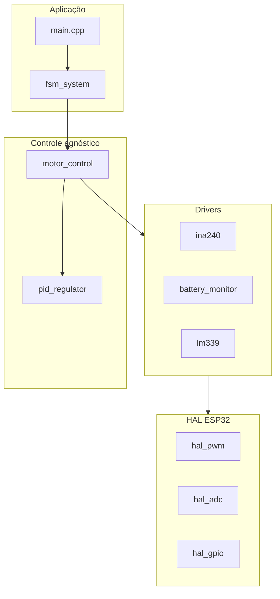

# Documentação de Programação — Firmware ESC BLDC (ESP32)

> **Documento vivo:** complemente e revise este arquivo **sempre** que criar, alterar ou revisar código em `Firmware/`.  
> Especificação de arquitetura (visão de produto): [`../Docs/especificacao_esc.md`](../Docs/especificacao_esc.md).

---

## Índice

1. [Política de manutenção](#1-política-de-manutenção)
2. [Visão geral do firmware](#2-visão-geral-do-firmware)
3. [Ambiente de build](#3-ambiente-de-build)
4. [Estrutura de diretórios](#4-estrutura-de-diretórios)
5. [Estado atual vs. planejado](#5-estado-atual-vs-planejado)
6. [Arquitetura em camadas](#6-arquitetura-em-camadas)
7. [Máquina de estados (planejada)](#7-máquina-de-estados-planejada)
8. [Mapa de hardware (`board_config.h`)](#8-mapa-de-hardware-board_configh)
9. [Módulo `lib/control/pid_regulator` (documentação de código)](#9-módulo-libcontrolpid_regulator-documentação-de-código)
10. [Módulos `lib/hal/*` (documentação de código)](#10-módulos-libhal-documentação-de-código)
11. [Módulos `lib/drivers/*` (documentação de código)](#11-módulos-libdrivers-documentação-de-código)
12. [Módulo `lib/control/motor_control`](#12-módulo-libcontrolmotor_control)
13. [Módulo `lib/drivers/bemf_zcd`](#13-módulo-libdriversbemf_zcd)
14. [Histórico de revisões](#14-histórico-de-revisões)
15. [Registro de dúvidas (modo Ask)](#15-registro-de-dúvidas-modo-ask)

---

## 1. Política de manutenção

| Regra | Descrição |
|-------|-----------|
| **Quando atualizar** | Ao adicionar, remover ou modificar arquivos em `src/`, `include/`, `lib/` ou `platformio.ini`. |
| **O que registrar** | Data, autor, arquivos afetados, resumo da mudança e impacto em API/comportamento. |
| **Onde registrar** | Seção [14. Histórico de revisões](#14-histórico-de-revisões) + seção do módulo correspondente. |
| **Dúvidas no modo Ask** | Sempre que o autor fizer uma pergunta em modo **Ask** cuja resposta seja útil para o projeto, acrescentar (ou atualizar) a entrada correspondente na seção [15. Registro de dúvidas](#15-registro-de-dúvidas-modo-ask). |
| **Divergência da spec** | Se o código diferir de `Docs/especificacao_esc.md`, explicar **por quê** (ex.: pinos inválidos no ESP32-WROOM-32). |
| **Padrão de escrita** | Preferir explicação em prosa + tabelas + passo a passo; não apenas listas de arquivos. |

---

## 2. Visão geral do firmware

Este firmware controla um **ESC trifásico** para motor **BLDC**. A ideia central da arquitetura é **separar responsabilidades**:

- **Aplicação** (`src/`): quando ligar o motor, em que estado está, regras de segurança.
- **Controle** (`lib/control/`): matemática de malha fechada (PI), sem saber qual pino é PWM.
- **Drivers** (`lib/drivers/`): conversão de sinais físicos (INA240, divisor de tensão, LM339) para grandezas de engenharia (A, V).
- **HAL** (`lib/hal/`): acesso direto ao silício (MCPWM, ADC, GPIO/EXTI).

Assim, você pode testar o PI no PC ou na bancada sem reescrever código quando mudar um pino ou sensor.

| Item | Valor atual / alvo |
|------|-------------------|
| MCU | ESP32 (`esp32doit-devkit-v1`) |
| Framework hoje | **Arduino** (via PlatformIO) |
| Framework alvo (spec) | ESP-IDF + FreeRTOS |
| PWM de comutação | 20 kHz, dead-time 500 ns (planejado, MCPWM) |
| Teto de duty | 95 % (recarga bootstrap IR2110) |
| Debug | GPIO 12–15 reservados para **JTAG** (ICE) |

---

## 3. Ambiente de build

Configuração em `platformio.ini`:

| Parâmetro | Valor | Significado |
|-----------|--------|-------------|
| `platform` | `espressif32` | Toolchain e SDK do ESP32 |
| `board` | `esp32doit-devkit-v1` | Placa de desenvolvimento de referência |
| `framework` | `arduino` | API Arduino (`setup`/`loop`) |
| `monitor_speed` | `115200` | Baud rate do monitor serial |
| `build_flags` | `-I include` | Expõe `board_config.h` às bibliotecas em `lib/` |

**Compilar:** `pio run` ou `platformio run`.

**Bibliotecas em `lib/`:** o PlatformIO compila automaticamente cada pasta como biblioteca estática e linka no firmware. Para usar o controlador PI em outro arquivo:

```c
#include "pid_regulator.h"
```

Não é necessário editar `platformio.ini` só por causa de `lib/control/`.

---

## 4. Estrutura de diretórios

```text
Firmware/
├── DOCUMENTACAO_PROGRAMACAO.md   ← este arquivo (documentação viva)
├── platformio.ini
├── include/
│   └── board_config.h            ← mapa de pinos e limites operacionais
├── src/
│   ├── main.cpp
│   ├── fsm_system.h / fsm_system.c   ← máquina de estados do ESC
├── lib/
│   ├── control/
│   │   ├── pid_regulator.h / .c  ← PI com anti-windup
│   │   └── motor_control.h / .c  ← corrente + comutação 6-step
│   ├── hal/
│   │   ├── hal_pwm.h / hal_pwm.c     ← MCPWM 6 canais, dead-time
│   │   ├── hal_adc.h / hal_adc.c     ← ADC1, leitura em mV
│   │   └── hal_gpio.h / hal_gpio.c   ← GPIO digital, EXTI OC trip
│   └── drivers/
│       ├── ina240_current_sensors.h / .c  ← corrente de fase (A)
│       ├── battery_monitor.h / .c         ← tensão barramento (V)
│       ├── lm339_protection.h / .c        ← trip OC + desarme PWM
│       └── bemf_zcd.h / .c                ← cruzamento zero BEMF (LM339)
└── test/                         ← testes (futuro)
```

---

## 5. Estado atual vs. planejado

| Componente | Status | O que faz / fará |
|------------|--------|------------------|
| `src/main.cpp` | **Provisório** | Loop com FSM + telemetria; comandos serial `a/d/c/s` |
| `fsm_system` | **Implementado** | INIT → IDLE → RUNNING / FAULT; arming e clear fault |
| `lib/control/pid_regulator` | **Implementado** | Malha PI com anti-windup; pronto para integração |
| `include/board_config.h` | **Implementado** | Mapa de pinos revisado (ESP32-WROOM-32) e limites operacionais |
| `lib/hal/*` | **Implementado** | MCPWM (20 kHz, dead-time 500 ns), ADC1 (mV), GPIO/EXTI (OC trip) |
| `lib/drivers/*` | **Implementado** | INA240 → A, divisor VBAT → V, LM339 → ISR + desarme PWM |
| `motor_control` | **Implementado (v1 bancada)** | Malha de corrente (PI) + comutação 6-step em malha aberta |
| `bemf_zcd` | **Implementado (v1)** | EXTI nos comparadores BEMF; handover OPEN → ZCD |
| Comutação com feedback de posição | **Parcial** | ZCD sensorless; FOC / halls dedicados ainda pendentes |

**Resumo:** Malha de corrente + 6-step com partida em malha aberta e comutação sincronizada por ZCD (BEMF) após handover; FOC e ESP-IDF permanecem no roadmap.

---

## 6. Arquitetura em camadas


```mermaid
flowchart TB
    subgraph app [Aplicação]
        MAIN[main.cpp]
        FSM[fsm_system]
    end
    subgraph ctrl [Controle agnóstico]
        MC[motor_control]
        PI[pid_regulator]
    end
    subgraph drv [Drivers]
        INA[ina240]
        BAT[battery_monitor]
        LM[lm339]
    end
    subgraph hal [HAL ESP32]
        PWM[hal_pwm]
        ADC[hal_adc]
        GPIO[hal_gpio]
    end
    MAIN --> FSM --> MC --> PI
    MC --> drv --> hal
```

**Regra de ouro:** `pid_regulator` recebe apenas números (`float`): referência, medição, saída. Não inclui `board_config.h`, não acessa GPIO, não conhece MCPWM.

---

## 7. Máquina de estados (`fsm_system`)

Implementação em `src/fsm_system.h` e `src/fsm_system.c`.

| Estado | Nome | O que acontece |
|--------|------|----------------|
| `ESC_STATE_INIT` | Inicialização | Calibra ADC/INA240; configura PWM e EXTI LM339 (transitório no boot) |
| `ESC_STATE_IDLE` | Espera | PWM desarmado; aguarda `fsm_system_request_arm()` |
| `ESC_STATE_RUNNING` | Ativo | PWM armado; `motor_control` entrará aqui no próximo passo |
| `ESC_STATE_FAULT` | Falha | Trip LM339; PWM desarmado; `fsm_system_clear_fault()` → IDLE |

**Transições:**

```text
INIT ──(ok)──► IDLE ──(arm)──► RUNNING ──(disarm)──► IDLE
                  │                │
                  └──── LM339 ─────┴────► FAULT ──(clear)──► IDLE
```

| API | Descrição |
|-----|-----------|
| `fsm_system_init()` | Sequência de boot; sucesso → `IDLE` |
| `fsm_system_tick()` | Processa `s_fault_pending` e monitora pino OC |
| `fsm_system_request_arm()` | `IDLE` → `RUNNING` |
| `fsm_system_request_disarm()` | `RUNNING` → `IDLE` |
| `fsm_system_clear_fault()` | `FAULT` → `IDLE` se hardware liberou |

**Bancada (serial 115200):** `a` arm, `d` disarm, `c` clear fault, `s` status, `t<amps>` corrente alvo em RUNNING, `o` força malha aberta.

---

## 8. Mapa de hardware (`board_config.h`)

### 8.1 Por que revisar a especificação original?

O arquivo `Docs/especificacao_esc.md` descreve a intenção do projeto, mas o mapa de pinos original tem **erros para o ESP32-WROOM-32**:

| Pino na spec | Problema técnico |
|--------------|------------------|
| GPIO 9, 10, 11 | Ligados à **flash SPI interna** do módulo — não usar em aplicação |
| GPIO 14 em `PIN_PWM_AL` | É **TMS do JTAG**; a spec dizia preservar JTAG, mas usava esse pino |
| GPIO 19, 20 como ADC | GPIO **20 não existe**; GPIO 19 não é entrada ADC padrão no ESP32 clássico |
| GPIO 24 em `PIN_OC_TRIP` | GPIO **24 não existe** no ESP32 clássico |

### 8.2 Mapa revisado (`include/board_config.h`)

```c
#ifndef BOARD_CONFIG_H
#define BOARD_CONFIG_H

// JTAG reservado: GPIO12, 13, 14, 15
// Flash reservado: GPIO6, 7, 8, 9, 10, 11

#define PIN_PWM_AH    25
#define PIN_PWM_AL    26
#define PIN_PWM_BH    27
#define PIN_PWM_BL    18
#define PIN_PWM_CH    19
#define PIN_PWM_CL    21

#define PIN_ADC_IA    32   // ADC1_CH4
#define PIN_ADC_IB    33   // ADC1_CH5
#define PIN_ADC_IC    34   // ADC1_CH6 (input-only)
#define PIN_ADC_VBAT  35   // ADC1_CH7 (input-only)

#define PIN_OC_TRIP   4    // LM339, ativo baixo + pull-up

#define MAX_DUTY_CYCLE_PERCENT 95.0f
#define PWM_FREQUENCY_HZ       20000
#define DEAD_TIME_NS           500

#define CONTROL_LOOP_HZ        10000.0f
#define CONTROL_DT_S           (1.0f / CONTROL_LOOP_HZ)

#endif
```

### 8.3 Finalidade de cada grupo de pinos

#### PWM — GPIO 25, 26, 27, 18, 19, 21

Geram os **6 sinais de gate** da ponte trifásica:

| Sinal | Pino | Função |
|-------|------|--------|
| AH | 25 | High-side, fase A |
| AL | 26 | Low-side, fase A |
| BH | 27 | High-side, fase B |
| BL | 18 | Low-side, fase B |
| CH | 19 | High-side, fase C |
| CL | 21 | Low-side, fase C |

Serão gerados pelo **MCPWM** do ESP32, com **dead-time** de 500 ns no hardware para evitar *shoot-through* (curto entre high e low da mesma perna).

#### ADC — GPIO 32, 33, 34, 35

Leitura analógica de **correntes de fase** e **tensão do barramento DC**:

| Pino | Sinal | Canal | Observação |
|------|-------|-------|------------|
| 32 | Corrente fase A | ADC1_CH4 | Entrada/saída geral |
| 33 | Corrente fase B | ADC1_CH5 | Entrada/saída geral |
| 34 | Corrente fase C | ADC1_CH6 | **Somente entrada** (ideal para sensor) |
| 35 | Tensão VBAT | ADC1_CH7 | **Somente entrada** |

Usar **ADC1** evita conflitos comuns do ADC2 quando o Wi-Fi está ativo.

#### Segurança — GPIO 4 (`PIN_OC_TRIP`)

Entrada digital do comparador **LM339** (sobrecorrente). Configuração esperada:

- Sinal **ativo em nível baixo** (open-collector + pull-up).
- Interrupção externa (EXTI) para desarme rápido.
- **Recomendação:** acoplar também ao **fault do MCPWM** para desligamento imediato por hardware, não só por software.

#### Reservados — não usar

| GPIO | Motivo |
|------|--------|
| 12, 13, 14, 15 | **JTAG** — depuração ICE (`MTDI`, `MTCK`, `MTMS`, `MTDO`) |
| 6, 7, 8, 9, 10, 11 | **Flash SPI** interna do módulo |

---

## 9. Módulo `lib/control/pid_regulator` (documentação de código)

Biblioteca de controle **Proporcional-Integral (PI)** para o ESC. É **agnóstica de hardware**: não sabe se a saída é duty cycle, corrente ou velocidade — apenas processa referência, medição e limites configurados.

**Localização:**

```text
lib/control/
├── pid_regulator.h   ← tipos e protótipo público
└── pid_regulator.c   ← implementação
```

---

### 9.1 Arquivo `pid_regulator.h` — interface pública

#### Proteção contra inclusão dupla

```1:2:lib/control/pid_regulator.h
#ifndef PID_REGULATOR_H
#define PID_REGULATOR_H
```

Se outro arquivo incluir `pid_regulator.h` duas vezes, o pré-processador ignora a segunda inclusão. Evita erro de “redefinição de tipo”.

#### Compatibilidade C e C++

```4:6:lib/control/pid_regulator.h
#ifdef __cplusplus
extern "C" {
#endif
```

O projeto usa `main.cpp` (C++). Sem `extern "C"`, o linker do C++ aplicaria *name mangling* e não encontraria `pi_compute`. Com esse bloco, o símbolo exportado segue a convenção C.

#### Estrutura `pi_controller_t` — cada campo explicado

```8:17:lib/control/pid_regulator.h
typedef struct {
    float kp;
    float ki;
    float dt;             // [s]
    float integral_term;  // integrator state
    float out_max;        // output saturation max
    float out_min;        // output saturation min
    float integ_max;      // anti-windup clamp max
    float integ_min;      // anti-windup clamp min
} pi_controller_t;
```

| Campo | Papel no controle | Como usar na prática |
|-------|-------------------|----------------------|
| `kp` | Ganho **proporcional**. Multiplica o erro atual. | Valores maiores → resposta mais rápida, mas mais oscilação/ruído. |
| `ki` | Ganho **integral**. Define quanto o acumulador corrige erro persistente. | Valores maiores → elimina erro em regime, mas pode causar overshoot se alto demais. |
| `dt` | Período de amostragem em **segundos**. | Deve ser **igual** ao intervalo real entre chamadas de `pi_compute()`. Ex.: 10 kHz → `dt = 0.0001f`. |
| `integral_term` | **Estado** do integrador. Persiste entre chamadas. | Não zerar a cada ciclo. Zerar só em reset seguro (ex.: ao armar motor). |
| `out_max`, `out_min` | Limites da **saída final** do controlador. | No ESC: tipicamente `0` e `95` (% duty), alinhado a `MAX_DUTY_CYCLE_PERCENT`. |
| `integ_max`, `integ_min` | Limites do integrador (**anti-windup**). | Impedem que `integral_term` cresça sem limite quando a saída já está saturada. |

> **Nota:** a especificação em `Docs/especificacao_esc.md` lista apenas `kp`, `ki`, `integral_term`, `out_max` e `out_min`. A implementação atual **adiciona** `dt`, `integ_max` e `integ_min` porque controle discreto e anti-windup exigem esses parâmetros explicitamente.

**Não há `kd`:** este módulo é **PI**, não PID. Não há termo derivativo.

#### Função pública `pi_compute`

```19:19:lib/control/pid_regulator.h
float pi_compute(pi_controller_t *pi, float setpoint, float measurement);
```

| Entrada | Significado |
|---------|-------------|
| `pi` | Ponteiro para a instância do controlador (ganhos, limites e estado do integrador). |
| `setpoint` | Valor desejado (ex.: RPM alvo, corrente alvo). |
| `measurement` | Valor medido pelos sensores/drivers (telemetria). |

| Saída | Significado |
|-------|-------------|
| Retorno `float` | Comando de controle já limitado em `[out_min, out_max]`. |
| Se `pi == NULL` | Retorna `0.0f` (comando neutro / seguro). |

---

### 9.2 Arquivo `pid_regulator.c` — implementação

#### Função auxiliar `clampf`

```5:14:lib/control/pid_regulator.c
static inline float clampf(float x, float min_v, float max_v)
{
    if (x > max_v) {
        return max_v;
    }
    if (x < min_v) {
        return min_v;
    }
    return x;
}
```

| Aspecto | Explicação |
|---------|------------|
| `static` | Função visível **somente** neste `.c`; não polui o namespace global. |
| `inline` | Sugere ao compilador embutir o código, evitando custo de chamada em loop rápido. |
| Comportamento | Garante `min_v ≤ resultado ≤ max_v`. |

Usada em **dois momentos**: limitar o integrador (anti-windup) e limitar a saída final.

---

### 9.3 `pi_compute()` — passo a passo (linha a linha)

Código completo da função:

```16:38:lib/control/pid_regulator.c
float pi_compute(pi_controller_t *pi, float setpoint, float measurement)
{
    float error;
    float p_term;
    float u_unsat;
    float u_sat;

    if (pi == NULL) {
        return 0.0f;
    }

    error = setpoint - measurement;
    p_term = pi->kp * error;

    // Discrete-time integrator with anti-windup by clamping.
    pi->integral_term += (pi->ki * error * pi->dt);
    pi->integral_term = clampf(pi->integral_term, pi->integ_min, pi->integ_max);

    u_unsat = p_term + pi->integral_term;
    u_sat = clampf(u_unsat, pi->out_min, pi->out_max);

    return u_sat;
}
```

#### Passo 1 — Proteção contra ponteiro nulo

```c
if (pi == NULL) return 0.0f;
```

Se alguém chamar `pi_compute(NULL, ...)`, o firmware não trava por acesso inválido; devolve saída zero.

#### Passo 2 — Cálculo do erro

```c
error = setpoint - measurement;
```

- Erro **positivo** → medição **abaixo** da referência → controlador tende a **aumentar** a saída.
- Erro **negativo** → medição **acima** da referência → tende a **reduzir** a saída.

Exemplo: `setpoint = 3000` RPM, `measurement = 2800` RPM → `error = +200`.

#### Passo 3 — Termo proporcional

```c
p_term = kp * error;
```

Resposta **imediata** ao erro atual. Sozinho, o PI deixaria um erro residual em regime permanente; o integrador corrige isso nos passos seguintes.

#### Passo 4 — Atualização do integrador (tempo discreto)

```c
integral_term += ki * error * dt;
```

Integração numérica tipo **Euler explícito** (retangular):

- A cada ciclo, soma-se uma parcela do erro proporcional a `ki` e ao tempo `dt`.
- Se `dt` estiver errado (task mais lenta/rápida que o configurado), o comportamento integral fica incorreto.

#### Passo 5 — Anti-windup por clamping do integrador

```c
integral_term = clamp(integral_term, integ_min, integ_max);
```

**O que é windup?**  
Quando a saída já está no teto (ex.: duty em 95 %), mas o erro continua positivo, o integrador ainda acumula valor “inútil” que não aparece na saída saturada.

**Consequência:** ao liberar a saturação, a resposta fica lenta, com overshoot ou instabilidade.

**O que o clamping faz?**  
Limita o acumulador **antes** que ele cresça demais. É simples, previsível e adequado para primeira versão do ESC.

#### Passo 6 — Soma P + I (saída não saturada)

```c
u_unsat = p_term + integral_term;
```

É o comando “ideal” antes de respeitar limites físicos do atuador.

#### Passo 7 — Saturação da saída

```c
u_sat = clamp(u_unsat, out_min, out_max);
```

Garante que o comando final respeite limites do hardware (ex.: nunca acionar 100 % de duty se o bootstrap exige margem).

#### Passo 8 — Retorno

```c
return u_sat;
```

Valor pronto para `motor_control` converter em duty PWM por fase.

---

### 9.4 Equações (referência matemática)

**Tempo contínuo (conceito):**

\[
u(t) = K_p \cdot e(t) + K_i \int e(t)\,dt
\]

**Tempo discreto (o que o código implementa), a cada amostra \(k\):**

\[
e_k = r - y_k
\]

\[
P_k = K_p \cdot e_k
\]

\[
I_k = \mathrm{clamp}\big(I_{k-1} + K_i \cdot e_k \cdot \Delta t,\; I_{min},\, I_{max}\big)
\]

\[
u_k = \mathrm{clamp}(P_k + I_k,\; u_{min},\, u_{max})
\]

Onde:

- \(r\) = `setpoint`
- \(y_k\) = `measurement`
- \(\Delta t\) = `dt`
- \(I_k\) = `integral_term`

---

### 9.5 Diagrama de fluxo de sinais

```text
                    ┌─────────────────────────────────────────┐
  setpoint (r) ────►│                                         │
                    │   error = r - y                         │
  measurement (y) ─►│                                         │
                    └──────────────┬──────────────────────────┘
                                   │
                    ┌──────────────┴──────────────┐
                    ▼                             ▼
              P = kp × error              I += ki × error × dt
                    │                             │
                    │                             ▼
                    │                    clamp(I, integ_min, integ_max)
                    │                             │
                    └──────────────┬──────────────┘
                                   ▼
                            u_unsat = P + I
                                   │
                                   ▼
                    clamp(u_unsat, out_min, out_max) ──► saída u
```

---

### 9.6 Exemplo completo de uso

```c
#include "pid_regulator.h"

// Instância global ou estática da malha de velocidade
pi_controller_t speed_pi = {
    .kp = 0.08f,
    .ki = 1.20f,
    .dt = 1.0f / 10000.0f,   // malha a 10 kHz — task deve rodar nesse período
    .integral_term = 0.0f,
    .out_min = 0.0f,
    .out_max = 95.0f,        // alinhado a MAX_DUTY_CYCLE_PERCENT
    .integ_min = -30.0f,
    .integ_max = 30.0f
};

void control_task(void)
{
    float target_rpm = 3000.0f;
    float measured_rpm = read_rpm();   // vindo de driver/estimador — futuro

    float duty_percent = pi_compute(&speed_pi, target_rpm, measured_rpm);

    // motor_control aplicará duty_percent nas fases — futuro
}
```

---

### 9.7 Boas práticas de integração no ESC

| Prática | Motivo |
|---------|--------|
| Chamar `pi_compute()` em **período fixo** igual a `dt` | Integrador discreto assume amostragem uniforme. |
| Zerar `integral_term` no arming (`IDLE` → `RUNNING`) | Evita “tiro” de saída por estado acumulado anterior. |
| Uma instância por malha, uma task dona | Evita condição de corrida sem mutex. |
| Ajustar `integ_min/max` junto com `out_min/max` na bancada | Anti-windup e saturação devem ser coerentes com a planta real. |
| Não chamar PI dentro de ISR lenta | Preferir task FreeRTOS ou timer dedicado. |

---

### 9.8 Limitações conhecidas e evoluções

| Limitação atual | Impacto | Evolução possível |
|-----------------|---------|-------------------|
| Anti-windup só por **clamping** | Pode ser conservador em saturação frequente | **Back-calculation** (ajusta integrador quando `u_unsat ≠ u_sat`) |
| Sem termo **D** | Não filtra por derivada do erro; ruído na medição não é atenuado por D | Módulo `pid_regulator` estendido, se necessário |
| `dt` configurado manualmente | Se a task atrasar, integral fica errado | Timer hardware ou `esp_timer` com período garantido |
| Não integrado ao `main` | Código compila, mas ESC ainda não usa o PI | Integrar via `motor_control` + FSM |

---

### 9.9 O que este módulo **não** faz (delimitação)

- Não lê ADC nem converte corrente (isso será `ina240_current_sensors` + `hal_adc`).
- Não gera PWM (isso será `hal_pwm`).
- Não implementa comutação BLDC nem FOC (isso será `motor_control`).
- Não trata falha de hardware (isso será `lm339_protection` + `fsm_system`).

---

## 10. Módulos `lib/hal/*` (documentação de código)

Camada de abstração do silício ESP32. Usa `board_config.h` para pinos e limites; **não** converte grandezas de engenharia (isso fica nos drivers).

### 10.1 `hal_adc` — leitura analógica bruta

| Função | Descrição |
|--------|-----------|
| `hal_adc_init()` | Configura ADC1 em 12 bits, atenuação até ~3,3 V (canais 4–7) |
| `hal_adc_read_mv(channel)` | Retorna milivolts no pino (escala linear 0–3300 mV / 4095 counts) |

Canais: `HAL_ADC_PHASE_IA/IB/IC`, `HAL_ADC_VBAT` → GPIO 32–35.

### 10.2 `hal_pwm` — comutação MCPWM

| Função | Descrição |
|--------|-----------|
| `hal_pwm_init()` | 3 timers MCPWM, 6 GPIO, dead-time 500 ns (modo complementar AH/AL) |
| `hal_pwm_set_armed(bool)` | Só aplica duty > 0 se armado; ao desarmar zera todas as fases |
| `hal_pwm_set_phase_duty(phase, %)` | Duty 0…`MAX_DUTY_CYCLE_PERCENT` (modo SOURCE) |
| `hal_pwm_set_phase_conduction(phase, mode, %)` | OFF / SOURCE (PWM high-side) / SINK (low-side on) |
| `hal_pwm_disable_all()` | Todas as pernas em OFF |

Frequência e dead-time vêm de `PWM_FREQUENCY_HZ` e `DEAD_TIME_NS`.

### 10.3 `hal_gpio` — segurança digital

| Função | Descrição |
|--------|-----------|
| `hal_gpio_init()` | `PIN_OC_TRIP` como entrada com pull-up |
| `hal_gpio_attach_oc_trip_isr(cb, arg)` | EXTI em borda de descida (trip ativo baixo) |
| `hal_gpio_oc_trip_asserted()` | `true` se LM339 puxou o pino para baixo |

O callback de ISR deve ser **rápido e ISR-safe** (sem `Serial`, sem malloc).

### 10.4 Delimitação da HAL

- Não aplica ganho INA240 nem escala de VBAT (drivers).
- Não implementa FSM nem comutação BLDC (`motor_control`, `fsm_system`).
- Framework atual: **Arduino**, com APIs ESP-IDF (`driver/mcpwm.h`, `driver/adc.h`, `driver/gpio.h`).

---

## 11. Módulos `lib/drivers/*` (documentação de código)

Convertem leituras da HAL em grandezas físicas e tratam proteção de hardware. Dependem de `lib/hal/`; **não** conhecem FSM nem PI.

### 11.1 `ina240_current_sensors`

| Parâmetro | Valor (hardware) |
|-----------|------------------|
| Ganho | 20 V/V (INA240A1DR) |
| Shunt | 1 mΩ |
| Offset nominal | 1,65 V (1650 mV) |

| Função | Descrição |
|--------|-----------|
| `ina240_init()` | Marca driver pronto (HAL ADC já deve estar init) |
| `ina240_calibrate_offset(n)` | Média de `n` amostras por fase com corrente zero |
| `ina240_read_amps(phase)` | Corrente em A: `(mV - offset) / 20` |
| `ina240_get_offset_mv(phase)` | Offset calibrado ou nominal |

### 11.2 `battery_monitor`

Divisor 39 kΩ / 4,7 kΩ → `V_bat = V_adc / (4,7 / 43,7)`.

| Função | Descrição |
|--------|-----------|
| `battery_monitor_init()` | Marca driver pronto |
| `battery_monitor_read_volts()` | Tensão do barramento DC em V |

### 11.3 `lm339_protection`

| Função | Descrição |
|--------|-----------|
| `lm339_protection_init()` | Marca driver pronto |
| `lm339_protection_arm(cb, arg)` | EXTI via HAL; ISR desarma PWM e chama callback |
| `lm339_protection_fault_active()` | Trip latched ou pino OC ainda ativo |
| `lm339_protection_clear_fault()` | Limpa latch só se hardware liberou o pino |

O callback de falha deve ser **ISR-safe** (sem `Serial`).

---

## 12. Módulo `lib/control/motor_control`

Núcleo que liga **telemetria → PI de corrente → PWM trifásico** com **comutação trapezoidal 6-step** em malha aberta (frequência elétrica fixa na bancada).

### 12.1 Fluxo

```text
INA240 (A,B,C) ──► |I| máximo ──► pi_compute(I_alvo, I_med) ──► duty %
                                        │
                    tabela 6-step ◄─────┴──► hal_pwm_set_phase_conduction (A,B,C)
                    (passo avança a 30 Hz elétrico, timer 1 kHz)
```

### 12.2 API

| Função | Descrição |
|--------|-----------|
| `motor_control_init()` | Inicializa PI e timer periódico (`MOTOR_CONTROL_LOOP_HZ` = 1 kHz) |
| `motor_control_on_arm()` / `on_disarm()` | Zera integrador; ativa/desativa malha (chamado pela FSM) |
| `motor_control_tick()` | Uma iteração (também chamada pelo `esp_timer`) |
| `motor_control_set_target_amps(amps)` | Corrente desejada 0…`MOTOR_CONTROL_MAX_TARGET_AMPS` (5 A bancada) |

### 12.3 Bancada (serial)

1. `a` — arm → `RUNNING`
2. `t1.5` — corrente alvo 1,5 A (enviar `t` seguido do valor)
3. `d` — disarm
4. Telemetria a cada 500 ms inclui `I*`, duty % e passo de comutação

### 12.4 Modos de comutação

| Modo | Nome serial | Comportamento |
|------|-------------|---------------|
| `MOTOR_COMM_OPEN_LOOP` | `OPEN` | Passos avançam em `DEFAULT_COMMUTATION_HZ`; tenta handover ZCD |
| `MOTOR_COMM_ZCD_CLOSED` | `ZCD` | Próximo passo após ZCD na fase flutuante + atraso `BEMF_COMM_DELAY_DEG_ELEC` (30°) |

Handover: `BEMF_ZCD_HANDOVER_COUNT` flancos válidos na fase flutuante esperada, com duty ≥ `MOTOR_CONTROL_MIN_DUTY_ZCD_HANDOVER`. Sem ZCD por 4× o período de passo → volta a `OPEN`. Comando `o` força malha aberta.

### 12.5 Limitações (v1)

| Item | Detalhe |
|------|---------|
| Pinos ZCD | GPIO 16/17/5 em `board_config.h` — **confirmar no esquemático da PCB** |
| Partida | Ainda depende de rampa em malha aberta (sem alinhamento por ímã) |
| `HAL_PWM_COND_OFF` | MCPWM força saídas baixas; não é alta impedância real |
| Ganhos do PI / filtro RC | Ajuste na bancada; atraso de fase do filtro BEMF não compensado no firmware |
| FOC / Hall | Não implementados |

---

## 13. Módulo `lib/drivers/bemf_zcd`

Driver dos comparadores LM339 de **cruzamento por zero** da BEMF (fase flutuante vs. neutro virtual), conforme a tese do projeto.

| Função | Descrição |
|--------|-----------|
| `bemf_zcd_init()` | Entradas GPIO com pull-up + EXTI `ANYEDGE` em `PIN_ZCD_A/B/C` |
| `bemf_zcd_floating_phase_for_step(n)` | Fase em alta impedância lógica para o passo 6-step |
| `bemf_zcd_consume_edge(phase)` | Consome um flanco pendente se for da fase esperada |
| `bemf_zcd_phase_asserted(phase)` | Nível do comparador (ativo baixo) |

Desabilitar no firmware: `#define BOARD_ENABLE_BEMF_ZCD 0` em `board_config.h`.

---

## 15. Registro de dúvidas (modo Ask)

Esta seção consolida perguntas feitas em modo **Ask** (revisão/consulta, sem alterar código na hora) e as respostas acordadas, para servir de referência ao time e à IA em sessões futuras.

| Tópico | Subseção |
|--------|----------|
| Máquina de estados do ESC | **15.0** |
| ZCD / BEMF / FOC | **15.1** – **15.5** |

Referência na tese (ZCD): [`../Docs/Thesis/main.tex`](../Docs/Thesis/main.tex). Detalhes de implementação da FSM: [seção 7](#7-máquina-de-estados-fsm_system) e `src/fsm_system.h` / `src/fsm_system.c`.

---

### 15.0 O que é FSM?

**FSM** = *Finite State Machine* — **máquina de estados finita**.

É um modelo em que o firmware está **sempre em um entre um conjunto fixo de estados**, e só muda quando ocorrem **eventos** ou **condições** definidas (não há estados “livres” fora da lista).

#### No projeto ESC

A FSM do controlador está no módulo **`fsm_system`** (`src/fsm_system.h`, `src/fsm_system.c`). Ela responde à pergunta: *“Em que modo de operação o ESC está agora?”* — separado de *como* comutar o motor (`motor_control`) ou *como* ler sensores (`lib/drivers/`).

| Estado (`esc_state_t`) | Nome serial | O que significa |
|------------------------|-------------|-----------------|
| `ESC_STATE_INIT` | `INIT` | Boot transitório: ADC, PWM, calibração INA240, proteção |
| `ESC_STATE_IDLE` | `IDLE` | Pronto; PWM desarmado; aguarda arm |
| `ESC_STATE_RUNNING` | `RUNNING` | PWM armado; `motor_control` ativo |
| `ESC_STATE_FAULT` | `FAULT` | Falha (ex.: LM339 OC); PWM desarmado até clear |

#### Transições principais

```text
INIT ──(init OK)──► IDLE ──(arm)──► RUNNING ──(disarm)──► IDLE
                      │                │
                      └──── OC trip ───┴────► FAULT ──(clear)──► IDLE
```

| API | Efeito típico |
|-----|----------------|
| `fsm_system_init()` | Sequência de boot; sucesso → `IDLE` |
| `fsm_system_request_arm()` | `IDLE` → `RUNNING` (habilita PWM + `motor_control_on_arm`) |
| `fsm_system_request_disarm()` | `RUNNING` → `IDLE` |
| `fsm_system_clear_fault()` | `FAULT` → `IDLE` se hardware liberou OC |
| `fsm_system_tick()` | Trata falha pendente e monitora `PIN_OC_TRIP` |

Comandos serial de bancada (115200): `a` arm, `d` disarm, `c` clear fault, `s` status. A telemetria periódica mostra o estado entre colchetes, ex.: `[IDLE]`, `[RUNNING]`.

#### Por que usar FSM aqui?

| Benefício | Exemplo no ESC |
|-----------|----------------|
| **Segurança** | Só arma em `IDLE`; em `FAULT` o PWM permanece desligado até `clear` |
| **Organização** | `main.cpp` não espalha `if (motor_on && !fault && …)` |
| **Depuração** | Um nome de estado na serial em vez de vários flags soltos |

A FSM **não** calcula PI, **não** faz comutação 6-step e **não** lê BEMF — apenas **autoriza** ou **bloqueia** a operação do motor e reage a falhas de hardware.

---

### 15.1 O que é ZCD?

**ZCD** = *Zero-Crossing Detection* (detecção de cruzamento por zero).

No ESC trifásico **sensorless**, monitora-se a tensão da **fase flutuante** (não alimentada no passo atual da comutação 6-step). Quando a **BEMF** (força contraeletromotriz / FCEM) cruza o **neutro virtual** do motor, o rotor está em uma posição angular conhecida; essa informação substitui sensores Hall para sincronizar a comutação.

No firmware, o modo de comutação associado aparece na telemetria serial como `comm=ZCD` (`MOTOR_COMM_ZCD_CLOSED`). A partida sem BEMF suficiente usa `comm=OPEN` (malha aberta por timer).

---

### 15.2 Como o sistema detecta o ZCD?

A detecção ocorre em **duas camadas**: hardware analógico + firmware digital.

#### Hardware (placa — conforme tese)

1. **Neutro virtual** — resistores (ex.: 33 kΩ) nas três fases do motor unidos num nó de referência \(V_{ref}\).
2. **Divisor + filtro RC** por fase (ex.: 33 kΩ / 3,3 kΩ + 10 nF) — atenua até ~3,3 V e filtra ruído do PWM (~20 kHz).
3. **LM339** — compara tensão da fase filtrada (+) com o neutro atenuado (−). Saída **open-collector** + pull-up (~10 kΩ) para 3,3 V → sinal digital.

O ESP32 **não** mede BEMF em volts no ADC para ZCD; lê **nível lógico** nos pinos `PIN_ZCD_A/B/C`.

#### Firmware (`lib/drivers/bemf_zcd` + `motor_control`)

| Etapa | O que faz |
|-------|-----------|
| EXTI | Flanco em qualquer borda nos GPIO ZCD; ISR marca qual fase (A/B/C) disparou. |
| Validação | `bemf_zcd_consume_edge()` só aceita evento se for a **fase flutuante** do passo 6-step atual. |
| Malha aberta | Timer avança passos (~30 Hz elétricos); após 6 flancos válidos com duty suficiente → **handover** para ZCD. |
| Malha ZCD | Após flanco válido, agenda comutação em **30° elétricos** (`BEMF_COMM_DELAY_DEG_ELEC`), usando metade do período entre passos estimado. |
| Watchdog | Sem ZCD coerente por muito tempo → volta a `OPEN`. |

```text
BEMF cruza neutro → LM339 muda saída → GPIO ZCD → EXTI → fase flutuante OK?
    → sim → espera 30° elétricos → próximo passo 6-step
```

**Limitações:** em baixa velocidade a BEMF é pequena; filtro RC atrasa o instante do zero (tese descreve compensação — firmware v1 usa 30° fixos).

---

### 15.3 Pinos ZCD não estavam no projeto inicial — dá para não usar?

**Sim.** O firmware já suporta operação **sem** circuito ZCD na placa.

Em `include/board_config.h`:

```c
#define BOARD_ENABLE_BEMF_ZCD  0
```

| Efeito | Detalhe |
|--------|---------|
| `bemf_zcd_init()` | Não configura GPIO nem EXTI. |
| `bemf_zcd_is_ready()` | Sempre `false`. |
| `motor_control` | Permanece só em **malha aberta** (`comm=OPEN`); PI de corrente e 6-step por timer continuam. |
| Handover `OPEN` → `ZCD` | Não ocorre. |

**Recomendação:** se não houver hardware ZCD, use `BOARD_ENABLE_BEMF_ZCD 0`. Com `1` e pinos flutuantes, interrupções espúrias podem causar comutação errática.

Comando serial `o` força malha aberta mesmo com ZCD habilitado no config.

**Projeto inicial sem comparadores BEMF:** esta é a configuração alinhada ao hardware mínimo (PWM + corrente + OC Trip + VBAT).

---

### 15.4 Onde ligar os pinos ZCD no circuito?

Os GPIO **não** ligam nas fases do motor nem no barramento em alta tensão. Ligam na **saída digital** do estágio BEMF (após pull-up para 3,3 V), com **SGND** comum ao ESP32.

```text
Fase motor A/B/C → neutro virtual + divisor/filtro → LM339 (por fase)
    → saída OC + pull-up 10 kΩ → 3,3 V → GPIO ESP32
```

| Pino no firmware (provisório) | Sinal |
|------------------------------|--------|
| `PIN_ZCD_A` (GPIO 16) | Comparador BEMF fase A |
| `PIN_ZCD_B` (GPIO 17) | Comparador BEMF fase B |
| `PIN_ZCD_C` (GPIO 5)  | Comparador BEMF fase C |

**Não confundir** com `PIN_OC_TRIP` (GPIO 4) — sobrecorrente (3 comparadores em wired-OR), função diferente.

**LM339 no projeto:** um CI com 4 comparadores pode usar 3 saídas em OR para **OCP** (1 GPIO). ZCD exige **3 saídas independentes** → em geral é necessário **outro LM339** (ou comparadores dedicados) e a rede completa de neutro virtual + divisores descrita na tese. **Confirmar nets no esquemático da PCB** antes de soldar; ajustar `PIN_ZCD_*` em `board_config.h` se o layout for outro.

Se a placa atual **não tiver** esse bloco, não há ponto correto para esses fios até uma revisão de hardware.

---

### 15.5 Sem ZCD, é possível FOC só com sensores de corrente?

**Resumo:** FOC **não depende** dos pinos ZCD (ZCD é para comutação **trapezoidal** 6-step). Porém FOC **sempre precisa do ângulo do rotor** (sensor ou estimativa). **Três shunts de corrente sozinhos não definem ângulo** em todo o regime — especialmente parado e em baixa rotação.

| Necessidade do FOC | No hardware atual |
|--------------------|-------------------|
| Correntes de fase \(i_a, i_b\) (ou três) | Sim — INA240 |
| Ângulo \(\theta\) para Clarke/Park | Não direto — exige Hall/encoder **ou** observador sensorless |
| Tensão aplicada nas fases | Não medida — pode **reconstruir** com \(V_{bat}\) + duty PWM |
| ZCD / comparadores GPIO | **Não obrigatório** para FOC |

**FOC sensorless por software** (sem ZCD): observador de fluxo/BEMF no modelo do motor, usando corrente + tensão reconstruída + parâmetros (\(R_s\), \(L_s\), \(\psi_f\), pares de polos). A BEMF entra na **equação**, não nos comparadores.

| Regime | Só corrente? |
|--------|----------------|
| Velocidade média/alta | Possível com observador + \(V_{bat}\) + PWM (complexo) |
| Parado / muito lento | **Não** confiável só com shunt — precisa align, injeção HF, ou sensor de posição |

Desabilitar ZCD (`BOARD_ENABLE_BEMF_ZCD 0`) **não bloqueia** um FOC futuro; remove apenas sincronismo 6-step por comparadores. Implementar FOC no ESP32 atual exigiria malha muito mais rápida que 1 kHz, SVPWM, observador e partida — escopo além do `motor_control` v1.

**Caminhos práticos sem ZCD na placa:**

1. **6-step malha aberta** + PI de corrente (estado atual com `BOARD_ENABLE_BEMF_ZCD 0`).
2. **FOC sensorless** (firmware pesado; corrente + VBAT + modelo do motor).
3. **Halls/encoder** (GPIO extras; não é “só corrente”).

---

## 14. Histórico de revisões

| Data | Autor | Arquivos | Resumo |
|------|-------|----------|--------|
| 2026-05-28 | Agente Cursor | `lib/control/pid_regulator.h`, `lib/control/pid_regulator.c` | Criação do controlador PI com anti-windup por clamping |
| 2026-05-28 | Agente Cursor | `DOCUMENTACAO_PROGRAMACAO.md` | Criação inicial do documento |
| 2026-05-28 | Agente Cursor | `DOCUMENTACAO_PROGRAMACAO.md` | Reescrita pedagógica: passo a passo do PI, explicação de pinos, prosa e referências ao código |
| 2026-05-31 | Agente Cursor | `include/board_config.h`, `DOCUMENTACAO_PROGRAMACAO.md` | Criação do mapa de hardware revisado (pinos PWM/ADC/OC_TRIP, limites PWM e malha de controle) |
| 2026-05-31 | Agente Cursor | `lib/hal/*`, `src/main.cpp`, `platformio.ini`, `DOCUMENTACAO_PROGRAMACAO.md` | HAL MCPWM/ADC/GPIO; main de bancada; `build_flags = -I include` |
| 2026-05-31 | Agente Cursor | `lib/drivers/*`, `src/main.cpp`, `DOCUMENTACAO_PROGRAMACAO.md` | Drivers INA240, VBAT, LM339; telemetria em A/V no main |
| 2026-05-31 | Agente Cursor | `src/fsm_system.*`, `src/main.cpp`, `DOCUMENTACAO_PROGRAMACAO.md` | FSM INIT/IDLE/RUNNING/FAULT; comandos serial de bancada |
| 2026-06-01 | Agente Cursor | `lib/control/motor_control.*`, `lib/hal/hal_pwm.*`, `src/fsm_system.c`, `src/main.cpp`, `DOCUMENTACAO_PROGRAMACAO.md` | `motor_control`: PI de corrente, 6-step, timer 1 kHz; HAL OFF/SOURCE/SINK; comando `t<amps>` |
| 2026-06-01 | Agente Cursor | `lib/drivers/bemf_zcd.*`, `motor_control.*`, `board_config.h`, `fsm_system.c`, `main.cpp`, `DOCUMENTACAO_PROGRAMACAO.md` | ZCD BEMF: handover OPEN→ZCD, comutação a 30° após flanco; pinos 16/17/5; comando `o` |
| 2026-06-01 | Enzo Fernandes / Agente Cursor | `DOCUMENTACAO_PROGRAMACAO.md` | Seção 15: registro de dúvidas (Ask) — ZCD, hardware, `BOARD_ENABLE_BEMF_ZCD`, FOC vs corrente |
| 2026-06-01 | Enzo Fernandes / Agente Cursor | `DOCUMENTACAO_PROGRAMACAO.md` | Seção 15.0: dúvida Ask — o que é FSM (`fsm_system`) |

---

*Última atualização: 2026-06-01*
